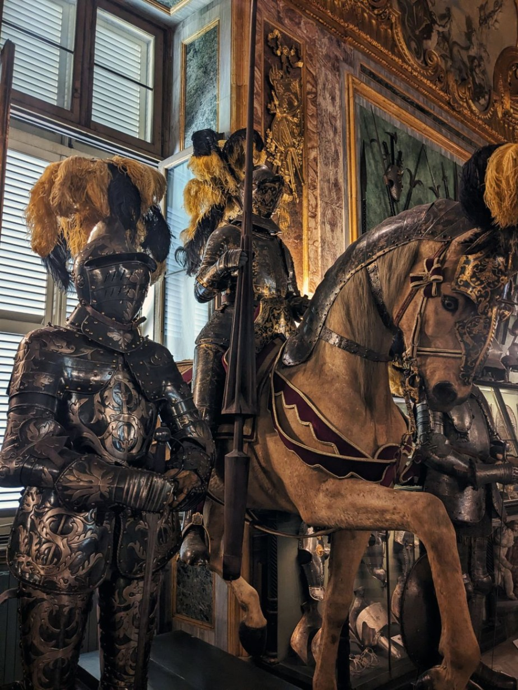

+++
title = "Lost in translation"
date = 2023-07-20 19:28:59.594228
draft = "false"
+++

Des changements de plans de dernière minute ont provoqué un petit imprévu : je passe une journée complète supplémentaire à Turin sans autre objectif que d'attendre le fatidique coup d'envoi de l'aventure.

#### (Dés)Orientation

L'arrivée a eu lieu la veille, à 23h, un peu de retard, ce car. Évidemment, mon fournisseur de réseau me lâche : pas de données mobiles.

Après une grosse demi-heure à galérer dans les rues de la ville pas très endormie et enveloppée d'une chaleur humide à vous en décoller le papier peint, je trouve l'auberge, mes clefs, ma chambre.






Une bonne douche me nettoie de la crasse accumulée de l'Intercités puis du Flixbus poisseux, je peux dormir serein - et seul - dans mon dortoir.

#### Bella Torino

Après deux heures de bataille avec mon opérateur, la connexion fonctionne à nouveau, je n'aurais pas à m'acheter une carte papier de la Scandinavie.

Je file au Decathlon du centre-ville parfaire mon attirail, je prends un couvre-casque étanche, car bien de la pluie est prévue pour les jours à venir.







Un rapide tour du centre plus tard, je jette mon dévolu sur une simili-boulangerie dans laquelle je commande - évidemment - une focaccia. Je la déguste dans un parc ombragé.

De petites rivières de gras en jaillissent à chaque bouchée. Heureusement, une fontaine proche me désaltère. C'est bien pire (ou mieux) que tout ce que j'ai pu manger auparavant ! Pas très adapté aux 34° qui s'annoncent ceci dit.

#### De l'art ou du cochon

À la suite de cette pause gustative douteuse, je me mets en route vers le grand _Museo Reali_ au sein duquel je me régale d'un excellent _caffè lungo_ à l'ombre des arcades.

15h, je traîne, la vague de chaleur arrive, étouffante, impitoyable. Mais un simple ticket en vient à bout, le musée est climatisé, ce sera mon havre de paix pour l'après-midi.







Je passe devant les collections l'œil vitreux et l'esprit embué. La NC4K occupe mes pensées et occulte quelque peu les vieilleries exposées çà et là.

Je me réjouis néanmoins des collections antiques du sous-sol, vestiges de lointains et prestigieux ancêtres moyen-orientaux.






À 18h me voilà déjà sur le chemin du retour, de petites provisions dans mon sac. Ce soir des wraps avocat/philadelphia/poulet OGM feront l'affaire.

Je profite du calme de l'auberge pour prendre une douche fraîche et m'écrouler sur mon lit. Une armée de ventilateurs a été dépêchée pour mettre la chaleur en déroute, en vain.

Ce soir de nombreux colocataires m'ont rejoint. Ils vont faire la connaissance de celui que mon ami Guillaume surnomme "l'ours". Bonne nuit à eux...

## Commentaires

#### Dad
J'espère quand même que tu ne ressembles pas trop à Bill Murray !!
Je te sens à la fois un peu nerveux mais aussi très impatient d'en découdre...
Est-ce que tu leur as montré aux Italiens ton beau maillot qui a fait le tour des îles britanniques l'an dernier ? Je pense qu'ils en seraient impressionnés !
Buona notte a Torino...
Et demain matin n'oublie pas le "Bicerin" sur la piazza San Carlo !

#### Nina
Ok la meilleure série de l'été recommence, la première saison était excellente et cet épisode pilote paraît prometteur ! J'ai toute confiance en la scénarisation, qui va encore nous offrir des détails culinaires croustillants.
