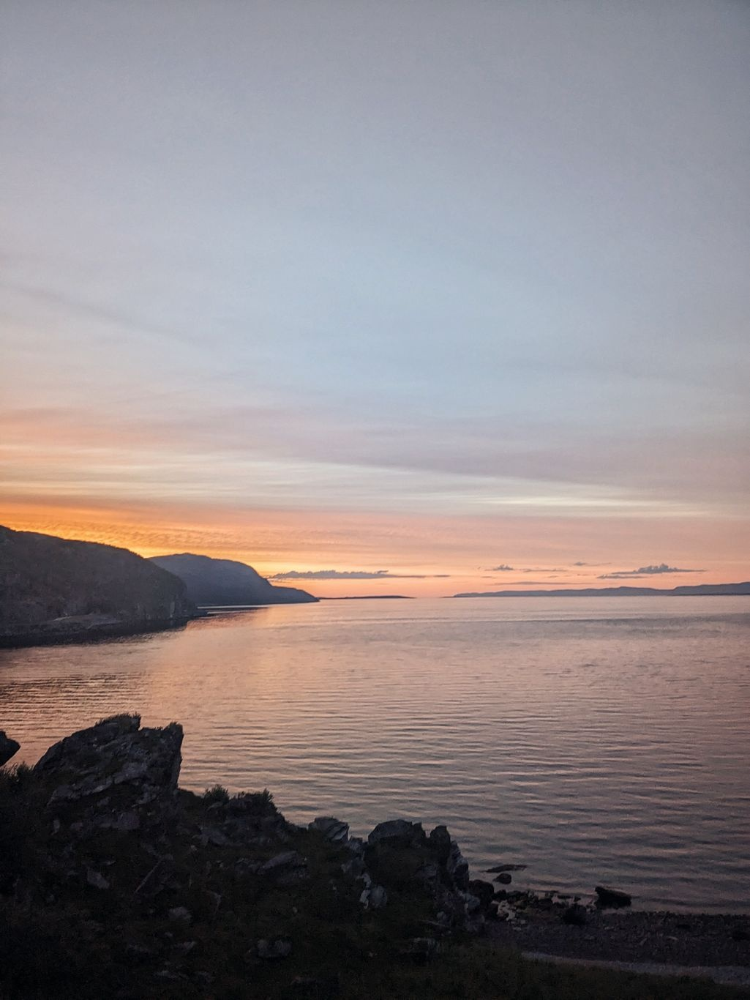

+++

title = "Nordkapp!"

draft = "false"

date = "2023-08-07 12:52:55.507093"
+++

We wake up refreshed from our night in our charming Finnish cabin. The breakfast is hearty, the owner even honors us with smoked wild trout, caught by himself.
<!--more-->






We know the day is going to be long, we don't rush to leave. The pace is slow because a headwind tries to pin us down during the first hundred kilometers.

Up to two hundred, we know we have to conserve our energy as much as possible, it's only after that the day really begins.







At nightfall, we take a break at a gas station to eat and buy supplies. It's the last one open before the North Cape, meaning 190 kilometers without resupply.

When we set off along the coastline, my main pannier is full of chocolate bars and other treats.

The beautiful midnight sun allows us to enjoy the grandiose landscapes that Norway offers and the sky takes on orange reflections for hours.

However, fatigue quickly sets in and the average drops further. The cold is biting and we impatiently wait, neck warmer over our noses, for the end of each descent.







The tunnels to cross before Honningsvåg are terrible and we lose steam there. But when the last thirty kilometers finally come, we discover with dread the true difficulty of the final course.

Two slopes of several kilometers at 9% average await us. Sébastien went ahead because his leg is hurting him and I painfully drag my bones up the climbs with Eduard.







Around 7:30am, deliverance at last. The arrival at the North Cape takes place under a radiant sun, unique we are told.

We quickly take our finish photos before heading off to stuff ourselves at the all-you-can-eat buffet.







A short nap later and the organizers are there to validate our time and take a few extra photos. Everything goes very fast afterwards, we have to organize, book buses, hotel, change flights, plan the cardboard boxes...

In a few minutes, we are on the bus to Alta, where a plane will take me to Bordeaux in a few hours.






I feel a mix of intense emotions, between pride, joy but also relief, because this adventure has tested me. I'm delighted to be able to rest a few days before resuming a normal life.

## Comments

#### Maman
Once again bravo Ivan! and thank you for sharing this adventure which is also an unforgettable experience for you! Thank you for this little diary and these photos that made me dream and travel because despite the difficulties and the suffering we imagine, you have the art of storytelling, as if everything was simple and easy and one dreams of being there!
Safe return to Bordeaux and enjoy these last days of real vacation!!
🌞😘

#### Lionel
Amélie and Romane join me in saying a big BRAVO. We followed your adventure with admiration. Looking forward to seeing you again so you can tell us all about it!
See you soon

#### François
Hats off, what's the level above "iron man"? :D
Quite an experience, travel companions and no doubt unforgettable memories!
Thank you for sharing it with us.
A "southcape8000" next year? :D

#### Dad
In your shots, we can sense the time you're chasing, the Earth turns slower at the pole and, far from our whirling frenzy, this time freezes...
In this end-of-the-world atmosphere, arrows of titanium and steel have pierced space. It's a beautiful story of friendship, which gave birth to a heck of an achievement.
Bravo Ivan!

#### Patricia and Norbert
We are proud of our nephew!!
A big bravo to you and see you soon Ivan!!
