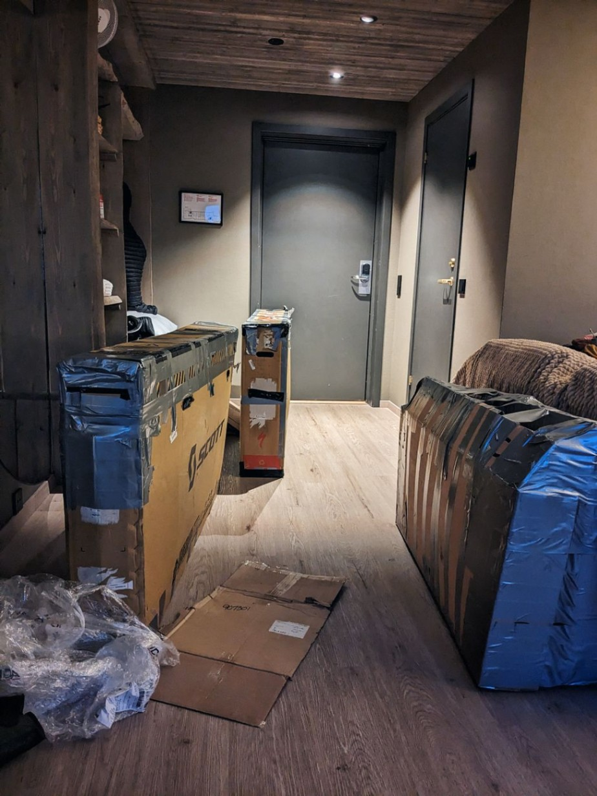

+++
title = "Over and out"
date = "2023-08-08 21:13:39.333778"
draft = "false"
+++

I always tend to think that a bike trip ends the day I stop pedaling, chasing a time. Yet it's a false impression because the transfer to Bordeaux is, in itself, a little adventure.

Breakfast this morning is taken on the terrace, at the hotel restaurant. Eduard left very early to catch his flight. So with Sébastien we enjoy the unexpected sun and the all-you-can-eat buffet.







Once this delicious moment is over, it's time to drag - as best we can - our enormous cardboard boxes containing our poor bikes in a thousand pieces towards the bus stop.

Airport, check-in, bike drop-off. We meet other NorthCape participants waiting for their flight, notably Julien and Paulina with whom I had the chance to exchange a few hours on the road.







The discussions are lively, everyone is delighted to share their best anecdotes.

Sébastien leaves first, then comes our turn, we board for Oslo. I make my connection to Bordeaux with Paulina, who is heading back to Prague.

Once arrived, I know I'll have to completely reassemble my bike to cover the ten or so kilometers that separate me from my apartment. This thought awakens a certain weariness in me, but I look forward to finding some comfort and privacy.







Only one question remains now: **but what will be the next adventure?**

## Comments

#### Lo73
You have the TCR, and the RAF, otherwise in gravel: French Divide, Sea to Peak :)
Good recovery!

#### François
In mountain biking, the Great Divide Mountain Bike Route.
In France, the GTJ and the GTMC (but too easy for you :-D). Some ideas here: https://bikepacking.com/bikepacking-routes/
