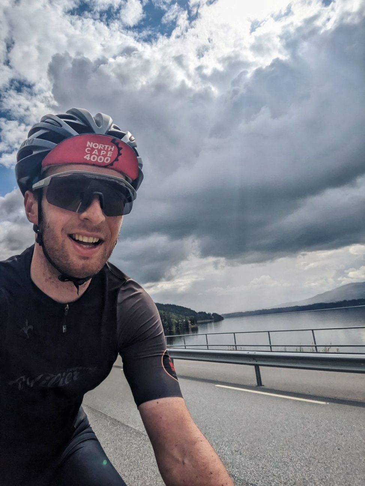
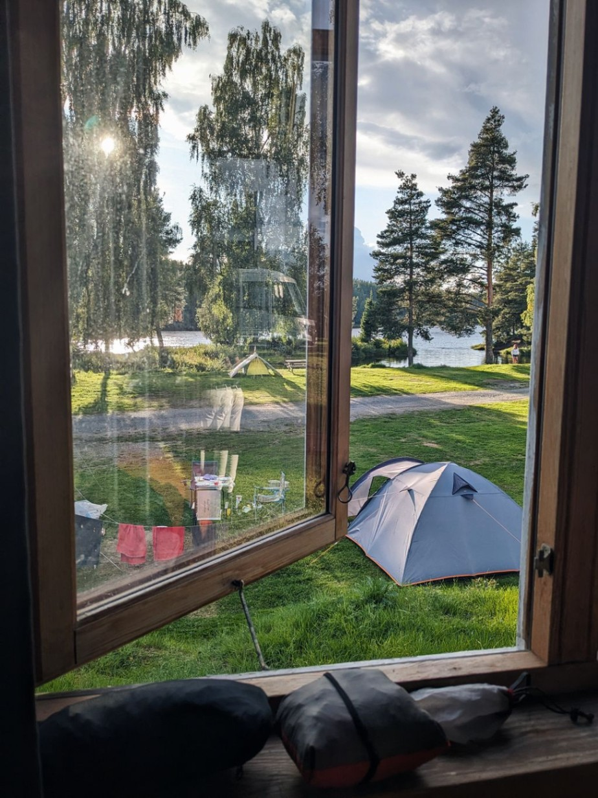

+++

title = "Return to Norway"

draft = "false"

date = "2023-07-31 19:22:22.159532"
+++

It's the great return to Norway for me! What emotion when disembarking at the port of Oslo. We go to the checkpoint to get our logbook stamped, for the first time.
<!--more-->






Very quickly, we get back on the road because we want to arrive early. Only 150 km planned today as it's hard to find accommodations, so we have to work with the towns along the way.

The day is generally radiant, except for a few violent showers that soak us and cover us with mud on the paths.







The little road is devoured at record speed. Barely time to do some shopping and we're already at the campsite, where a charming little cabin awaits us.

We have dinner early, the goal is to go to bed as quickly as possible to plan a 5am departure tomorrow and a 300 km stage. It promises to be difficult as neither the elevation nor the weather are on our side.







The rain clothes are ready, we sink into a deep and restorative sleep by the river.







## Comments

#### Maman
Ha! Ha! What joy to read you and see you like this! The Norwegian at heart! Tomorrow, big stage, this never-ending climb but you are in Paradise! Rest well and tomorrow, go for it guys!! Thank you for these news and these beautiful photos Ivan! 😘
