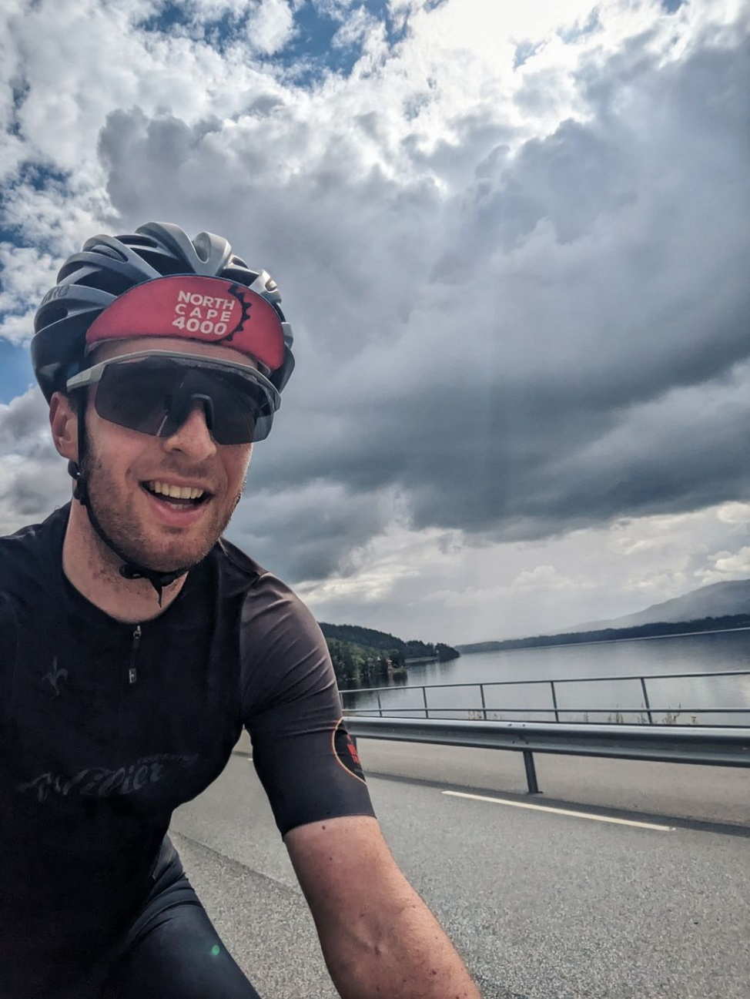
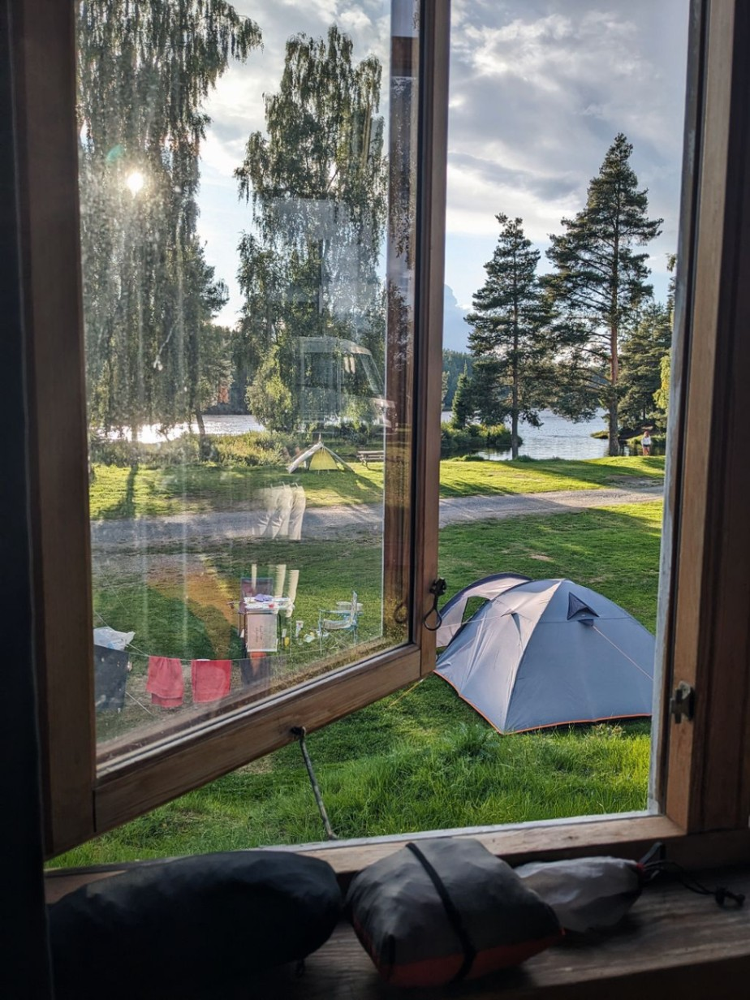

+++
speed = "16.02853"
title = "Retour vers la Norvège"
gps = "Morning_Ride.png"
draft = "false"
distance = "159052"
elevation = "1640"
duration = "9:55:23"
date = "2023-07-31 19:22:22.159532"
+++

C'est le grand retour en Norvège pour moi ! Que d'émotion en débarquant sur le port d'Oslo. Nous passons au checkpoint faire tamponner notre carnet de bord, pour la première fois.
<!--more-->






Très rapidement, nous reprenons la route car nous voulons arriver tôt. Seulement 150 km de prévu aujourd'hui car il est difficile de trouver des hébergements, nous devons donc composer avec les villes sur le chemin.

La journée est globalement radieuse, à l'exception de quelques douches violentes qui nous trempent et nous couvrent de boue dans les chemins.







Le peu de route est avalé à une vitesse record. À peine le temps de faire quelques courses et nous voilà déjà au camping, où une charmante petite cabane nous attend.

Nous dînons tôt, l'objectif est d'aller se coucher le plus vite possible pour prévoir un départ à 5h demain et une étape de 300 km. Elle s'annonce difficile car ni le dénivelé ni la météo ne sont de notre côté.







Les vêtements de pluie sont prêts, nous sombrons dans un sommeil profond et réparateur sur les bords de la rivière.







## Commentaires

#### Maman
Ah ! Ah ! Quel bonheur de te lire et de te voir ainsi ! Le Norvégien de cœur ! Demain, grosse étape cette grimpette qui n'en finit pas mais tu es au Paradis ! Reposez-vous bien et demain, hardi les gars !! Merci pour ces nouvelles et ces belles photos Ivan ! 😘
