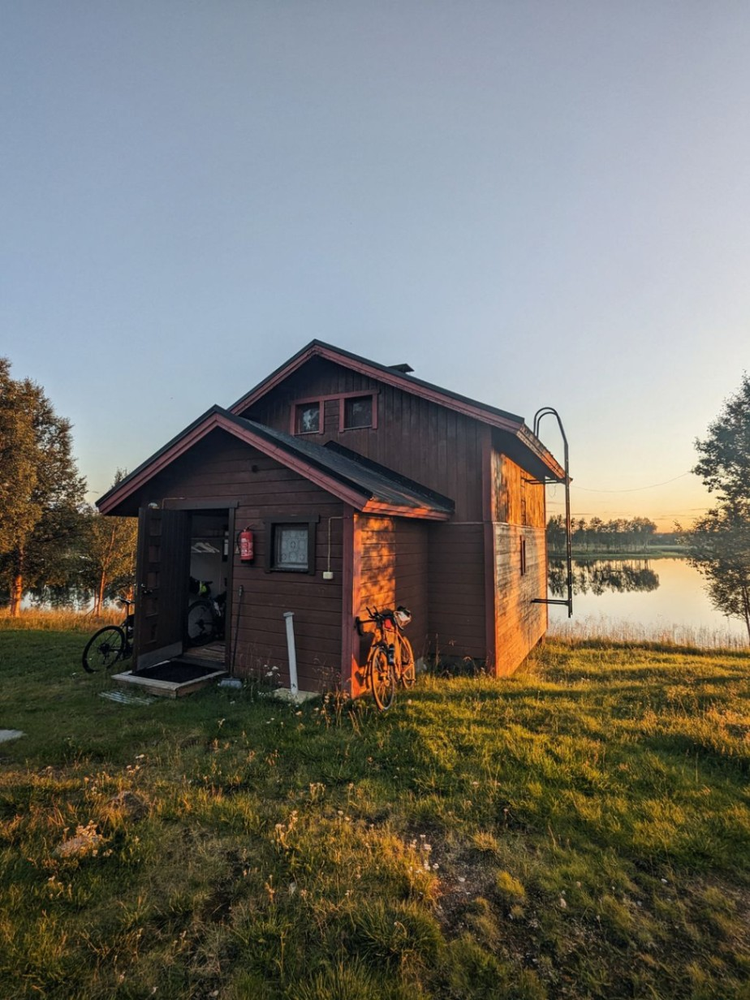
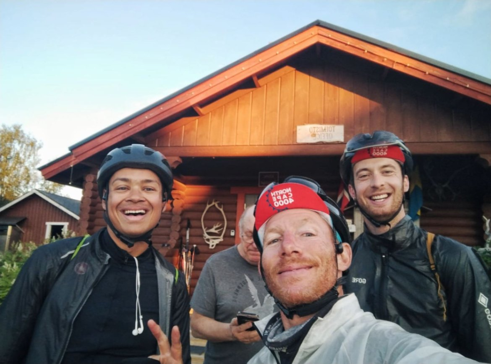

+++

title = "Under the sun of the Arctic Circle"

draft = "false"

date = "2023-08-05 21:25:13.005172"
+++

Now that's a day we wish we had more often! Sun from morning to night, not a drop of rain and 15°C at the warmest of the day. Enough to devour the kilometers serenely.
<!--more-->






It's time though for the adventure to end because the small discomforts are multiplying. My hands have been burnt by the sun and are blistering, Sébastien has injured his quadriceps and, the icing on the cake, Eduard broke a spoke on his wheel, bought new in Oslo.

Fortunately, thanks to Sébastien's multi-tool, I was able to true it on the roadside and it seems to be holding up for the moment.







We found a little lakeside chalet absolutely charming for tonight and we don't hesitate to light a fireplace while eating our chickpea wraps.

Tomorrow's stage is ready, as well as the resupply points. As they say, "just gotta do it"...







## Comments

#### Maman
Ah! The sun changes everything! Your cheerful faces are a joy to see!! Final straight! What satisfaction to be here after all these kilometers devoured at the cost of so much effort. And yet, I feel like Turin was yesterday...
The cherry on the cake tonight is this dreamy chalet by the water! The landscapes are idyllic! Good night Ivan, and may tomorrow give you wings! 😘
