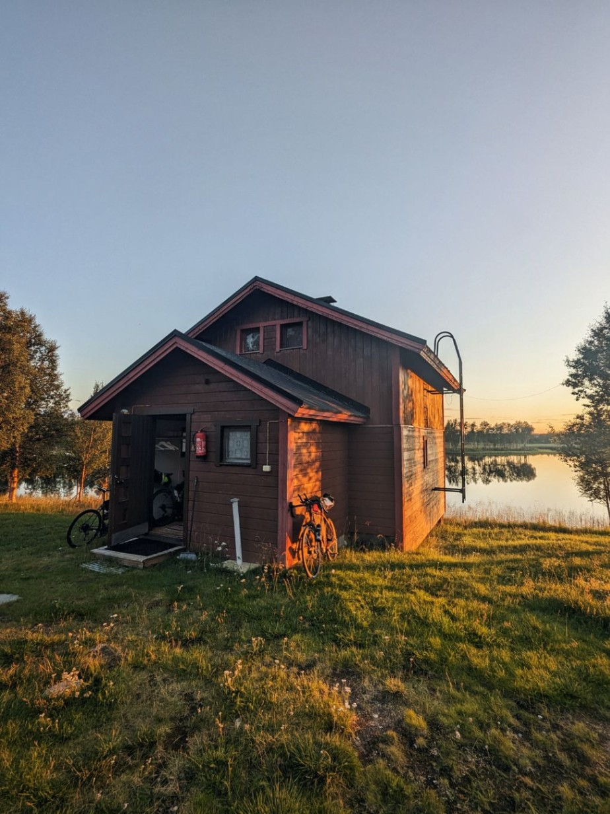
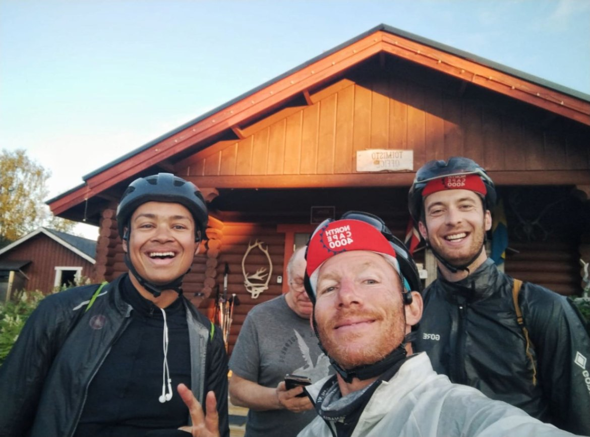

+++
speed = "21.342894"
title = "Sous le soleil du cercle polaire"
gps = "Morning_Ride.png"
draft = "false"
distance = "288882"
elevation = "1561"
duration = "13:32:07"
date = "2023-08-05 21:25:13.005172"
+++

Voilà une journée comme on aurait voulu en avoir plus souvent ! Du soleil du matin au soir, pas une goutte de pluie et 15° au plus chaud de la journée. De quoi avaler les kilomètres sereinement.







Il est temps cependant que l'aventure se termine car les petits inconforts se multiplient. Mes mains ont brûlé au soleil et font des cloques, Sébastien s'est blessé au quadriceps et, clou du spectacle, Eduard a cassé un rayon de sa roue, achetée neuve à Oslo.

Heureusement, grâce au multi-outils de Sébastien, j'ai pu la dévoiler sur le bord de la route et elle semble tenir le coup pour le moment.







Nous avons dégoté un petit chalet en bord de lac absolument charmant pour ce soir et nous ne nous privons pas de faire un feu de cheminée en mangeant nos wraps aux pois chiches.

L'étape de demain est prête, ainsi que les points de ravitaillement. Comme on dit, "y'a plus qu'à"...







## Commentaires

#### Maman
Ah ! Le soleil ça change la vie ! Vos mines réjouies font plaisir à voir !! Dernière ligne droite ! Quelle satisfaction d'être là après ces kilomètres avalés au prix de tant d'efforts. Et pourtant, j'ai l'impression que Turin, c'était hier...
La cerise sur le gâteau ce soir, c'est ce rêve de chalet au bord de l'eau ! Les paysages sont idylliques ! Bonne nuit Ivan et que demain vous donne des ailes ! 😘
