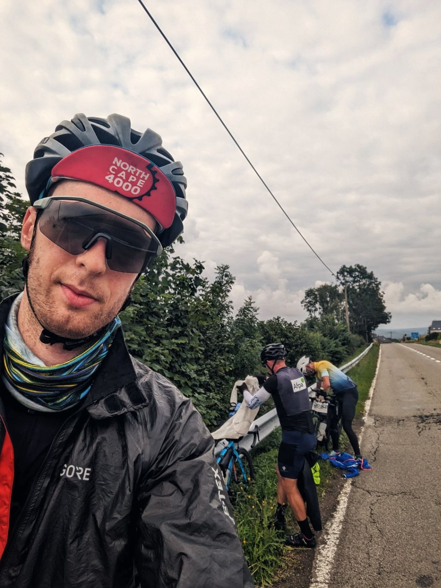

+++

title = "One day, four countries"

draft = "false"

date = "2023-07-26 22:29:27.696452"
+++

The start is freezing, 7°C by the water, everyone is well covered. The night at the hotel was excellent, we are in perfect working order.
<!--more-->





Leaving France to reach the Belgian Ardennes is the best part of the day. The weather is cool, the elevation is present without being burdensome and the landscapes are bucolic.

As soon as the border is crossed, we clean out all the Compeed from a pharmacy to stick them on our bleeding backsides.

Another border crossing, Holland, a country with a gastronomy more contrasted than its landscapes. Long slopes, hills, fields of wheat and wind turbines. We treat ourselves to an afternoon snack in a small pub.






Finally comes Germany and terrible bike paths. Impossible to avoid, at the risk of being run over by a roaring BMW or other Porsche.

The asphalt on the paths is wrecked and every root is a blow against our battered bodies. From early evening, we ride on the now-deserted roads.







We stop in Moers where a kitsch hotel, fit for wealthy old Teutons, awaits us. A quick dinner later, the little team is in bed.

My travel companions think it would be wiser to reduce the pace and take the boat on the 30th. This saddens me but I need them to continue, so I'll go along with the majority opinion.

I'm suffering from various inflammations in my joints, it might indeed be wiser to ease off.

Tomorrow, it rains.

## Comments

#### Titi
Gosh. Your adventure seems particularly demanding. Your travel companions are probably right. Who wants to go far spares their calves. Courage tomorrow for you and your rear end. ✊️

#### Lo73
A little easing off won't hurt, you can always push harder in the last days! Tough trip :)

#### Maman
The body has its reasons that reason must acknowledge! It seems wise to slow down indeed to avoid a forced break. Over such a distance, to hold on, you have to maintain yourself! Morale is important too. You're right to listen to your teammates, too bad for the Saturday crossing... It's so nice to share all these moments off the road. Your culinary photos give an idea of the calories spent!!
Go on, courage Ivan!! 😘
