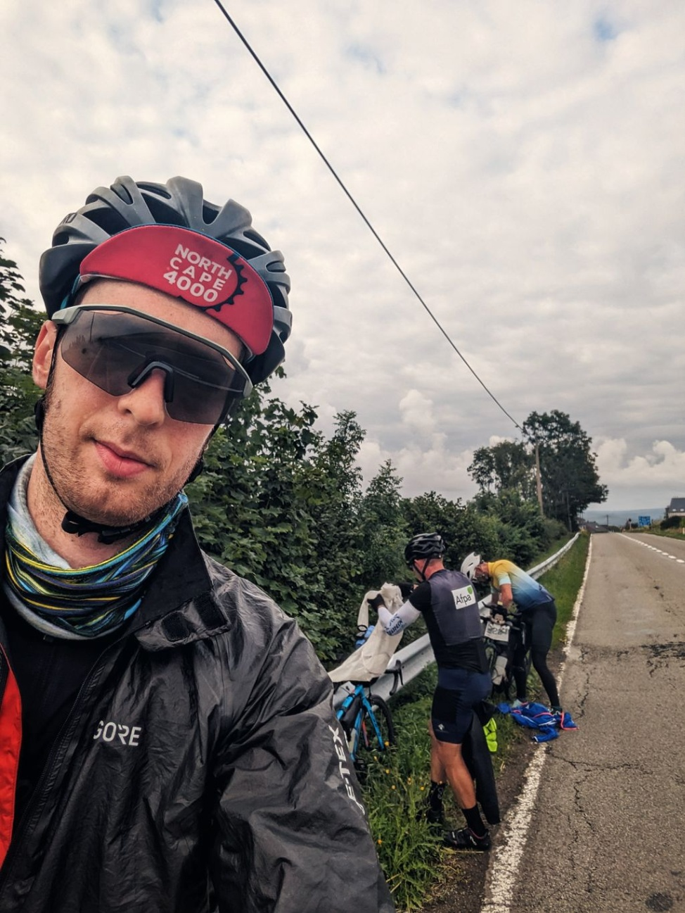

+++
speed = "18.441454"
title = "Un jour, quatre pays"
gps = "Morning_Ride.png"
draft = "false"
distance = "285402"
elevation = "1999"
duration = "15:28:34"
date = "2023-07-26 22:29:27.696452"
+++

Le départ est glacial, 7° au bord de l'eau, tout le monde est bien couvert. La nuit à l'hôtel a été excellente, nous sommes en parfait état de fonctionnement.






Quitter la France pour rejoindre les Ardennes belges constitue la meilleure partie de la journée. Le temps est frais, le dénivelé est présent sans être pesant et les paysages bucoliques.

Dès la frontière passée, nous dévalisons toutes les Compeed d'une pharmacie pour les coller sur nos derrières sanguinolents.

Nouveau passage de frontière, la Hollande, pays à la gastronomie plus contrastée que ses paysages. Longues pentes, collines, champs de blé et d'éoliennes. Nous nous régalons d'un quatre-heures dans un petit troquet.






Vient enfin l'Allemagne et de terribles pistes cyclables. Impossibles à éviter, sous peine de se faire renverser par une BMW rugissante ou autre Porsche.

L'asphalte des pistes est défoncé et chaque racine est un coup de boutoir contre nos corps meurtris. Dès le début de soirée, nous roulons sur les routes devenues désertes.







Nous nous arrêtons à Moers où un hôtel kitsch à souhait, pour vieux riches teutons, nous attend. Un dîner expédié plus tard, la petite équipe est au lit.

Mes compagnons de route pensent qu'il serait plus sage de réduire l'allure et de prendre le bateau le 30. Cela me désole mais j'ai besoin d'eux pour continuer, je me joindrai donc à l'avis de la majorité.

Je souffre de nombreuses inflammations diverses aux articulations, il serait peut-être effectivement plus sage de lever le pied.

Demain, il pleut.

## Commentaires

#### Titi
Diantre. Ton aventure a l'air d'être particulièrement exigeante. Tes compagnons de route ont probablement raison. Qui veut aller loin ménage ses mollets. Courage demain pour toi et ton derrière. ✊️

#### Lo73
Petit levage de pied fera pas de mal, tu pourras toujours mettre un coup de collier les derniers jours ! Costaud ce trip :)

#### Maman
Le corps a ses raisons que la raison se doit de reconnaître ! Il semble sage de ralentir en effet pour éviter la pause contrainte. Sur une telle distance, pour tenir, il faut s'entretenir ! Le moral est important aussi. Tu as raison d'écouter tes coéquipiers, tant pis pour la traversée de samedi... C'est tellement sympa de partager tous ces moments hors la route. Tes photos culinaires donnent une idée des calories dépensées !!
Allez, courage Ivan !! 😘
