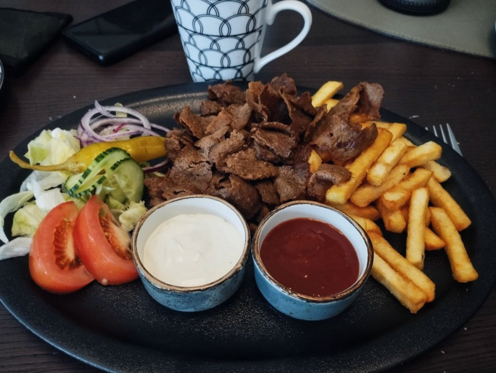

+++

title = "Lapland, here we come!"

draft = "false"

date = "2023-08-04 21:34:27.840438"
+++

The goal of the day is clear: reach Gällivare, the capital of Lapland. The stage promises to be long but not very difficult.

For the first hundred kilometers, I shamelessly shelter behind my comrades; I warned them, yesterday's day broke me.
<!--more-->






I planned stops every hundred kilometers, the first one takes place in a small café that also serves as a restaurant. We enjoy the dish of the day, quickly dispatched.

Rain sometimes joins the journey but nothing too unpleasant, overall we ride dry and almost warm. However, every roadside break is an opportunity for thousands of Swedish mosquitoes to try to get us.







The day goes off without a hitch, between taking turns and small chocolate bars, doing three hundred kilometers with twenty-kilo bikes seems _almost_ normal.

Unfortunately we call the Gällivare campsite too late, there are no more cabins and we have to fall back on the expensive city hotel. Between the cold, the rain and the mosquitoes, I can't sleep outside. I regret not bringing my tent...

For the next two days, we want to tackle the second-to-last GPS track of 550 kilometers, which promises great stages again.

If all goes well, arrival expected Monday 7th at the North Cape!

## Comments

#### Maman
Such a stage - beautiful road but over 320 km nonetheless! - well deserves a night at the hotel 😊! The fatigue shows on the faces but your smiles are radiant. Refreshing!
The Arctic Circle is only 50 km away!
Have a beautiful day tomorrow, on this infinitely splendid road! 😘

#### Cousine Didine
It looks so beautiful... 😯
Go on, hang in there for the rest!

#### Leslie
Go Ivan!! I'm sorry, I'm waking up a bit late... No surprise you're almost at the end already but still, what craziness... I wish you enjoy the last two days! Good luck for the finish!! You're an incredible loony <3
