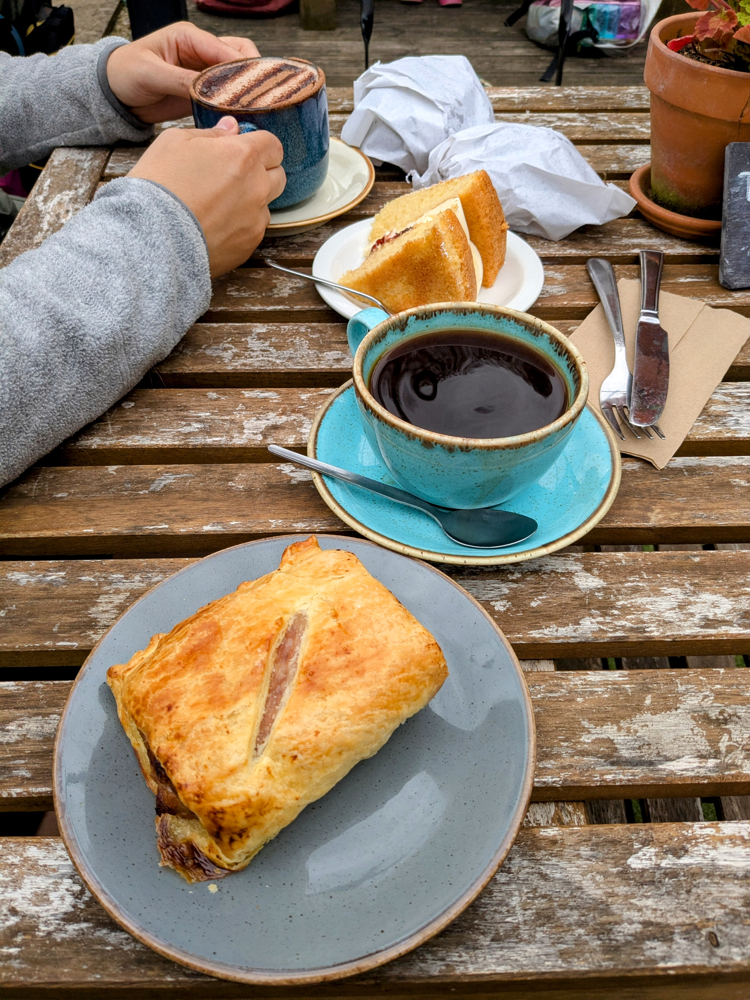
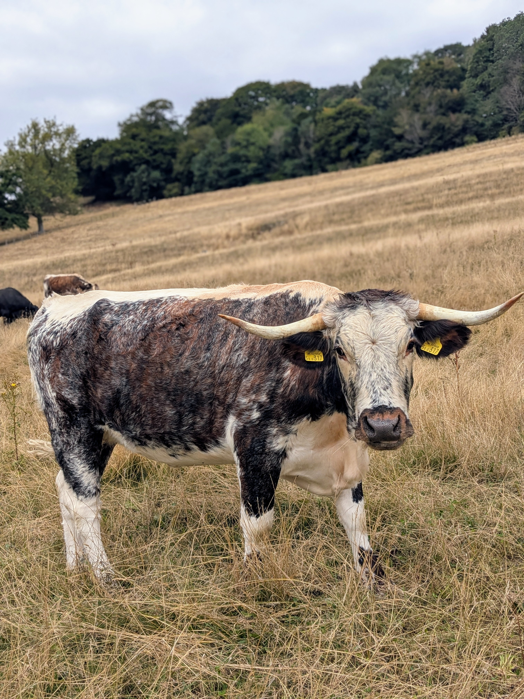
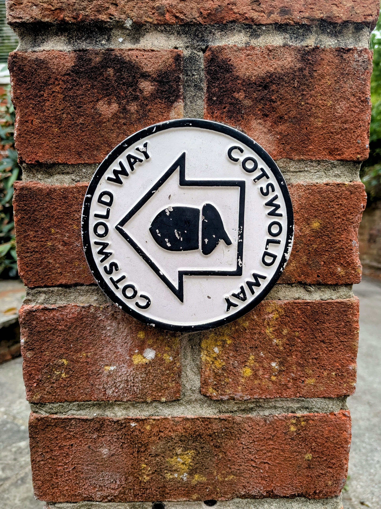

+++

title = "Walk on the Ridge"

draft = "false"

date = "2025-08-21"
+++

The night wasn't so great at the inn. Was it the meal that was too heavy? Maybe. A little too much good ale? Possibly too.

Anyway, we hit the road quickly after a rushed breakfast (they still made me some excellent scrambled eggs). First stop, Dursley, still asleep when we passed through. It's less pretty than usual, so no regrets. <!--more-->






We continue walking towards a striking monument overlooking the town of Wotton under Edge. I run up and down the steps four at a time to enjoy the magnificent panorama, before starting the long descent to the village where a coffee awaits us.











We're surprised to discover a lively little country town with a bustling high street lined with many coffee shops. We pick a charming one and take our break (for me, a large filter coffee and a sausage roll).






The rest, we're starting to know it: fields, little woods, pastures, cottages built of local stone.
Even so, we never tire of gazing at the majestic cattle and the curly sheep.






The sun really makes itself known in the middle of the afternoon and we have to struggle a bit to stay cool. One last field crossing and there's Old Sodbury in sight, then the Cross Hands inn. It's already 6:30 PM when we arrive; the day has been long.

Tomorrow we have to repeat the feat of 20 miles (which impresses the English a lot) if we hope to reach Bath on time!

