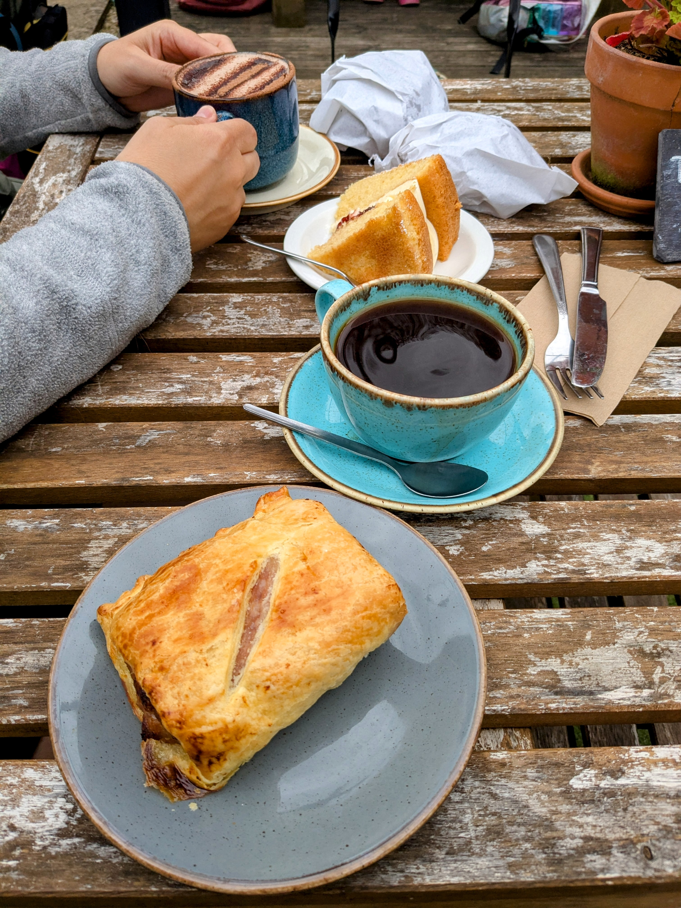
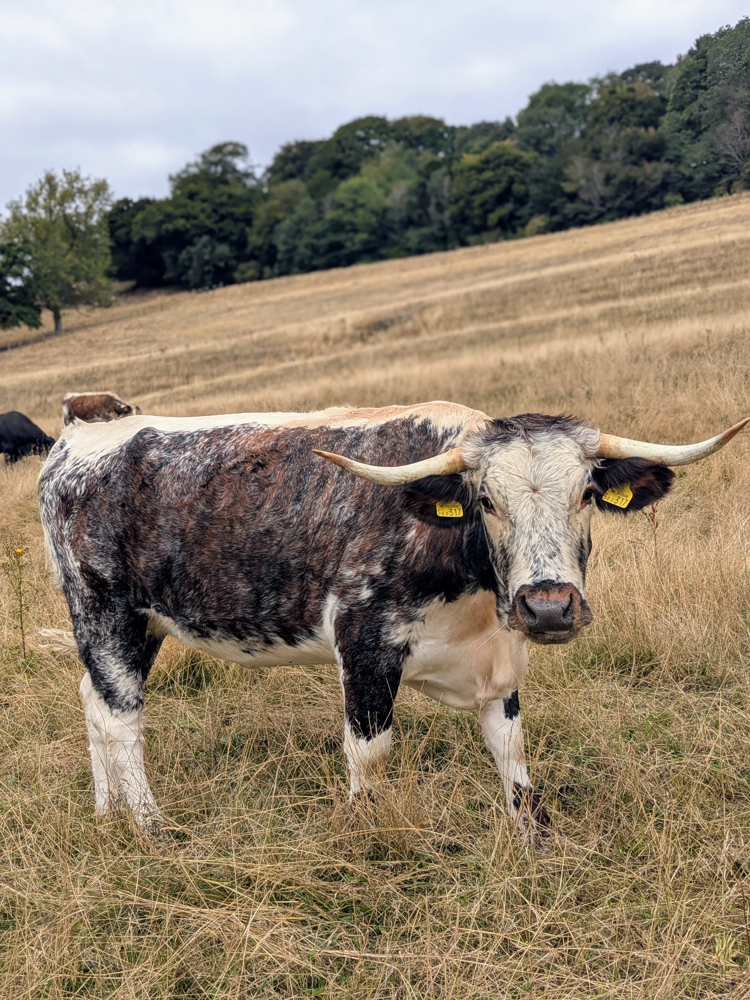
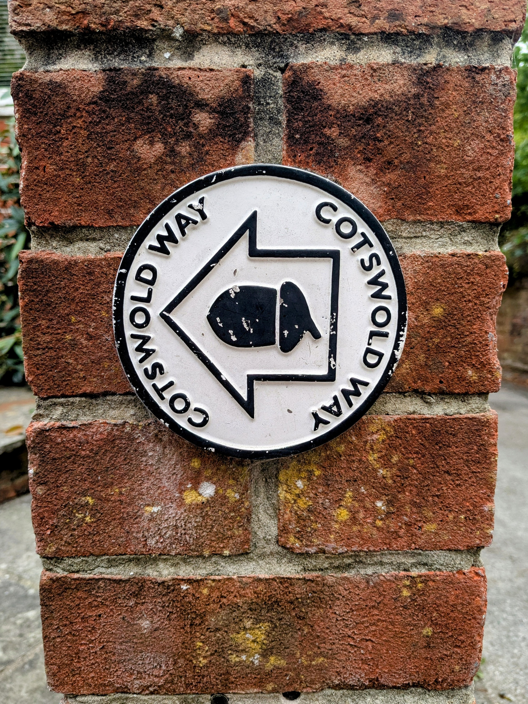

+++
speed = "3.200225"
title = "Balade sur l'arête"
gps = "Balade sur l'arête.png"
draft = "false"
distance = "34750"
elevation = "818"
duration = "10:51:31"
date = "2025-08-21"
+++

La nuit n'a pas été si bonne à l'auberge. La faute à un repas trop copieux ? Peut-être. À un peu trop de bonne ale ? Possible aussi. 

Quoiqu'il en soit, nous nous mettons en route rapidement après un petit déjeuner expédié (on me fait tout de même d'excellents œufs brouillés). Première étape Dursley, encore endormi lorsque nous passons. C'est moins joli que d'habitude, alors aucun regrets. <!--more-->






Nous continuons notre marche vers un monument étonnant, surplombant la ville de Wotton under Edge. Je monte et redescends les marches quatre à quatre pour profiter du magnifique panorama, avant d'entamer la longue descente vers le village où un café nous attend. 











Nous sommes étonnés de découvrir une petite ville de campagne fort dynamique et notamment une rue commerçante animée, flanquée de nombreux coffee shop. Nous en choisissons un, charmant, et prenons notre pause (pour moi un grand café filtre et un sausage roll).






La suite, on commence à la connaître : des champs, des petits bois, des pâturages, des cottages en pierre du pays. 
Malgré tout, on se lasse pas de contempler les majestueux bovins et les frisés ovins.






Le soleil se déclare sérieusement en milieu d'après-midi et nous devons lutter un peu pour rester frais. Une dernière traversée de champ et voilà Old Sodbury en vue, puis l'auberge de Cross Hands. Il est déjà 18h30 lorsque nous arrivons, la journée à été longue. 

Demain nous devons renouveler l'exploit des 20 miles (ce qui impressionne beaucoup les anglais) pour espérer rejoindre Bath dans les temps !

