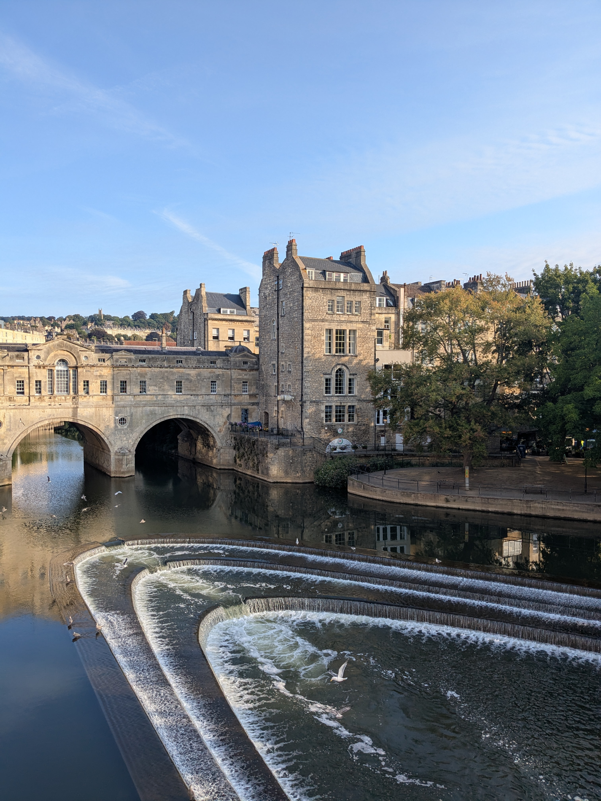
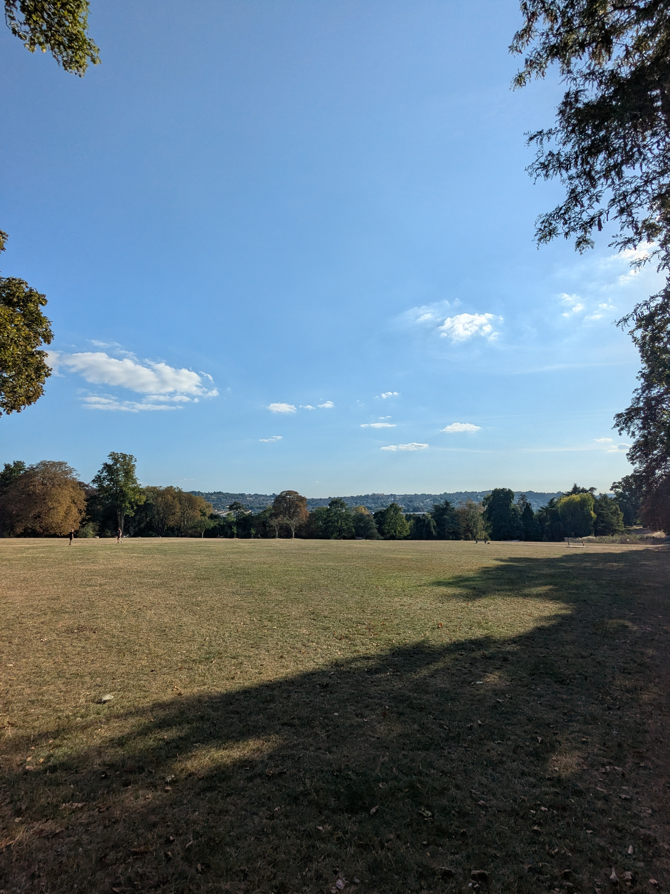

+++
title = "Bath Without Effort"
date = "2025-08-22"
draft = "false"
+++

This morning around 7 AM, an unprecedented question arises: is the last leg of the Cotswold Way worth it? The map shows crossing many roads, including the highway, and German hikers we met yesterday confirmed that the stage was "forgettable."

After some back and forth, our decision is made: we'll finish by bus and instead spend the day visiting the ancient city of Bath, which wasn't in the original plan.

The bus only takes an hour to get us into town; it's 8:30 AM when we arrive. We drop our bags at the YMCA so we can enjoy our stroll in peace. One small coffee later and we're already at the city museum, which hosts a very nice exhibition on Turner.
It feels good to be back in civilization!






The day flies by, between coffees and visits, walks and naps. Ultimately this rest day was essential — I'm exhausted. Tomorrow we set off again for Weymouth to walk a few days along the Jurassic Coast, but that's another adventure.

For now, the Cotswold Way is over..!

