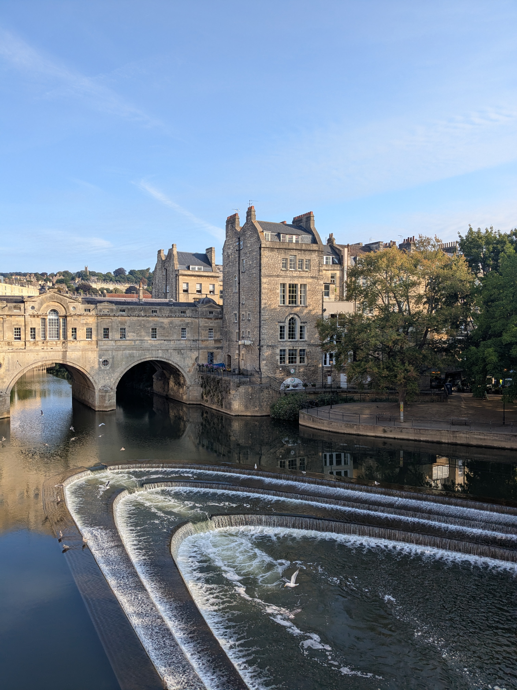
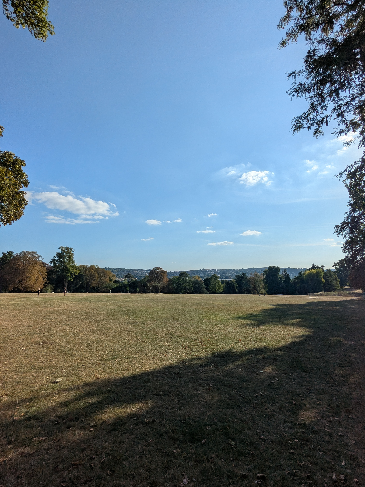

+++
title = "Bath sans effort"
date = "2025-08-22"
draft = "false"
+++

Ce matin vers 7h, une question inédite de pose : la dernière étape de la Cotswold Way vaut-elle le coup ? La carte indique la traversée de nombreuses routes, dont l'autoroute, et des randonneurs allemands croisés hier nous ont confirmé que l'étape était "oubliable".

Après quelques tergiversations, notre décision est prise, nous finirons en bus et profiterons plutôt de cette journée pour visiter la ville millénaire de Bath, qui n'était pas au programme initial. 

Le bus ne prend qu'une heure pour nous emmener en ville, il est 8h30 lorsque nous arrivons. Nous déposons nos sacs au YMCA afin de profiter tranquillement de notre balade. Un petit café plus tard et nous voilà déjà au musée de la ville, où se tient une très belle exposition sur Turner.
Il est bon d'être de retour dans la civilisation !






La journée s'écoule rapidement, entre cafés et visites, balades et siestes. Finalement cette journée de repos était essentielle, je suis épuisé. Demain nous repartons pour Weymouth histoire de marcher quelques jours le long de la Jurassic Coast, mais ça, c'est une autre aventure.

Pour l'heure, c'en est fini de la Cotswold Way..!

