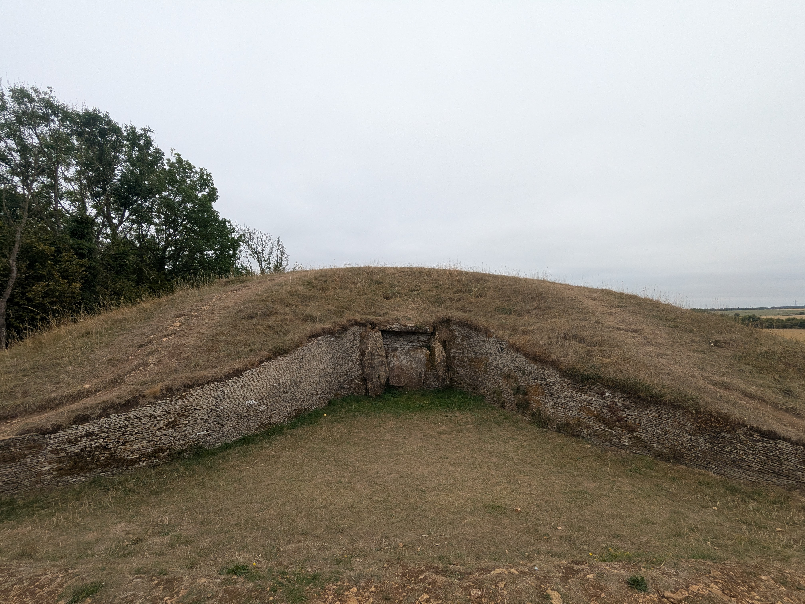
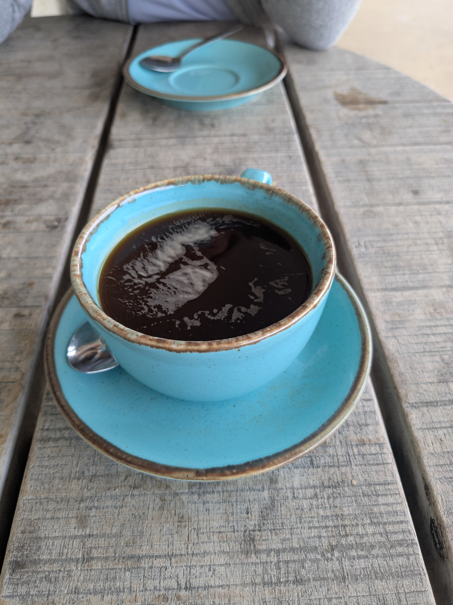
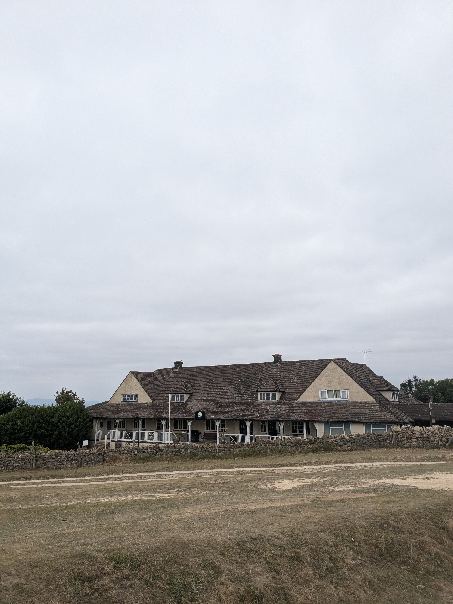
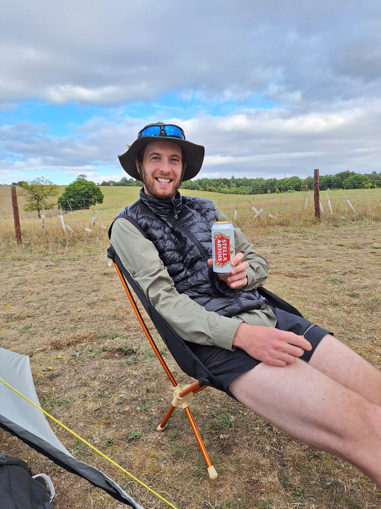

+++

title = "Kilometres on the Green"

draft = "false"

date = "2025-08-18"
+++

The night is excellent and the waking gentle, though the sun isn't playing along. We take the time to heat up coffee and prepare some porridge; the stage isn't that long and we want to enjoy the morning softness.

When it's finally time to leave, it's for a few quiet kilometres that take us to Winchcombe, a charming village in the same style as yesterday's, but noticeably larger.






We don't linger too long and instead set off to conquer a little local hill, atop which Neolithic ruins testify to ancient funeral rites in the region — and to a certain sense of architecture.

Long grassy paths wind through fields yellowed by the sun, and we regularly have to cross pastures again, whether occupied by sheep, cows or horses. It's surprising that no guidebook warns the hiker that they shouldn't be too sensitive to large furry mammals before undertaking this trail!






A large golf course, atop a hill, is the occasion for a well-deserved mid-trail coffee. It's quite cool and the wind is blowing; we take shelter and use the opportunity to have lunch.

The crossing of the green is punctuated by picking up broken tees, each more colourful than the last. We have fun trying to understand some of the symbols that adorn them.

A long descent back into the valley, then a climb through somewhat less pleasant woods unfortunately. The campsite is on the path; we don't have to make any detour today, and that's a good thing.

No sooner have we arrived than our charming Dutch neighbours offer us two cold beers, perfect for ending this beautiful day!

