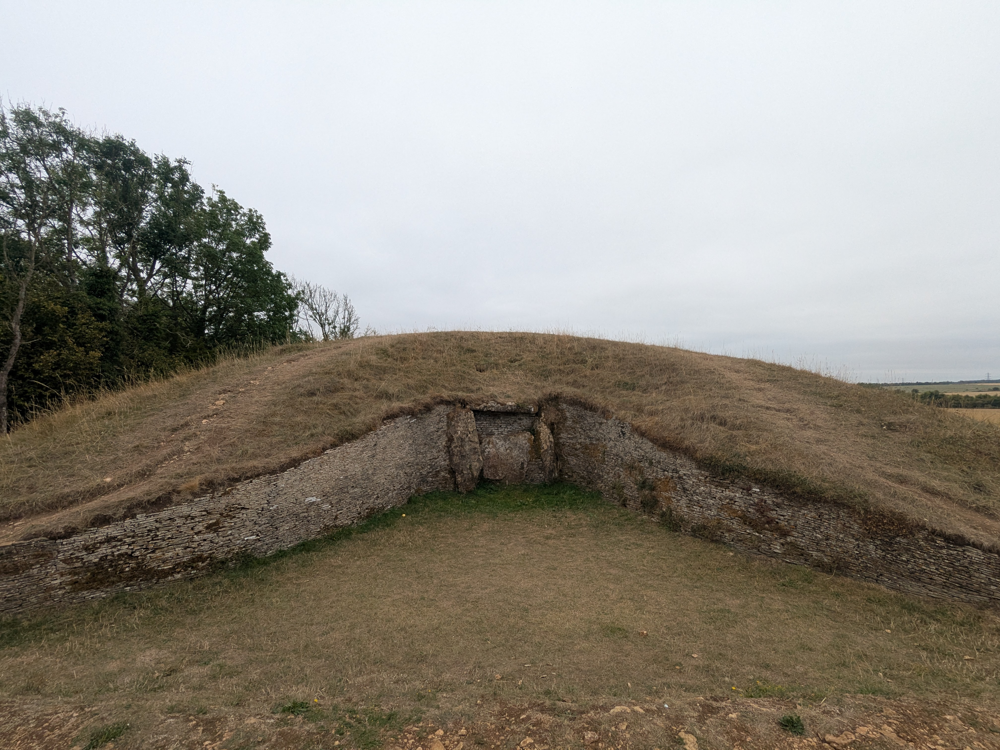
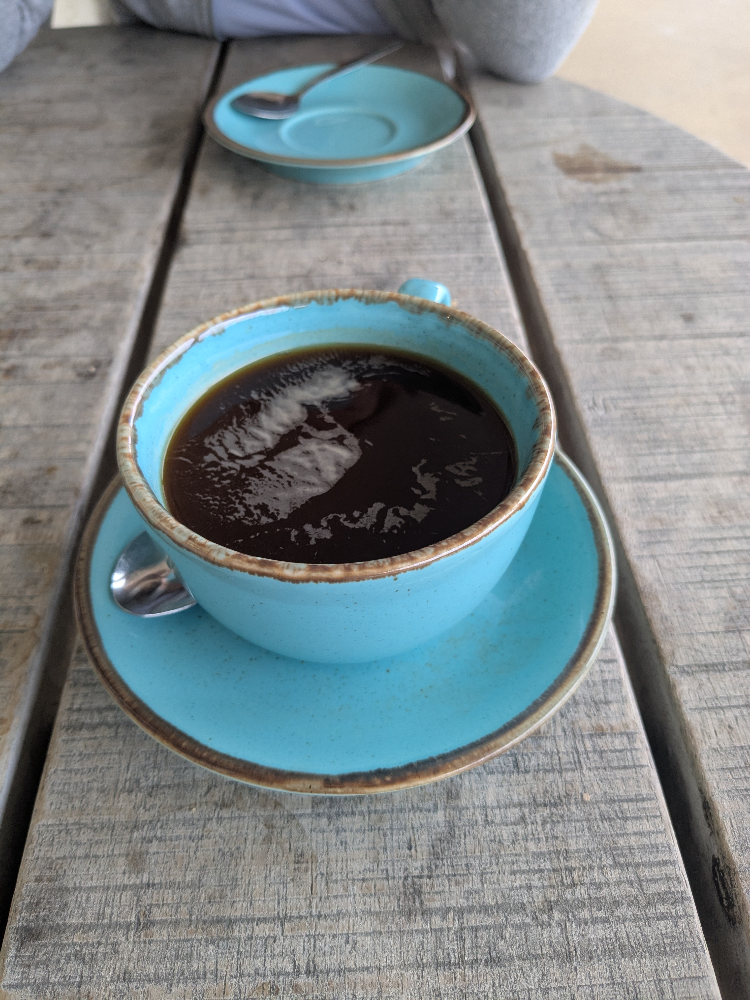
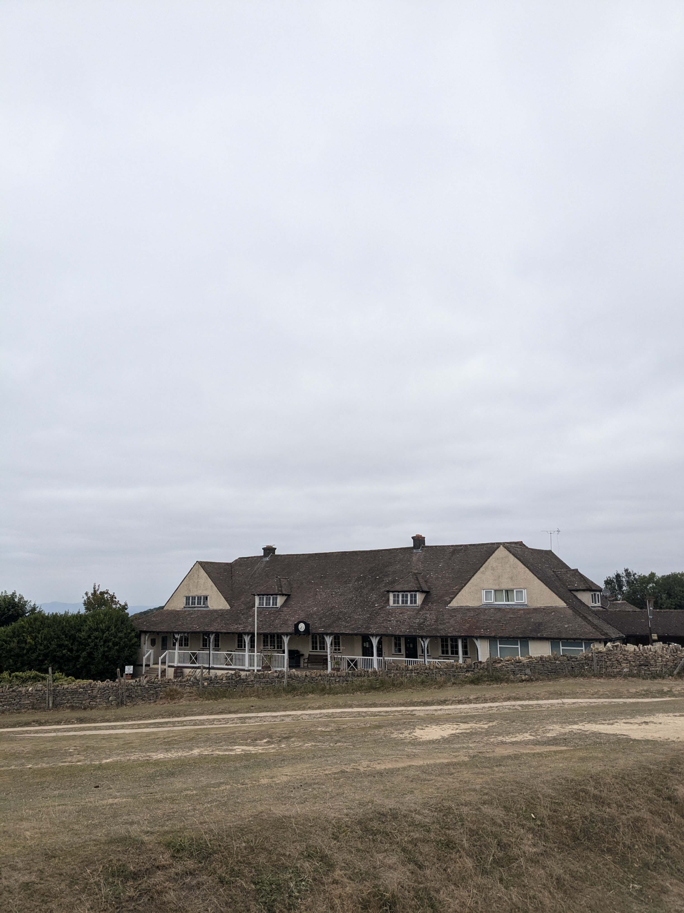
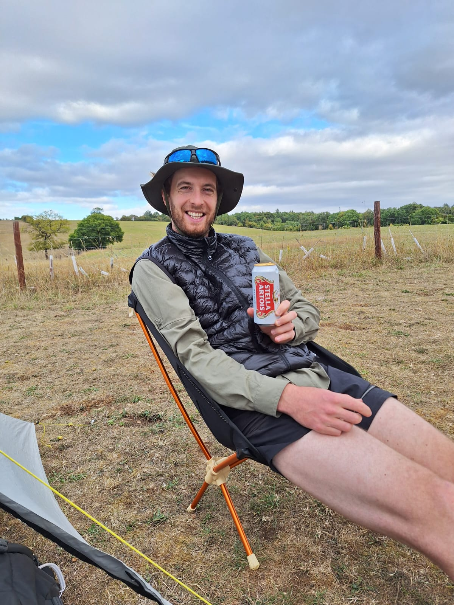

+++

title = "Des kilomètres sur le green"

draft = "false"

date = "2025-08-18"
+++

La nuit est excellente et le réveil doux, bien que le soleil ne soit pas de la partie. Nous prenons le temps de faire chauffer du café et de préparer du porridge, l'étape n'est pas si longue et nous voulons profiter de la douceur matinale. 

Lorsqu'il est enfin l'heure de partir, c'est pour quelques kilomètres tranquilles qui nous emmènent à Winchcombe, charmant village dans le même style que ceux d'hier, mais notablement plus grand. 






Nous ne nous attardons pas trop et partons plutôt à la conquête d'un petit mont local, en haut duquel des ruines néolithiques attestent de rites funéraires anciens dans la région - et d'un certain sens de l'architecture.

De longs chemins herbeux serpentent à travers les champs jaunis par le soleil, et nous devons à nouveau traverser régulièrement des pâturages, qu'ils soient investis de moutons, de vaches ou de chevaux. Il est étonnant de constater qu'aucun guide ne met en garde le randonneur qu'il ne doit pas être trop sensible aux gros mammifères velus avant d'entreprendre ce chemin !






Un grand golf, en haut d'une colline, est l'occasion d'un café de mi-parcours bien mérité. Il fait assez frais et le vent souffle, nous nous mettons à l'abri et en profitons pour déjeuner.

La traversée du green est ponctué de ramassage de tee brisés, plus colorés les uns que les autres. L'on s'amuse à essayer de comprendre certains symboles qui les ornent.

Longue redescente ensuite dans la vallée, puis remontée à travers des sous-bois un peu moins sympathiques malheureusement. Le camping est sur le chemin, nous n'avons pas de détour à faire aujourd'hui, et c'est tant mieux.

A peine arrivés que nos charmants voisins néerlandais nous offrent deux bières fraîches, idéales pour terminer cette belle journée !

