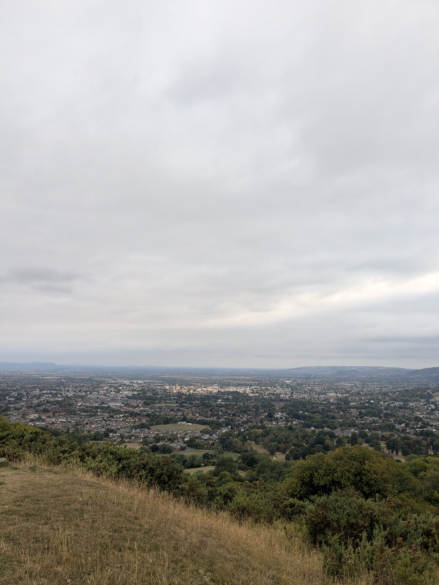
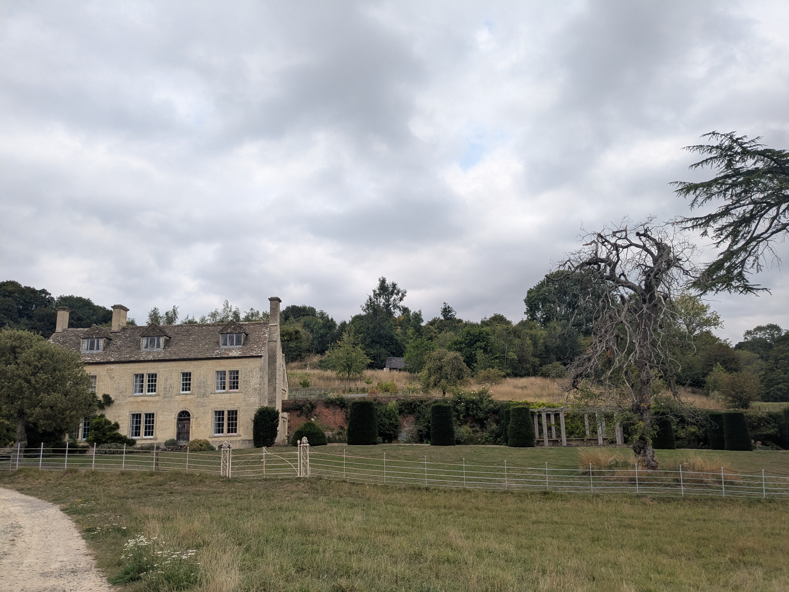

+++

title = "Damn Highway"

draft = "false"

date = "2025-08-19"
+++

The campsite's common room is an excellent reason to linger this morning over breakfast. It's warm inside and we're well settled.

When it's time to leave, unfortunately we're greeted by a dreary landscape of harvested fields, interspersed with busy roads. We quickly climb a hill, enjoying the nice view of the Gloucester basin.
<!--more-->

The descent hides another nasty surprise: a massive construction site and a highway, both producing an infernal noise. We try to escape it as quickly as possible via small detour paths.






As we cross another golf green, we decide to take a small shortcut to reach the campsite, rather than doing the big loop through Painswick. It turns out to be a good decision, as this path proves quite charming and we can once again enjoy the beautiful English countryside.






At the campsite, no miracle: we're once again... next to a road. Clearly, that was the theme of the day. While we curse at the passing cars, our friendly neighbours offer us chocolate bars "to go with the tea." Thank you to them for saving the evening, and bring on tomorrow!

