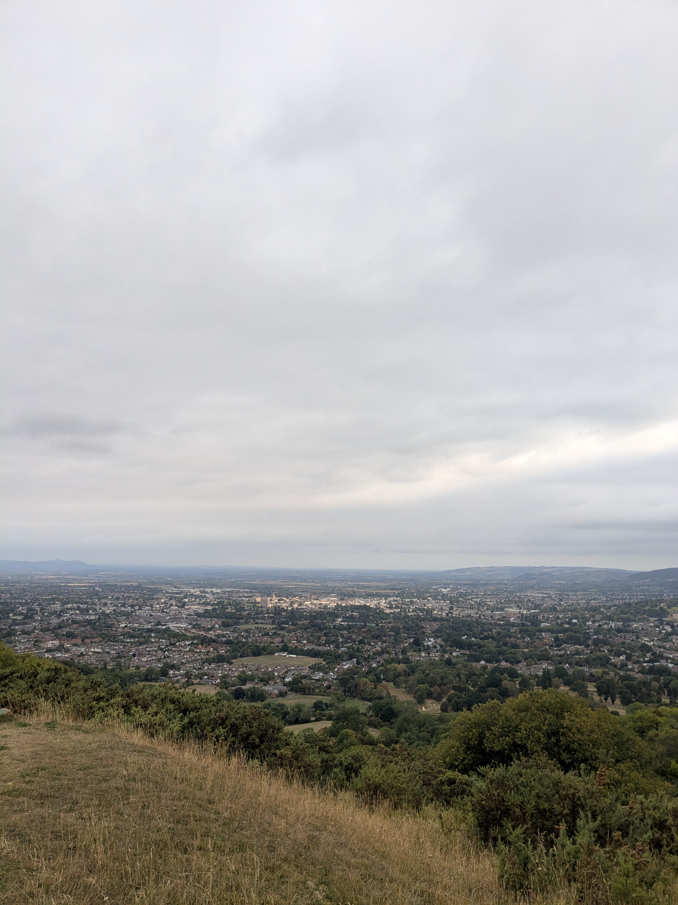

+++
title = "Fichue highway"
date = "2025-08-19"
draft = "false"
+++

La salle commune du camping est une excellente raison de traîner ce matin pour le petit déjeuner. Il y fait chaud et on est bien installés. 

Lorsque l'heure du départ sonne, c'est malheureusement pour nous faire découvrir un triste paysage de champs moissonnés, entrecoupés de routes fréquentées. On monte rapidement sur une colline, profitant ainsi de la jolie vue sur le bassin de Gloucester. 
<!--more-->

La redescente cache une autre mauvaise surprise, un chantier immense et une autoroute, qui tous deux produisent un bruit infernal. On essaie d'en échapper le plus vite possible par de petits chemins détournés. 






Alors que nous parcourons de nouveau un green de golf, nous décidons de prendre un petit raccourci pour rejoindre le camping, plutôt que de faire le grande boucle par Painswick. Bien nous en prend car ce chemin s'avère fort charmant et nous pouvons de nouveau profiter de la belle campagne anglaise. 






Au camping, pas de miracle, nous sommes de nouveau... à côté d'une route. Décidément, ça aura été le mot d'ordre de la journée. Pendant que nous pestons contre les voitures qui passent, nos sympathiques voisins nous offrent des barres chocolatées "pour accompagner le thé". Merci à eux de sauver ainsi la soirée, et vivement demain !

