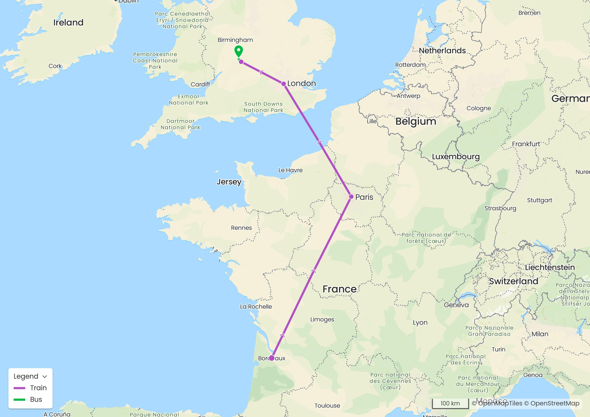
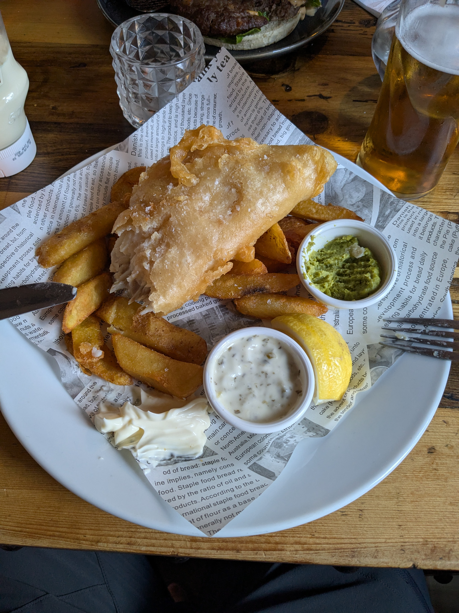

+++
title = "The Crossing of Paris (Among Other Things)"
date = "2025-08-16"
draft = "false"
+++

We decided, in an effort to reduce our carbon footprint — it's the done thing — not to take the plane to get to England. The prospect of taking the Eurostar for the second time in my life delighted me to no end, I must admit.
However, we're not simply going Paris - London, but Talence - Chipping Campden, and that's where the difference lies.
<!--more-->

Thus, having left home at five in the morning, we took, in order: a tram, a bus, the TGV, the metro, the Eurostar, the London Underground, another train, a shabby bus... And there we are!

What a pleasure, then, to arrive in this beautiful little village of Chipping Campden after those very long hours of travel — about eleven.






We are received royally at the Red Lion Tavern. Bags are quickly dropped; village tour, small errand, laundry, nap, dinner. We're exhausted from the journey and need to keep it simple and efficient.

We're counting on a restorative night's sleep to put us in the best conditions to tackle this beautiful hiking trail tomorrow morning, at dawn.

