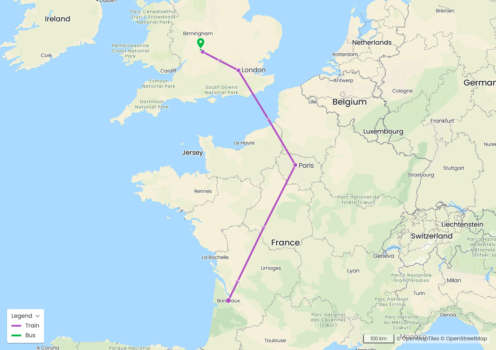
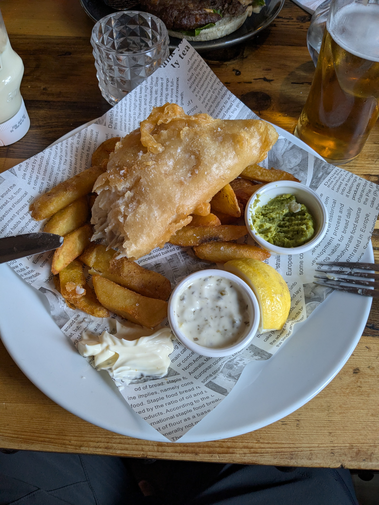

+++
title = "La traversée de Paris (entre autres)"
date = "2025-08-16"
draft = "false"
+++

Nous avons décidé, dans un soucis de réduction de notre empreinte carbone - c'est à la mode - de ne pas prendre l'avion pour nous rendre en Angleterre. La perspective de prendre l'Eurostar pour la deuxième fois de ma vie me réjouissais au plus haut point je dois l'admettre. 
Cependant nous ne faisons pas simplement Paris - Londres, mais Talence - Chipping Campden, et là est toute la différence. 
<!--more-->

Ainsi, partis de chez nous à cinq heures du matin, nous avons pris, dans l'ordre : un tram, un bus, le tgv, le métro, l'Eurostar, le métro londonien, un autre train, un bus miteux... Et voilà !

Quel plaisir donc, d'arriver dans ce magnifique petit village de Chipping Campden après ces très longues heures de voyage - onze environ.






On nous accueille royalement au Red Lion Tavern. Les sacs sont vite déposés ; tour du village, petite course, lessive, sieste, dîner. Nous sommes épuisés par la route et il s'agit de faire simple et efficace. 

Nous comptons sur une nuit de sommeil réparateur pour nous mettre dans les meilleures conditions pour attaquer ce beau chemin de randonnée demain matin, aux aurores. 

