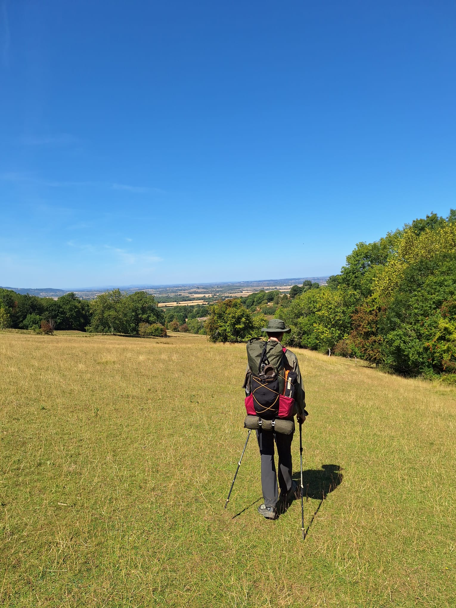
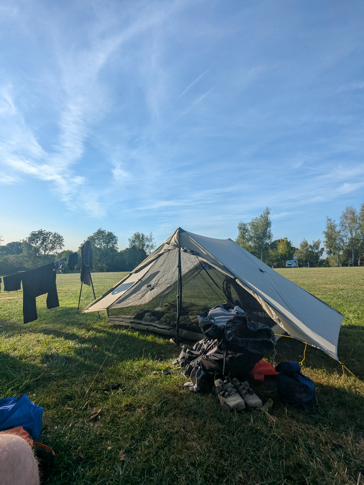

+++

title = "The Sun That Glitters and the Grass That Greens"

draft = "false"

date = "2025-08-17"
+++

Strange surprise upon waking today: the water is cut off in the whole village. Hard to make breakfast (usually porridge) or even do a bit of washing.

We buy two litres of water at the grocery store, where we run into many locals, just as puzzled as we are.
<!--more-->

Little grassy paths take us to Broadway Tower and we discover the landscapes that will probably be the backdrop for the week ahead: old rounded hills, gnarled oaks, yellow and muddy meadows. We amuse ourselves with the numerous gated passages that take us across countless pastures. The sheep watch us hike peacefully.






A proper breakfast (read: scones) sets us right again for the rest. And it's just as well, because a nice climb awaits us, at the top of which is a viewpoint.






Descent to Stanton, sleepy from the heat, then climb again... Then descent again. You quickly understand that this will be the lot of this trail: a myriad of small climbs, seemingly gentle but sometimes treacherous, especially under the sun. The English are appalled by this "gorgeous weather."

The day ends at the Hailes fruit farm campsite, where we pitch our tent and set up our newly acquired "hiking chairs" — which we cursed when they were in the backpack and now bless.

The day has been long but quiet, made difficult only by the lack of water. A quick game of Yams and off to bed!

