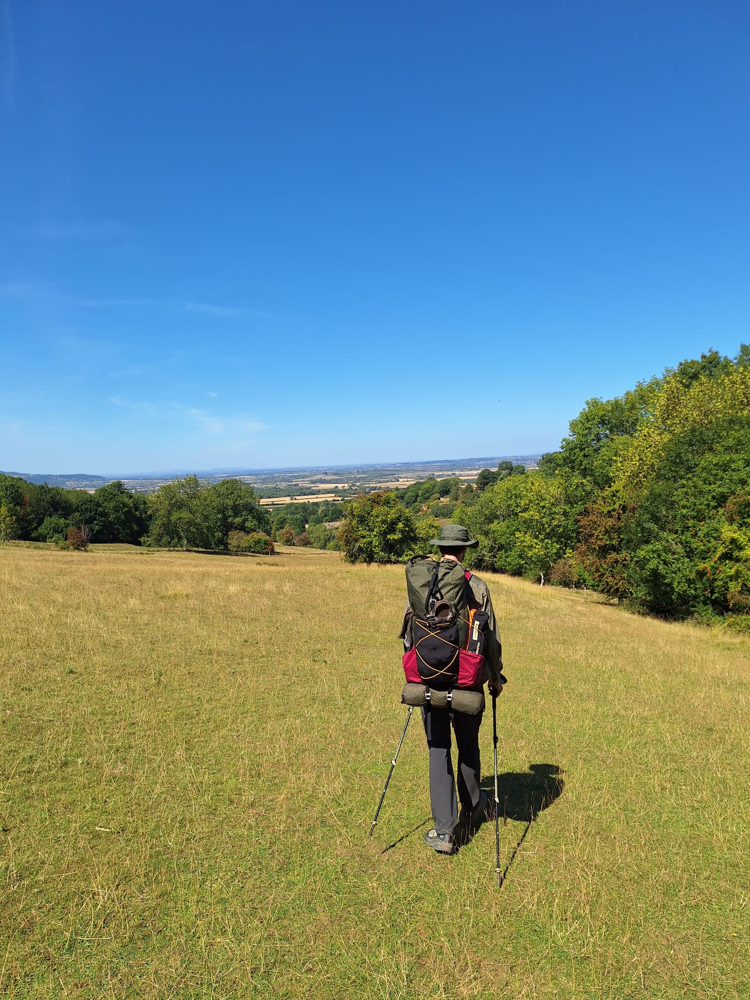
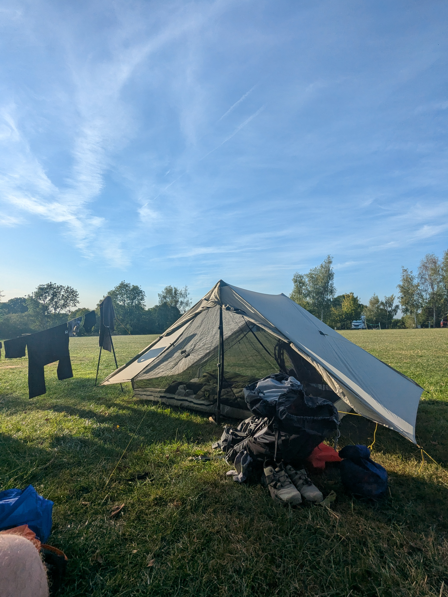

+++
speed = "3.076734"
title = "Le soleil qui poudroie et l'herbe qui verdoie"
gps = "Le soleil qui poudroie et l'herbe qui verdoie.png"
draft = "false"
distance = "26430"
elevation = "614"
duration = "8:35:25"
date = "2025-08-17"
+++

Drôle de suprise au lever aujourd'hui : l'eau est coupée dans tout le village. Difficile de faire un petit déjeuner (a base de porridge normalement) ou même un brin de toilette. 

Nous achetons deux litres d'eau à l'épicerie, où nous croisons nombre d'habitants, tout aussi circonspects que nous.
<!--more-->

De petits chemins herbeux nous amènent à la tour de Broadway et nous découvrons les paysages qui seront probablement le décors de la semaine à venir; vieilles collines rondes, chênes noueux, prairies jaunes et crottées. Nous nous amusons des nombreux passages, clôturés, qui nous font traverser d'innombrables pâturages. Les moutons nous regardent randonner paisiblement.






Un petit-déjeuner en bonne et due forme (comprendre : des scones) nous remet d'aplomb pour la suite. Et il vaut mieux car une belle montée nous attend, en haut de laquelle un point de vue. 






Redescente vers Stanton, endormi par la chaleur, puis remontée... Puis redescente. On comprend vite que ce sera le lot de ce chemin, une myriade de petites montées, d'apparence tranquilles mais parfois fourbes, surtout sous le soleil. Les anglais sont atterrés par ce "gorgeous weather". 

La journée s'achève au camping de la Hailes fruit farm, où nous posons notre tente et nos "chaises de randonnée" nouvellement acquises et contre lesquelles nous avons pesté lorsqu'elles étaient dans le sac à dos et que nous bénissons maintenant. 

La journée a été longue mais tranquille, rendue difficile seulement par le manque d'eau. Une petite partie de yams et au lit !

