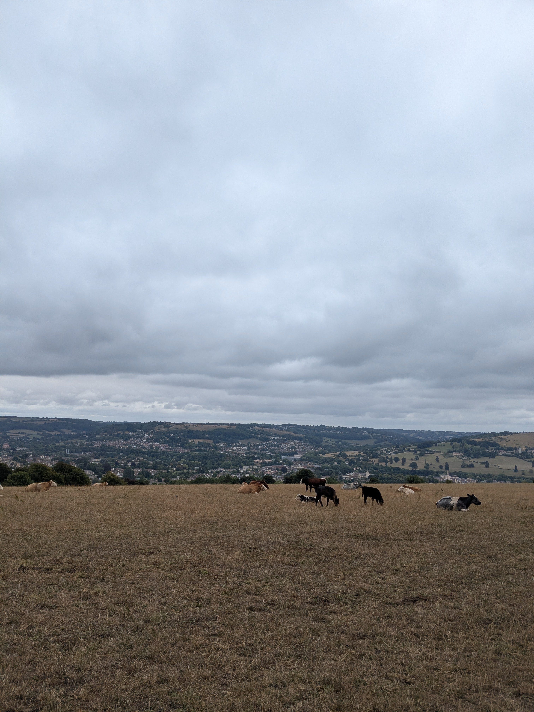
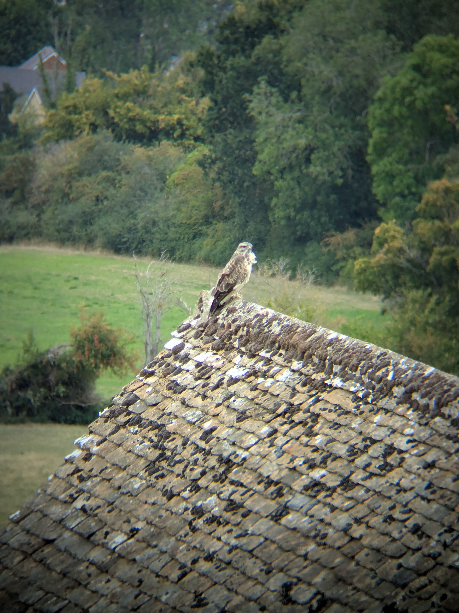
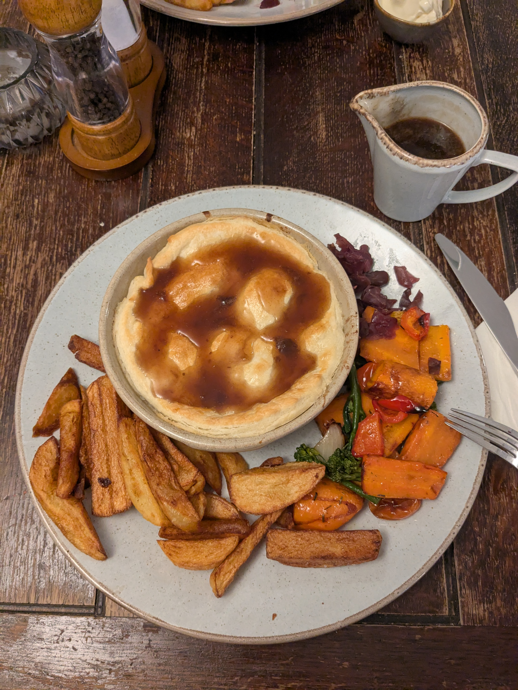

+++

title = "Comfort at Uley"

draft = "false"

date = "2025-08-20"
+++

The night was finally excellent — thanks to earplugs — and the mood is frankly very good this morning, especially since we know we'll be able to have a proper breakfast in three kilometres at Painswick.
<!--more-->






After a few dozen minutes of a gentle descent through fields (and a very wide detour around a bull), we arrive at the village. The houses are charming and there's a convenience store where we finally stock up on supplies. Next we need to find the little saving grace of a café, which we manage without trouble. We're served a black coffee and a hot chocolate, some sweet treats, and we can finally enjoy the warmth and calm.






When it's time to leave, a fine drizzle sets in and we put on our raincoats. It won't be enough to discourage us: the morale is excellent. Once again, many crossings of very beautiful pastures, meticulously maintained farms.

Lovely forests provide pleasant breaks, especially since we stocked up on sweets at the grocery store; we never tire of it.






Crossing a farm with a stone roof even gives me the chance to use my newly acquired binoculars to observe some birds of prey!

The descent to Uley is steep, but no matter, we know that an inn awaits us there — and not just any inn, according to the testimony of an old local Englishman (and his greyhound): "the best around."

We are indeed received like royalty in this low-ceilinged inn, with exposed beams, smelling of freshly brewed Ale. A good shower and a quick visit to the village later, and we're seated at the table, ready to savour the traditional _pie_, here with beef marinated in beer.

A last half-pint of a local beer closes this trouble-free day. We need to build up strength before the long marathon that awaits us tomorrow!

