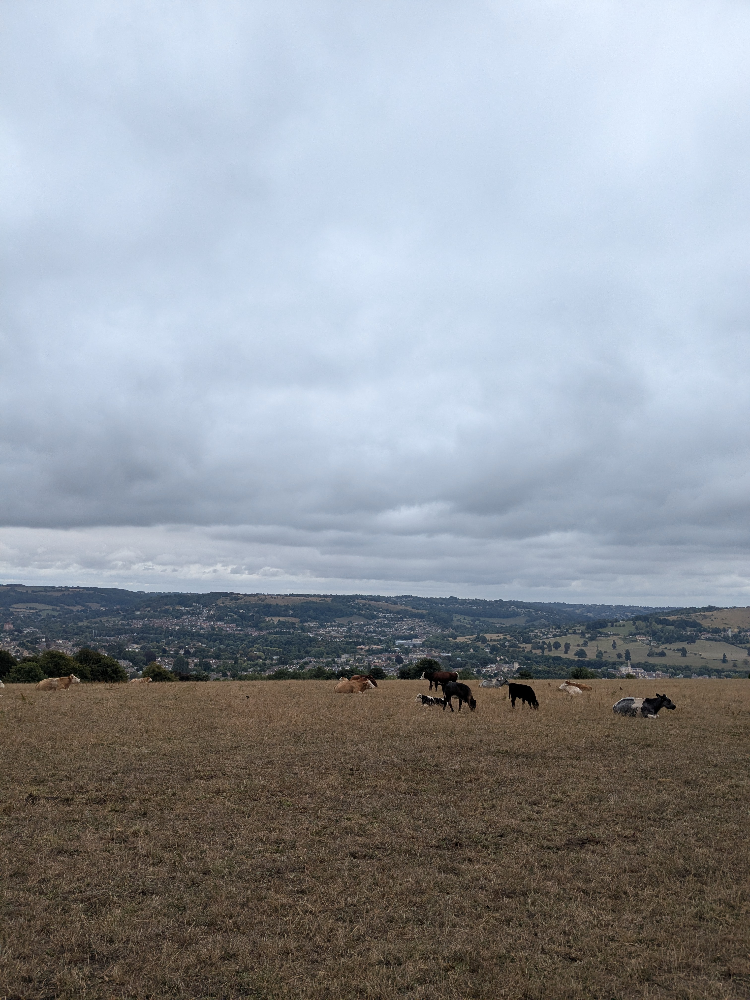
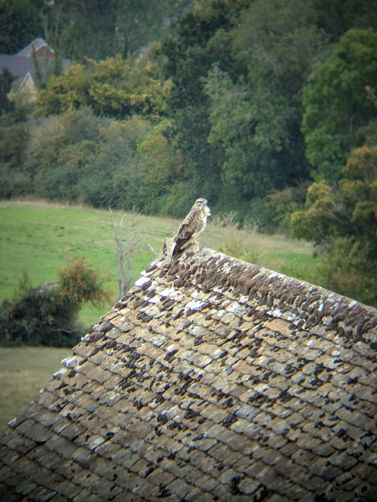
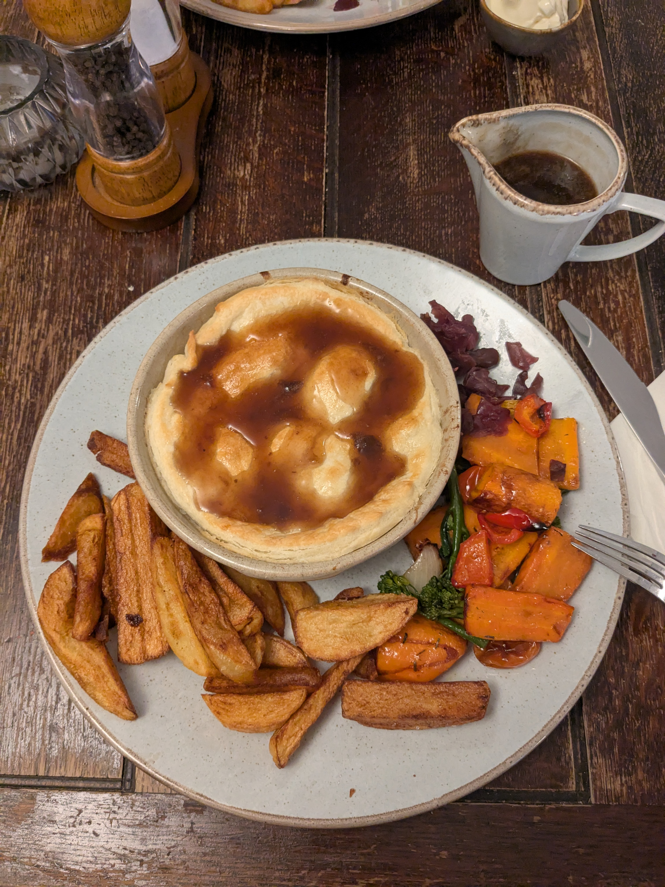

+++
speed = "2.9217908"
title = "Réconfort à Uley"
gps = "Réconfort à Uley.png"
draft = "false"
distance = "26176"
elevation = "558"
duration = "8:57:32"
date = "2025-08-20"
+++

La nuit a finalement été excellente -grace aux bouchons d'oreille- et l'humeur est franchement très bonne ce matin, d'autant que nous savons que nous pourrons prendre un petit déjeuner digne de ce nom dans trois kilomètres à Painswick.
<!--more-->






Après quelques dizaines de minutes de descente tranquille à travers champs (et le très large contournement d'un taureau), nous voilà au village. Les maisons sont charmantes et il y a une supérette dans laquelle nous faisons enfin des provisions. Il s'agit ensuite de trouver le petit café salvateur, chose faite dans encombre. On nous sert un café noir et un chocolat, quelque douceurs, et nous pouvons finalement profiter de la chaleur et du calme. 






Lorsqu'est ventu le temps de repartir, une bruine fine s'est levée et nous enfilons les imper. Ça ne suffira pas à nous décourager : le moral est excellent. Une fois encore, beaucoup de traversée de très beaux pâturages, de fermes méticuleusement entretenues. 

De jolies forêts sont l'occasion de pauses agréables, d'autant que nous avons fait le plein de confiseries à l'épicerie ; on ne s'en lasse pas. 






La traversée d'une ferme au toit de pierre m'offre même l'occasion d'utiliser mes jumelles nouvellement acquises pour observer quelques rapaces !

Le descente vers Uley est abrupte, mais qu'importe, nous savons qu'une auberge nous y attend et pas des moindres, selon le témoignage d'un vieil anglais du cru (et de son lévrier) : "la meilleure du coin".

Nous sommes effectivement reçu comme des princes dans cette auberge basse, aux poutres apparentes, qui fleure bon l'Ale fraîchement brassée. Une bonne douche et une rapide visite du village plus tard et nous voilà attablés, prêts à déguster la traditionnelle _pie_, ici au bœuf mariné à la bière. 

Un dernier demi d'une bière locale vient clôre cette journée sans écueils. Il faut prendre des forces avant le long marathon qui nous attend demain !

