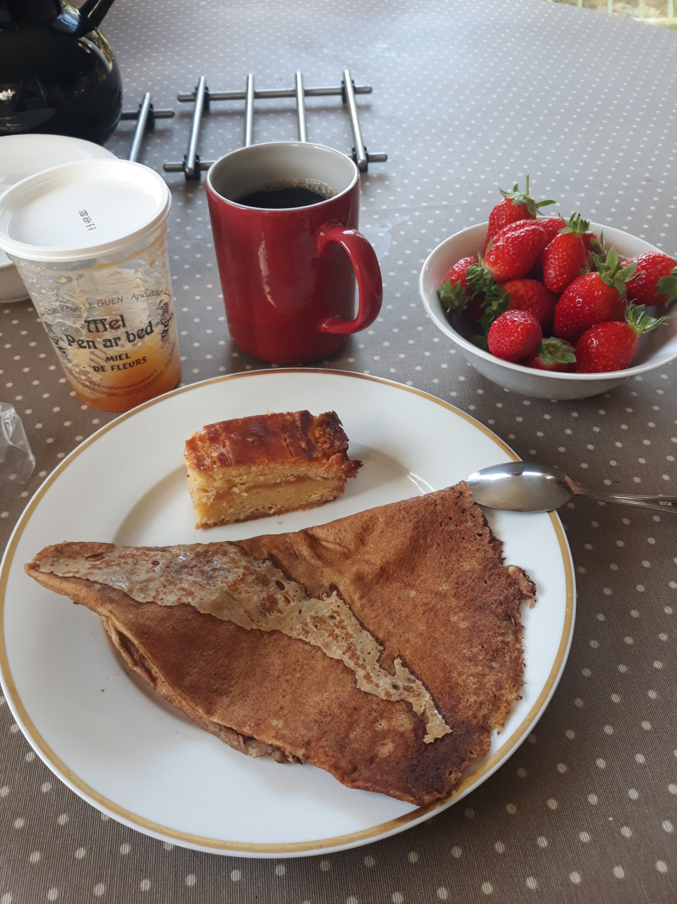
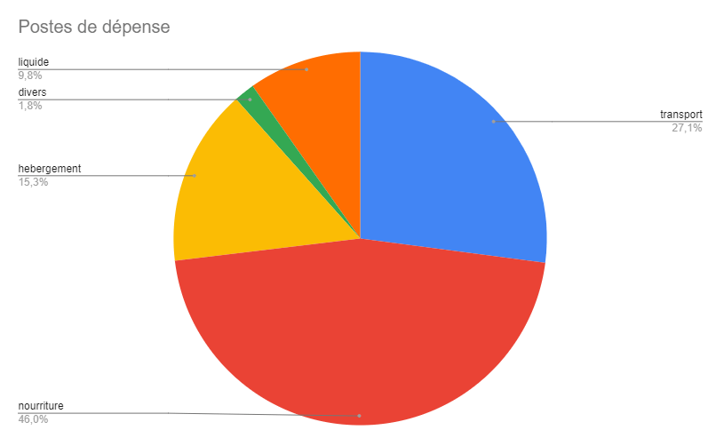

+++
title = "Assessment"
date = "2022-08-20 10:17:16.383389"
draft = "false"
+++

It's time to take stock of this great adventure of summer 2022. Beyond the whole palette of emotions that the trip gave me, I must say that I'm relatively satisfied with the sporting performance itself.

I would have liked (but isn't it always the case?) to go further, faster, pedal longer. I sometimes pushed my physical and mental limits, sometimes decided to take time, to rest, to visit.

In the perspective of the NorthCape4000, a great race connecting the north of Italy to the North Cape in Norway in which I want to participate, this training has been beneficial to me in many aspects. I now know where my limits are in terms of time spent on the saddle and comfort, especially when bivouacking.

I have one year left to try to improve, before enlisting in the next edition in July 2023.

From a material point of view, I'm quite satisfied with the latest improvements made to the bike and camping gear, but I still want to do better. My large green panniers take up too much space, aren't aerodynamic.

I'm already working on my next travel bags, which remember, are "homemade".

From a physical point of view, the areas for improvement are very simple to implement, in theory (in practice, it'll be hell, for me). I need to lose weight (86 kg to drag uphill is no longer possible) and especially improve my energy consumption.

I think I "eat too much" on the road, which forces me to frequent stops. This is due in particular to my bad habits in terms of daily diet, but also to my way of pedalling on the bike (position not aero enough, muscles not prepared enough) which makes me consume too many calories.

Only regular training during the coming year and a more rigorous diet will allow me to improve these points. But will I find the motivation? To be continued.

From a financial point of view, the trip was, let's say it, a money pit. If you think travelling by bike doesn't cost much, you're royally deluding yourself. The trip cost me, transport, food, accommodation included... €1,900. Hard to believe? Me too.

The main expense, I think it's easy to guess if you followed the adventure, is food (about €900). With the numerous stops at overpriced service stations, the few restaurants and, in general, my very high consumption of foodstuffs, nothing surprising in this number.

Let's not forget that I left for 27 days after all! Despite everything, this is an important area for improvement for future adventures. I hope precisely, with new bags, to be able to carry more food with me and thus reduce stops at small expensive grocery stores.

Second expense, and it's a surprise, transport (about €530). Between the outward journey from Bordeaux to Portsmouth then the return from Cork and the numerous coaches, trains and ferries, it ended up costing me an arm and a leg. Unfortunately, not much to do about this, it's part of the trip.

Finally, accommodation (about €400). I who wanted to bivouac as much as possible... That failed! For now, I really struggle to go settle in a field, after 9 hours spent pedalling, without toilets, nor shower, nor shelter.

If during my Gironde escapes, this poses no problem for me, the fact of knowing that I'm returning to my cozy apartment at most one or two days later gives me the courage to accept the discomfort of bivouacking. In conditions such as this summer, it's more complicated.

Once again, it's a question of mindset and I think a little work on myself is needed so that I'm capable, in the future, of accepting these somewhat Spartan living conditions (even if it means occasionally taking a campsite pitch, despite everything).

Then come some miscellaneous expenses that I couldn't categorise and which aren't necessarily specific to the trip, but simply to everyday life. The small pie chart attached contains this information, except that the "cash" part doesn't include all the nights I paid "cash", not easy to always remember where the green notes went during the trip...

To conclude, allow me to thank one last time all those who made it possible for me to realise this somewhat crazy adventure: first of all, my parents, it's obvious, for their unconditional moral (and financial) support.

Then, my family and dear friends who, privately as on this blog, sent me many messages of encouragement. You have no idea how a little note warms the heart when you're soaked, with your spirits in your boots.

Finally, my dear bike shop owners, Myriam and Olivier, whom I won't fail to visit as soon as I return to Bordeaux, not only to thank them, but also to entrust them with my poor bike, which badly needs a bit of attention. Thank you all!

## Comments

#### Dad
Every problem offers solutions. I can modestly contribute to the edifice.
1- You can continue eating quietly because I propose to make you a small sign to hang behind the Italian jersey "Caution, frequent stops".
2- Moum has trouble telling you, so she contacted me and we agreed to consider that 10% of expenses in cash (beer I imagine) is too much.
3- For finances, a solution: sponsorship.
- Number one, "one point" of course.
- The brands redundantly displayed on the blog: "Irish Flapjack", "Philadelphia"...
You see, solutions exist, simple to implement...
So looking forward to NORTHCAP!!!!!!! and a big thank you to you too for this blog.

#### Damien le Belge
Very interesting these reflections! If I can contribute: eating a lot during the trip is inevitable. Especially in ultra-cycling, performance is roughly equivalent to the ability to digest + ride :D What makes a big difference though is carrying food and consuming continuously while riding. I find the time gain and energy regularity really appreciable! And for a reference point (for what it's worth) on a trip like this in England I was constantly eating ~550 kcal/hour of pedalling (+2,000 more each evening).

And for the bags, having tried a bit of everything on my side, I'd advise you to think about a full triangle frame bag. You don't see tons because everyone has a different shape/size, so it needs to be custom-made to be well done, but in your case that's precisely not the problem! Good prep :)

#### Moum
If I may add a little grain of salt to the edifice, I'd say I have a regret, a lack of reactivity that I can't forgive myself... Positioned in a good spot, on the hill where we live, I was about to immortalise the moment of your arrival but I didn't have time to press the shutter of an unforgettable photo, before you were already jumping off your saddle...! I didn't have the heart to ask you to redo this climb standing on the pedals as we used to say but I can testify that despite your fatigue, you're in Olympic shape!
Bravo Ivan and thank you again for this story!!

#### Nicolien
Super interesting the point on expenses, I thought exactly that bike travel was very economical.
To limit food expenses, maybe eat survival rations from time to time, it's not super fun taste-wise but it takes little space and keeps very well.
Also drink your urine to save on liquids notably.
