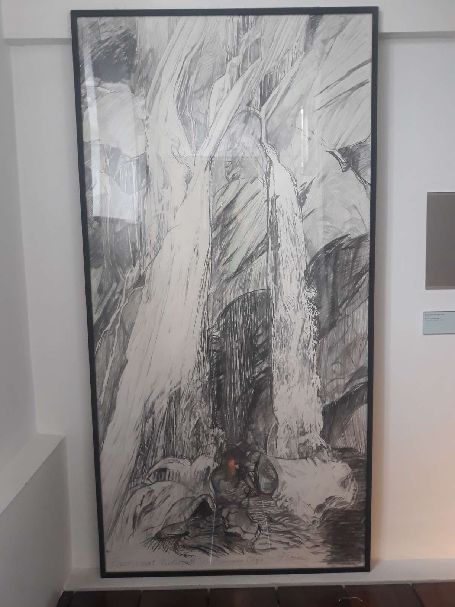
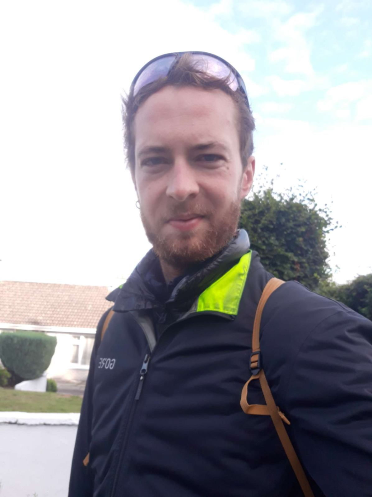

+++
title = "Cork City"
date = "2022-08-16 20:37:13.546640"
draft = "false"
+++

Today, visiting Cork on the programme. The night was restless, the wind blew terribly hard, lifting the tent and whipping my face. I managed to sleep, but less peacefully than usual and I was a bit cold.

Early rise, breakfast with lots of peanut butter (need to lighten the bags!). I walk down to Blarney to take the bus and thus avoid dragging my cumbersome bike around all day.

Arrival in the city, I'm a bit lost. My cyclist look is a bit out of step with the nice suits or chic casual outfits around me. I wander for a while, before deciding I'll visit the tourist office.

I gather all the necessary information, then go drink a coffee to plan the day. So it'll be postcards first, fine arts museum then wandering from monument to monument.






Cork is pretty and lively but to be perfectly honest, I get bored quite quickly. The smell of fresh hay and cow dung has been replaced by that of exhaust fumes and elaborate perfumes. I don't quite feel in my place.

The museum is interesting, not very big, I've quickly gone through it. Damn, I'm outside again. It's frankly cold today, the wind is still blowing.

I go buy some small drawing supplies (a micron pen, coloured pencils and a tiny notebook). I'm very happy with the shelter I made myself and already have lots of new sewing ideas, I want to put some sketches on paper.

I have lunch on a shopping street; an old man shouts in the street for a good hour without pausing, cars honk, phones ring. Where has the calm of the countryside gone?






Finally visiting a few monuments; cathedrals, castles and belfries follow one another. I don't want to return too late (I have more than an hour of road) because I absolutely must repair my inner tube, I don't want to struggle during my stage in Brittany.

Little bus ride, little shopping, little walk, I'm back at the campsite. I do my repair while drawing between each patch drying (and there are many!).







I'm exhausted, at least as much as after a day of cycling. I think the night will still be a bit tough, but tomorrow is a very short day.

I have about 30 km to the pier and the boat doesn't leave until 4pm. Plenty of time to refine my drawings and finally open the book that's been languishing at the bottom of my bags.

## Comments

#### Moum
Ha! Ha! What a look! It's true, seen like that, real froggy legs! I still laughed reading you, Ivan and discovering this first photo but when I saw your little eyes 🥹... I measure your fatigue and the energy that this heroic odyssey demanded! So, courage! Savour your last kilometres on Irish soil thinking that you're going to sleep dry now and in a good bed soon!
Keep thinking of your kouign-amann which is waiting for you... ! 😘

#### Yann
Ivan!
I think I'm like you ;)
The smells, the noises and the hyperactive animation of the city really push me to prefer the calm of the countryside, the birdsong, and even the smells of livestock :D
Your fatigue is still very visible. You'll need rest, which will be well deserved, and certainly filled with the images you've been able to imprint in your brain these last fifteen days.
Once again, bravo and a big thank you for sharing
Bises

#### Dad
Well well, is it now that we say bravo!
I dare not, because of the terrible entrenched camps with their holidaymakers, that you'll have to cross...
Last information before facing these indomitable little granite villages...
Since you left, everyone has taken on Roman manners and now drives on the right. Then they limited the speed to 80 km/h, a few legionnaires check you don't exceed it...
If you're thirsty, avoid drinking their cervoise, they make it with apples and it's very tart...
Last recommendation, they have bards who blow into what they call: a bombarde... when you see them, put your earplugs in...
Come on son, courage!
