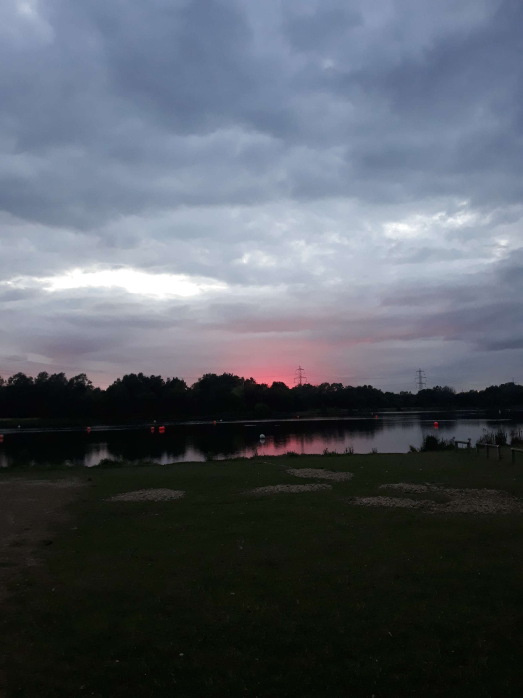
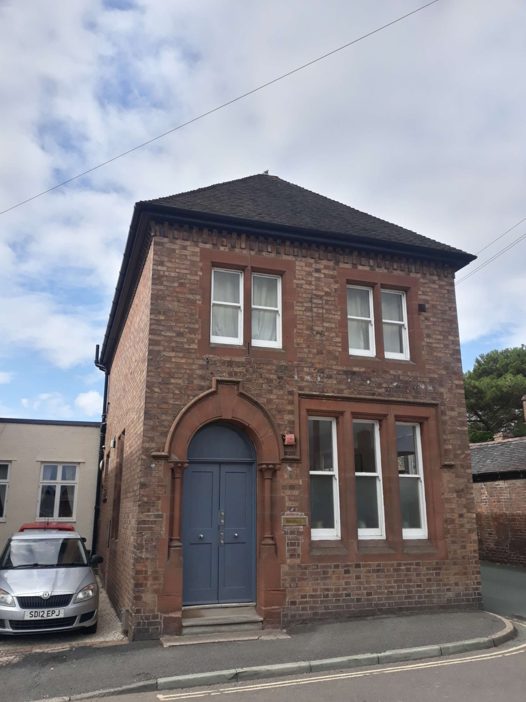
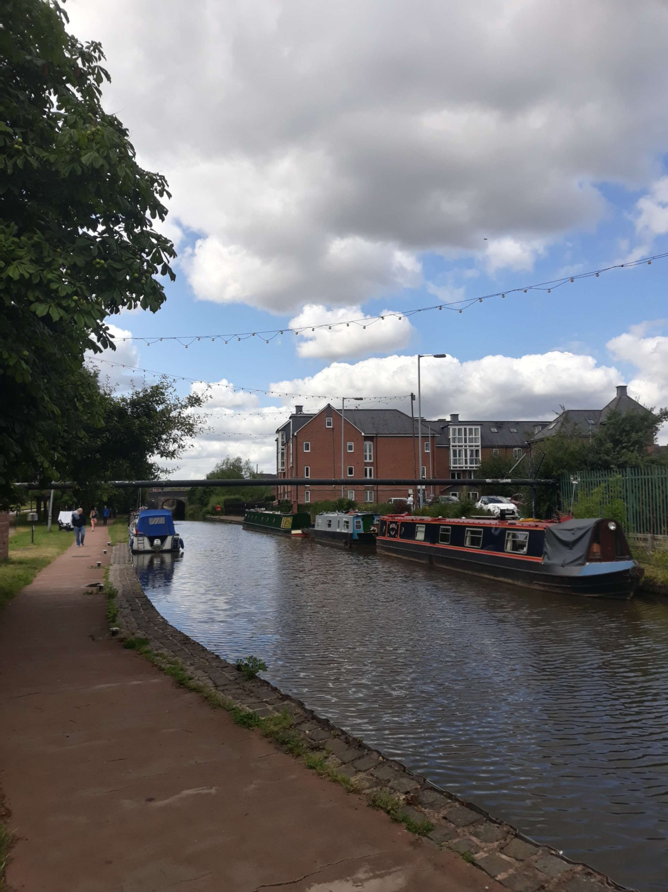

+++
title = "Craven Arms - Chesterfield"
draft = "false"
date = "2022-07-26 22:48:16.562444"
+++

Apparently invigorated by my famous evening yesterday, I decided this morning to take all my time before starting to pedal (it's holidays, isn't it?). Except leaving at 8:30am to do 200 km... that doesn't work, elementary my dear Béthus.

I try to enjoy the "little" elevation of this stage to make up for my slight delay from previous days.
<!--more-->







Shortly after noon, a violent urge for a nap pushes me to go kiss the nettles (the local press claims it was actually a loss of control of my bolide - where's the evidence?!). After this painless wipeout, I set off again nevertheless with one less lens on my glasses. It will fortunately be glued back on some 100 km later.

Nice stretches along the canal, unfortunately the path is very, very narrow. Often only about one metre wide. Needless to say, the scared grannies with their poodles, I kind of want to send them to test the water temperature.

The enormous roots lifting the tarmac brought me into an ever more intimate phase in my relationship with my bike. Cream will be in order tonight.

Finally, after nearly 30 km (!) of canal, I finally arrive at Leek, a magnificent little town, with its charming pubs. In one of them, I ask some locals for the best road to Chesterfield, because the GPS shows an elevation I'd like to avoid.






It's already 4pm, I've only done 130 km. They look at me a bit hilariously (I'll understand why afterwards) saying that, no, there's no way to avoid it. Small disappointment; they firmly believe I won't make it "before one in the morning".

We talk a bit about my trip and when I leave, closing the door, I hear one of them: "Bloody hell, he's a tough one!". That makes me laugh and boosts my morale, given what I still have to face (by the way, their accent is already thick as a knife, I'm afraid of what awaits me up north).

Indeed, leaving Leek by the north means arriving in... the Peak District, which lives up to its name! A series of climbs follow, including one of almost 1 km at 12% average, I nearly died there (besides, there's no photo, too hard).

The landscape is however magnificent, more beautiful than anything I've seen so far. After still quite a lot of effort, I finally arrive at Chesterfield. From there, rain starts to fall and light fades; I know I must find somewhere to sleep.







After about twenty kilometres, I finally reach a campsite I had spotted. Unfortunately, it's 9pm and I get turned away, despite my insistence (seems crazy, right??).

I go back to the lake overlooking the campsite to set up camp on the shore. The night will be very short, the place is touristy, I must leave early this time.







Tomorrow, heading to the Lake District!







## Comments

#### Moum
I hope you were able to recover Ivan! Not very friendly the camping with the English... Anyway it's not your first wild bivouac experience... Still disappointing... Well, I assume you're learning from this all-out start, 200 km/day, every day, it's huge given the conditions! You'll have to spare your mount and your body a bit at the start of the trip, won't you...? Anyway, bravo for this feat! I hope you'll have a bit more clement weather, heading north who knows?!
You are really a tough one! Hey!

#### Teunteve
We suffer with you Ivan! 🤣 We pulled out the atlas to follow your journey a bit better... Well the English have a peculiar sense of hospitality but you won't find that at all in Ireland where people go out of their way to help.
Anyway it's quite a challenge you've set yourself... From Saturday we'll follow your adventures as a family since we're heading to Ardèche for a week with the 3 daughters, sons-in-law and grandsons.
Good luck kisses

#### Dad
What adventures!!
Bravo "tough guy", though cooking in the Midlands is hard!
Little remark: we don't see many vegetables in your meals... I hope you're maintaining your dietary balance... 😉
We eagerly await photos of the Lake District, especially those of campers in diving suits (remember!) 😄
Come on son, dig in!!

#### Sandrine
"Ivan straight ahead" will now be your nickname! Not bad for a tough guy? Anyway (this time I didn't fall for the intuitive writing!! 😉) you impress not only the pub customers! And we never tire of reading your new article every evening! What a thrilling adventure!
Courage to you!
