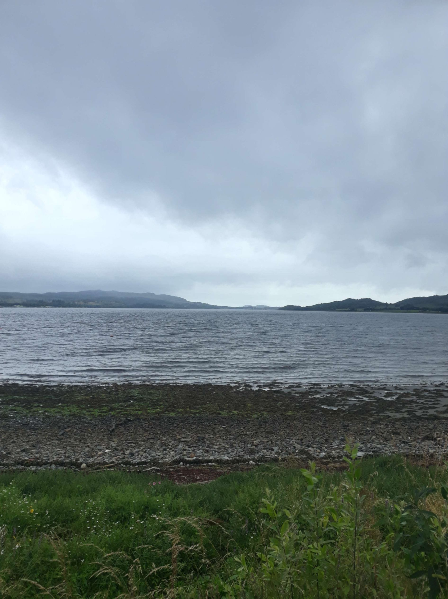

+++
title = "From Inverness to Oban"
draft = "false"
date = "2022-08-02 21:36:50.474611"
+++

At the Inverness campsite, it's a bit of a sausage party. By which I mean that apart from me, there are only Germans.

While it's public knowledge that I have certain affinities with our Teutonic neighbours, I fear I won't much appreciate sharing the road with their large pearly-white Wohnwagens. So I decide to leave as early as possible to head along Loch Ness towards the southwest, with Oban as my objective, which will make a good stopping point before my descent to Glasgow.

At 6:30am I'm off, full of enthusiasm. The first half hour is stunning. Hard to take your eyes off the immense oil-blue expanse sleeping at the bottom of the valley.

Soon, however, a few flecks of white foam disturb the surface. Discreet drops prepare me at the same time for what's to come.







Shortly after 8am, a dense fog swallows lake and forests, rain falls, wind rises, it's the beginning of the ordeal. I struggle to climb the local little hill, barely 5% average, I'm on the smallest cog, the wind, always it, would almost send me back where I came from.

Needless to say, the view from the top is limited to a few fluffy clouds settled on the peat bogs. Even in the descent I have to pedal to move forward, I'm fuming! Nessie must be having a good laugh, at the bottom of her lake.







It's so hard to advance that I quickly sacrifice the peace of the towpath to stay on the main road. I prefer to face the wind on asphalt than on a muddy path.

Unfortunately, it's not easy to ride with the constant flow of tourists. The trucks from the neighbouring forestry operation transport huge trunks from which chips fly off, often ending up in my eyes.







Around 10am a large coffee and some sweets lift my spirits. I discover a treasure: Tesco makes a turnover stuffed with an "English breakfast", scrambled eggs, bacon and baked beans, in a puff pastry fresh from the oven. I immediately subscribe to the concept.

At noon, I take another break in a café, mainly to warm up, because I'm soaked to the bone. A good hot leek soup then a large coffee (with a flapjack, that's a given) and I'm off again.







I will take no pleasure from the cycling part of the day. I grit my teeth, hunch my back, lower my head until it's between my hands.

Impossible to do 200 km today, that's a certainty. I stop early, at a campsite; this will be the opportunity to finally do laundry and recharge the batteries (in every sense of the word).







Highlight of this pathetic day, my neighbour comes to bring me, at mealtime, steaming sausages, grilled bacon as well as a warm bread roll, and the receptionist brings me two beers, offered by the house.

I accompany all this with canned ravioli, with prunes in their juice for dessert. No sooner have my generous benefactors left than the rain starts again in earnest, I finish dinner in the laundry room.







Now under the tent, which is weathering the beating rain, I wonder: what will tomorrow be like? I still have 300 km to cover to reach the port from where I'll depart for Ireland.

If the rain persists with this intensity, I might consider another option than cycling to get there, to be continued...







## Comments

#### Nicolien
Really magnificent Scotland, you revive my desire to go explore this country as the first men did.
Courage my boy, the rain is just a pipe dream.

#### Moum
Oh dear! So much water! So much water! They don't know drought up there! It's fascinating to see that it doesn't deter tourists, the campsites seem full... 🤔, 😁! But we understand when we see these landscapes, this grandiose nature! Very romantic all these greys, the mist, on the lakes and hills... Not for you, in these conditions, that's for sure. There are days like that, you wonder what you're doing there...! However, I think this day should be marked with a white stone, you did your laundry!!! And honestly, the two beers and the meal so kindly offered warm the heart! Come on Ivan courage! Tomorrow it will be nice, because you're heading towards new adventures! Ireland!! Enjoy your Olympic fitness! I read determination in your gaze 🤨!
Everything is alright!
Kisses 😘

#### Dad
All this proves that you're not stucco... but rather Carrara marble...
By the way, what if this sudden change in weather was due to the removal of the Italian jersey...
There are moments, which can go on forever and which definitively break the good order of things, the charm that reigned in a soothing picture...
That's what happened to me yesterday when having a drink on the terrace of an old café in Vic-sur-Cère.
All the elements were gathered to make this moment harmonious.
I had my Perrier menthe in my hand which I could bring to my lips with a simple raise of my elbow, which rested on an old farm table just at the right height so that the lever thus achieved required no discomfort or inconvenience.
My nostrils could navigate between the sweet scent of a mechoui being prepared in the plain below and the reassuring childhood smell of urine, tobacco and alcohol mixed, coming from inside the café.
On the square a stone's throw away, an accordion, a hurdy-gurdy and a violin were tuning up and the musicians were doing the soundcheck...
This moment of grace was nevertheless brutally interrupted by a man, apparently arriving late, who began frantically beating time with his aged shoes. After brutally extracting his instrument from a case, he immediately followed with an excerpt from a BOMBARDE piece!!
All to the shelters, this piece plunged me into doubt, anger, schoolyard fights...
Harmony broken, charm vanished!
Anyway, the rain doesn't detract from the charm of the Loch photos nor does it take any weight away from the story...
I hope you're not too stuffed my little ravioli...
Come on son, keep smiling.

#### Sandrine
The adventure is getting tougher... Luckily there's some Scottish warmth somewhere (cf. grilled meat and beers!)
But sometimes painful experiences give way to good surprises!
Here's a mini anecdote to illustrate...
After a hike under scorching sun, I was dreaming of that cold beer in a small café spotted at the start of the walk.
End of the walk, 6pm: the café had closed at 1pm. We ended up at a seedy joint but which seemed to please Serge. I'll spare you the pungent smell when I crossed the room to go to the counter (luckily we settled on the terrace... which was sloping!)
Then appeared a group of musicians ready to make me forget my nascent disappointment. And above all my ears were caught by the vibrant melodies of the bombarde!!!
I don't know why, suddenly, Serge asked me if I had finished my drink. He wanted to pay and leave quickly... Strange...
In the end, I let him leave the table and was able to peacefully enjoy my last drops of beer, accompanied by a few notes of music!
Courage Ivan and I think you'll soon miss the bagpipes!
