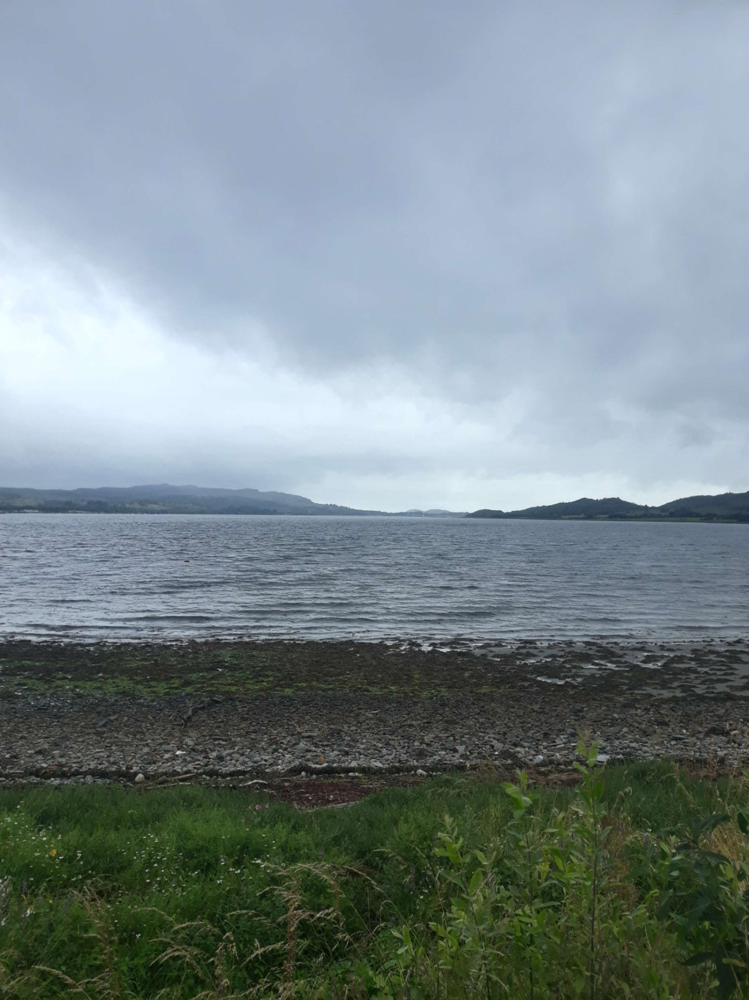

+++

title = "D'Inverness à Oban"

draft = "false"

date = "2022-08-02 21:36:50.474611"
+++

Au camping d'Inverness, c'est un peu la fête à la saucisse. Comprenez par là qu'à part moi, il n'y a que des Allemands. 

S'il est de notoriété publique que j'ai des affinités certaines avec nos voisins teutons, je crains cependant de ne pas trop apprécier partager la route avec leurs gros Wohnwagen blancs nacrés. Je décide donc de partir le plus tôt possible pour longer le Loch Ness en direction du sud-ouest, avec comme objectif Oban, qui fera un bon point de chute avant ma descente vers Glasgow.

À 6h30 me voici donc parti, plein d'entrain. La première demi-heure est stupéfiante. Difficile de détacher le regard de l'immensité bleue pétrole qui sommeille au fond de la vallée. 

Rapidement cependant, quelques éclats d'écume blanche viennent troubler la surface. Des gouttes discrètes me préparent en même temps à la suite du programme.







Peu après 8h, un brouillard dense engloutit lac et forêts, la pluie tombe, le vent se lève, c'est le début du calvaire. Je gravis avec peine la petite colline locale, 5 % à peine de moyenne, je suis sur le plus petit pignon, le vent, toujours lui, me ferait presque repartir d'où je viens. 

Inutile de préciser que la vue, d'en haut, se limite à quelques nuages floconneux posés sur les tourbières. Même dans la descente je dois pédaler pour avancer, j'enrage ! Nessie doit bien se fendre la poire, au fond de son lac.







Il est tellement dur d'avancer que je sacrifie rapidement la tranquillité du chemin de halage pour rester sur la grande départementale. Je préfère affronter le vent sur l'asphalte que dans un chemin boueux. 

Malheureusement, pas facile de rouler avec le flot incessant de touristes. Les camions de l'exploitation forestière voisine transportent des troncs immenses dont s'envolent des copeaux qui finissent bien souvent dans mes yeux.







Vers 10h un grand café et quelques confiseries me remontent le moral. Je découvre un trésor : Tesco prépare un chausson fourré au "petit-déjeuner anglais", œufs brouillés, bacon et haricots à la tomate, dans une pâte feuilletée toute juste sortie du four. J'adhère immédiatement au concept.

À midi, je fais de nouveau une pause dans un café, notamment pour me réchauffer, car je suis trempé jusqu'aux os. Une bonne soupe aux poireaux bien chaude puis un grand café (avec un flapjack, c'est une évidence) et je suis reparti.







Je ne tirerai aucun plaisir de la partie vélo de la journée. Je serre les dents, courbe l'échine, baisse la tête jusqu'à l'avoir entre les mains. 

Impossible de faire 200 km aujourd'hui, c'est une certitude. Je m'arrête tôt, dans un camping ; ce sera l'occasion de faire enfin une lessive et de recharger les batteries (dans tous les sens du terme).







Point culminant de cette journée pathétique, mon voisin vient m'apporter, à l'heure du repas, des saucisses fumantes, du bacon grillé ainsi qu'un petit pain chaud et le réceptionniste m'apporte deux bières, offertes par la maison. 

J'accompagne le tout de raviolis en boîte, avec en dessert des pruneaux servis dans leur jus. À peine mes généreux bienfaiteurs sont-ils partis que la pluie reprend de plus belle, je finis de dîner dans la laverie.







Désormais sous la tente, qui essuie la pluie battante, je me questionne : qu'en sera-t-il demain ? J'ai encore 300 km à parcourir pour atteindre le port d'où je partirai pour l'Irlande. 

Si la pluie persiste avec cette intensité, j'envisagerai peut-être une autre option que le vélo pour m'y rendre, affaire à suivre...







## Commentaires

#### Nicolien
Vraiment magnifique l'Écosse, tu ravives mon envie d'aller parcourir ce pays comme l'ont fait les premiers hommes.
Courage mon garçon, la pluie c'est du pipeau.

#### Moum
Ah là ! là ! Que d'eau ! Que d'eau ! Ils ne connaissent pas la sécheresse là-haut ! C'est fascinant de voir que cela ne rebute pas les touristes, les campings ont l'air pleins... 🤔, 😁 ! Mais on comprend quand on voit ces paysages, cette nature grandiose ! Très romantique tous ces gris, la brume, sur les lacs et les collines... Pas pour toi, dans ces conditions, c'est sûr. Y'a des jours comme ça, on se demande ce qu'on fait là... ! Cependant, je trouve que cette journée est à marquer d'une pierre blanche, tu as fait ta lessive !!! Et franchement, les deux bières et le repas si gentiment offerts ça fait chaud au cœur ! Allez Ivan courage ! Demain il fera beau, car tu vas vers de nouvelles aventures ! L'Irlande !! Profite de ta forme olympique ! Je lis la détermination dans ton regard 🤨 !
Everything is alright !
Bisous 😘

#### Dad
Tout ceci prouve que tu n'es pas en stuc... mais plutôt de marbre de Carrare...
Au fait, et si ce changement brutal de temps était dû au dépouillement du maillot italien...
Il est des instants, qui peuvent s'éterniser et qui rompent définitivement avec le bon ordonnancement des choses, le charme qui régnait dans un tableau apaisant...
C'est ce qui m'est arrivé hier en prenant un verre à la terrasse d'un vieux café de Vic-sur-Cère.
Tous les éléments étaient réunis pour rendre ce moment harmonieux.
J'avais en main mon Perrier menthe que je pouvais porter à mes lèvres d'une simple remontée de coude, lequel prenait appui sur une vieille table fermière juste à bonne hauteur pour que le levier ainsi réalisé ne nécessite aucune gêne ou inconfort.
Mes narines pouvaient naviguer entre le doux fumet d'un méchoui en préparation dans la plaine en contrebas et l'odeur d'enfance rassurante d'urine, de tabac et d'alcool mêlés, qui me parvenait de l'intérieur du café.
Sur la place située à une encablure, un accordéon, une vielle à roue et un violon s'accordaient et les musiciens effectuaient la balance...
Ce moment de grâce fut néanmoins brutalement interrompu par un homme, manifestement arrivé en retard et qui se mit à battre frénétiquement la mesure de ses souliers vieillis. Après avoir extirpé brutalement son instrument d'une mallette, il enchaîna derechef par un extrait de morceau de BOMBARDE !!
Tous aux abris, ce morceau me plongeait dans le doute, la colère, les bagarres de cour de récréation...
Harmonie rompue, charme disparu !
En tout cas, la pluie ne fait pas perdre de charme aux photos de Loch ni n'enlève aucun poids au récit...
J'espère que tu n'es pas trop farci ma petite raviole...
Come on son, keep smiling.

#### Sandrine
L'aventure se corse... Heureusement que réside quelque part la chaleur écossaise (cf. grillades et bières !)
Mais parfois les expériences douloureuses laissent place à de bonnes surprises !
Voici une mini-anecdote pour illustrer...
Après une randonnée sous un soleil écrasant, je rêvais de cette bière fraîche dans un petit café repéré en début de promenade.
Fin de la promenade, 18h00 : le café avait fermé depuis 13h00. Nous nous sommes rabattus sur un troquet miteux mais qui semblait plaire à Serge. Je passe sur l'odeur piquante quand j'ai traversé la salle pour me rendre au comptoir (heureusement nous nous sommes installés en terrasse... qui était en pente !)
Alors est apparu un groupe de musiciens prêt à me faire oublier ma déception naissante. Et surtout mes oreilles furent accrochées aux vibrantes mélodies de la bombarde !!!
Je ne sais pourquoi, soudainement, Serge m'a demandé si j'avais fini mon verre. Il voulait régler et partir rapidement... Étrange...
Pour finir, je l'ai laissé quitter la table et j'ai pu savourer tranquillement mes dernières gouttes de bière, accompagnées de quelques notes de musique !
Courage Ivan et je pense que tu pleureras bientôt la cornemuse !
