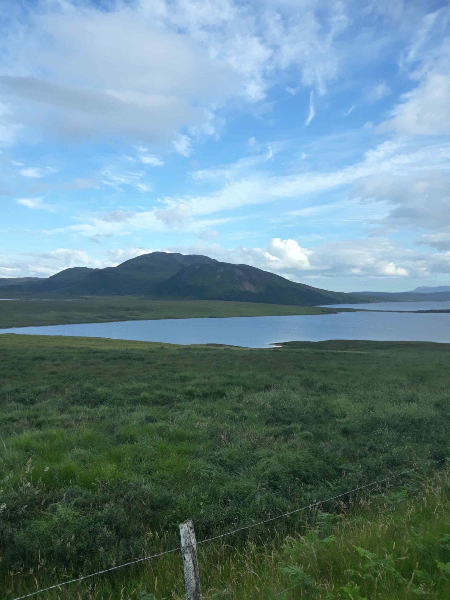

+++
title = "From Inverness to Tongue"
draft = "false"
date = "2022-07-31 20:24:31.806564"
+++

Today, the goal is to reach Tongue, on the north coast of Scotland. The day promises to be radiant, but cold! Upon waking, the mercury timidly reaches 9°.

During my preparation, I planned clothing down to 7° minimum, I won't last long below that. Breakfast is therefore, as often, quickly dispatched. I try not to wake my biker neighbours, who snore as loudly as their machines rev (not surprising given the number of beers consumed the previous evening).

I leave around 7:30am, hands numb with cold. In these conditions, no secret, you have to spin to warm the joints, then the body. The road to Inverness is very pleasant and I arrive around 10am in the port city, still asleep. After all, it's a Sunday.







City sections, while pleasant for the eyes and senses, are less so for the clock. The GPS and I get hopelessly lost in the suburbs. After many twists and turns, I finally cross the big bridge that marks the exit of the city northwards.

Then begin several dozen kilometres that seem endless, as the headwind pins me to the spot. I spend a crazy amount of energy trying to maintain a measly 20km/h, sometimes without even succeeding.







Once past Alness, I start a long but easy climb on the hill overlooking the bay. I arrive at the top sweating (the sun is beating down) and I'm greeted, like many others, by a magnificent café. It's noon, I'm starving and I'm out of water, the opportunity is too good to miss.

So I settle on the terrace, with a magnificent view. I'm served a large coffee with its raisin scone. What a forgotten pleasure! The scone is served with butter and jam, needless to say I don't hold back. I even provoke hilarity among the staff by ordering a second one (that perhaps doesn't conform to the very strict etiquette of tea time).







Sated, I finish climbing the hill, then descend it all in long gentle hairpin bends through the fir trees. Definitely, I prefer roads to greenways and other dirt tracks (no offence to my mountain biker friends).

My bike flies all by itself in the long curves, I literally float on my large tyres more suited to trails. I love feeling, as Depardieu would say, "the air cushions (and not oil, sorry Gérard) under my arse" (to the one who finds the film and director behind this quote that I'm mangling, I offer a miniature of the vehicle in question).







After enjoying myself on these beautiful roads, change of atmosphere. I finally arrive in the north, the real north. Suddenly, no more dual carriageways, no more speeding cars. No, a single "single file", a small winding and very narrow road, which should lead me, according to the sign, to Tongue.

I check the GPS: "Next turn, 50km". For all this time, then, I'll have to battle to advance on this road in a more than questionable state and with, once again, a... dreadful wind, in the face.







I had anticipated in my calculations that this stage would be difficult, especially because of the wind. This is far beyond any forecast. Checking my speed between two gusts, I note that I lose up to 5km/h, at equal power.

It's long, very long to conquer this piece of asphalt lost between the mountains, which this time are red, covered in heather (heather which, by the way, doesn't jump in circles holding little fingers, so I assume it's not from Quimperlé).







The landscape is otherwise magnificent, very wild. The further north I go, the more surprised I am by what I discover (and by the cold that freezes my bones).

Finally, after more than 3 hours of effort, here's the city. Or rather the village. Actually, the hamlet. There's NOTHING in Tongue, except a service station and the campsite I was aiming for.







I settle in, they sell me food. I buy myself the very stylish and essential midge net because you're quickly pursued by a cloud of these lovely critters when staying still.

As I finish my beer (local) while writing these lines, a huge sun sets over the mountains that plunge into the bay. Definitely, today Scotland rewarded me.







Tomorrow it's finally time to discover John o' Groats, the highest point of the United Kingdom. I don't yet know what will follow. Backtrack to head to the west coast, or crossing by boat?
























## Comments
#### Moum
A long Sunday of more than 200km,
alone against the wind, freezing on top of it, definitely Ivan you are courageous...!
You're testing your resistance there,
even on air cushions! (The oil is in the DS from Les Valseuses by B. Blier, isn't it! 😉). A car, my cousins had one, in which I was always car sick 😞... Dreadful memory, the corners....
So, are you starting to consider the crossing to Ireland?
Anyway, you seem to have found your "marks" between speed and effort. The marathon continues! Don't forget to pay attention to the little signs that should tell you to ease off if needed!
Kisses😘
#### Dad
Ah it really smells of the far North, it's becoming mineral, but aren't you good there, in the cool...............A bit disappointed to have been beaten to it...
Reassured about your physical potential, here are some food for thought for you who are en-cyclo-pedia.
- Is your phone still usable?
- Are you left in your dreams?
- How many calories in a Flapjack?
- How many Flapjacks then correspond to 10,000 calories?
- Does peated beer exist?
- Are lochs, as claimed, sometimes monstrous?
- Cycling on the left, is it the beginning of freedom?
- Does producing oil explain their way of rolling their rrrrr?
- What do Scots think of Asselineau's political future?
- Is woman the future of man also in Scotland? have they written it? Sung it? And for football?
- Can we say that Cantal is Scotland in the sun?
Very nice photos and fascinating story.
Come on son, keep warm!
