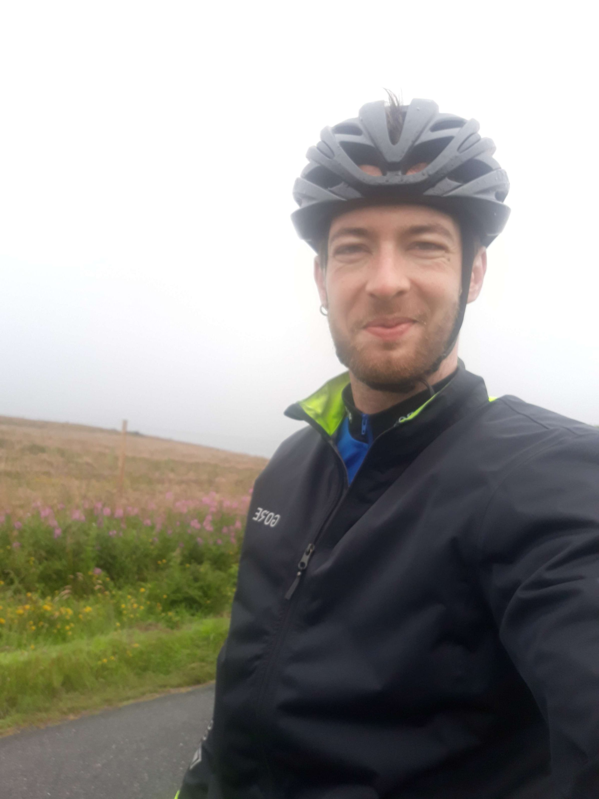
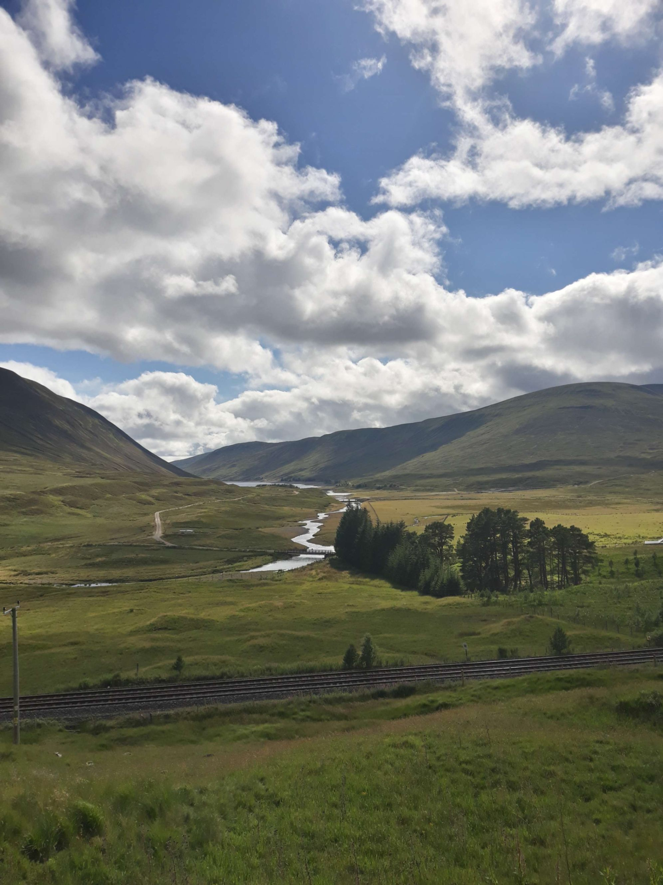
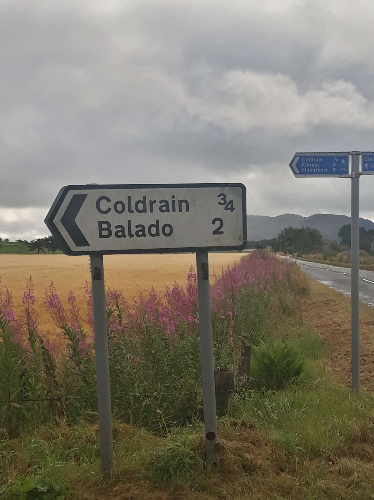
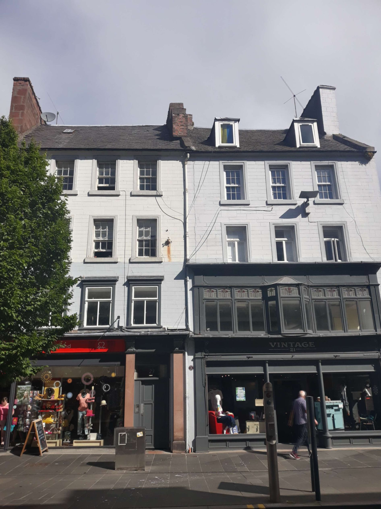

+++
title = "From Edinburgh to almost Inverness"
draft = "false"
date = "2022-07-30 20:30:59.221877"
+++

As often, waking up is hard. I couldn't set up the tent properly for lack of a tall enough pole. With the rain, the fabric loosened and delicately stuck to my back, allowing me to feel the gentle massage of the big falling droplets.

I get changed and have breakfast in a rental tent nearby, just to be dry. I take the opportunity to make myself one of my famous instant coffees, because anyway, I know I have to deal with my punctured tyre.

Still in the rain, I transform myself into a surgeon and, armed with my pliers, I go in search of the little piece of wire, stuck in the tyre casing, that caused me so much trouble. Quickly, it's extracted and the new tube is mounted. I also repair the old one, it will surely serve again.

Once the bike is back together, the rain intensifies. I hide under the tent waiting for the squall to pass (sweet innocence) and I rework my route.







8:15am, the rain is still falling but I can't take it anymore, I decide to break camp. As I'm about to leave, the owner calls me over to chat a bit. Problem: since last night, his jaw hasn't loosened by magic, I still don't understand a thing. With many head nods and awkward smiles, I take leave of my host as politely as possible.

Once again I'm in full rain gear and this time it's necessary, I'm getting a torrent on my head. Despite everything, I'm in great shape, almost cheerful. I must say the landscapes drowned in mist are magnificent, I can see in the distance the sea inlet in front of Edinburgh.

The road to Kinross is under pouring rain, then a discreet clearing turns into radiant sunshine once I reach Perth. From there on, happiness is complete and total, without a cloud on the horizon.

The weather is splendid, I only get one shower around noon near Pitlochry. While chatting with the cook at a café, I learn that the entrance to the Highlands is imminent.






And what an entrance! Under a magnificent sky - luminous, but laden with heavy clouds - I finally enter the wild part of Scotland. Hills as far as the eye can see, great roaring rivers, endless flower meadows.

The road is very good, it's a perfectly paved cycle path that follows the main road serving the North. I ride well, except when the wind decides otherwise, which rarely happens.







I've had my eye on a forest campsite for a while now, 40 miles from Inverness and where, for once, I can set up without hassle (less fun for you but a relief for me...!).

I finish this day without incident with a sumptuous dinner of large pita breads, spread with tzatziki and stuffed with tomatoes, salad, marinated chicken and mozzarella. Yes, I deny myself nothing. This meal wouldn't be complete without a special vintage Paolozzi, the Edinburgh craft beer.

I notice however this evening that the "little" pain around my ears comes simply from them being cooked to the Xth degree (read: they're blistering). At the same time, with the intermittent rain and sun, it's not always easy to remember the sunscreen. It was definitely time I had some ice cream available.

This evening I also decide to wash some of my clothes, I'm beginning to notice the almost systematic creation of security zones around me when I enter shops.







Finally, to answer the FAQs in the comments, yes, one of the bottles sadly passed away, not because of mud, but because of an unexpected rubbing against the wheel, which wore through the plastic until it holed. Regarding the midges: it's done! They're buzzing around me right now, it's an intense sharing moment we're experiencing (well, mainly them).

I enjoy listening to my biker neighbours. People are starting to have the true northern accent, the r's are rolled and the very conventional "yes" has become "hay". A bit like feeling among pirates.







Tomorrow, I need to get within a few dozen miles of my goal for this first part of the trip: John o' Groats. The young Belgian I met on the ferry to Portsmouth has the same objective, but he chose the western route.

He proposed this evening a friendly race to the far North. Will I accept?












## Comments

#### Moum
The good thing about you Ivan is that everything seems easy... always. It "rolls" in a way, without wanting to make an easy pun 🥸! When you were little, we called you Ivan find-it-all, do you remember?
Well, you're rewarded for your unshakeable good humour, and it's the least you deserve, by discovering the Highlands under the sun! Magnificent!! Luckily I saw your photo, the jersey casually open, (very end of stage, first to arrive, of course...), before the morning one because you scared me a bit... those little eyes... You reminded me of someone 🤔...! I hope you'll allow yourself a rest day after such an intense week and enjoy this paradise!
I kiss you goodnight 😘

#### Dad
Oh my goodness me! Just magnificent! Gorgeous!
Without doubt the most beautiful photos since the start. The tyre repaired, the near-sun, the space opening up... You know what?
I think you're happy...
Remember if you can, I took you north of Inverness, to Cromarty. What beauty!
I must confess to you now, I was going to meet Marie-Pierre... the voice of Marie-Pierre, her velvet voice when she announced marine weather forecasts by area: on Fisher, Dogger, Cromarty... the sea will be rough to very rough...
This voice had the power to make you travel in sound poetry. Today, it's thanks to you that we vibrate and I admit I feel like I'm there.
Only small downside: it's true, this jersey is very nice but, for my part, I'm a bit afraid the Scots might take you for... an Italian...
So be it for having sacrificed the Kingdom of Naples and the Duchy of Milan, let's pass on Nice and Corsica that they long bothered us about. We forget the Battle of the Alps - that's all our ancestors' history...
But since then there was Materazzi, and now the wound is gaping...
Is the other jersey dry?
Come on son, keep dreaming...
Sei il più bello!!! 😉😉

#### Max
Respect and admiration Ivan! Dear president you are on the road to happiness, and you know how to share it with us! Take good care of your feet old chap! But at this stage, it's you who's giving us lessons, without a doubt! Keep pushing!

#### Lucie
Hello Ivan!!
We follow your adventures as a family from Ardèche!! We admire your journey and your writing ☺️
Great trip, enjoy and we await the rest of the adventures!
Big kisses
La Chusseau Family

#### Sandrine
Your writing never ceases to make us travel! It's really pleasant to read you! Obviously your pedal stroke has something to do with it too!
Thanks again for sharing these magnificent photos! These splendid landscapes are the reward for your courage!
