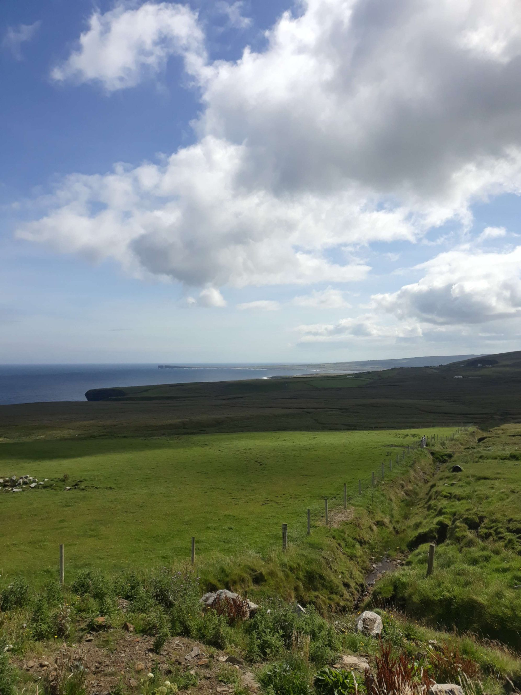
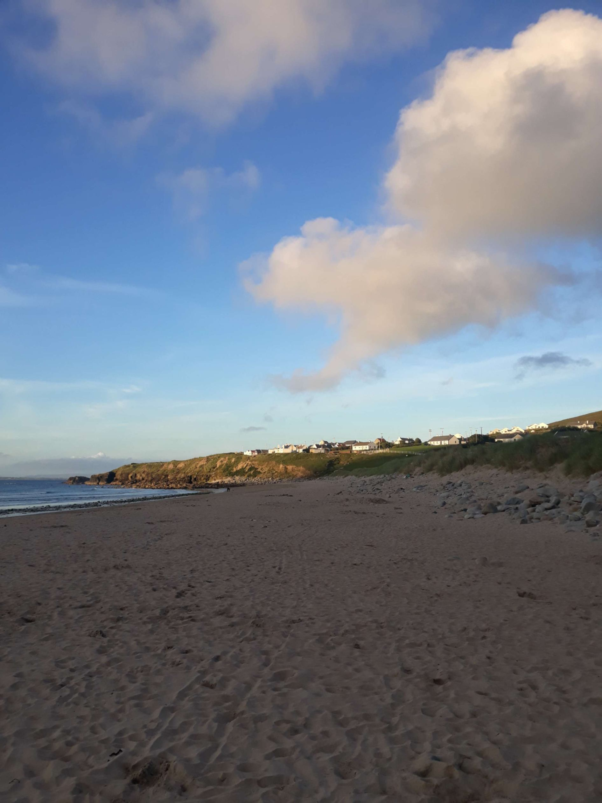

+++
title = "From Ballina to Achill Island"
draft = "false"
date = "2022-08-07 20:57:08.220828"
+++

Here's summer, I see the sun, the clouds fly and the sky clears [...]. I'm barely exaggerating! The day looks promising, waking up under the big blue sky this morning.

Departure is still very late because I share my breakfast with a very friendly Belgian. He's a piano tuner, former luthier, who has travelled the world by bike, an original. The conversation flows until 9am, when we decide it's high time to start riding.

I set off towards the coast, which I must follow until the bridge that will take me to Achill Island. The road is very beautiful, less easy than it seems, between the wind in the face and the hairpin bends climbing the hills.

I have a first coffee at Coast Coffee, where I'm told that until the next town, 30km away, there's nothing more. I take good note of this, along with a second piece of brownie.







After the obligatory photos of the coast and its cliffs, I set off again for Bangor, inland. There's indeed nothing, apart from peat drying on the roadside.

In the village, I stop for lunch. I'm still struck by how much people know each other in these backwaters. I feel like everyone's slapping each other on the back around me.







And I'm not left out, no fewer than three people come to talk to me during the short time my meal lasts. Definitely, the Irish are as warm as they say.

Well obviously when it's the village grandpa with two pints in his nose, I understand a bit less what the conversation is about, but apparently it doesn't bother him.







As I leave, I realise my knuckles are very painful and blistered. I think, without being sure, that these are bad sunburns, because they're well exposed, outside my mitts. Another point to watch in the week ahead.

On the road, I daydream; here's an excerpt from my mental peregrinations. In the countryside, you don't smell much apart from the grass, sometimes the little muddy canals bordering the road.







So when cars overtake me, all windows open, I tend to smell the perfume emanating from them. Anthology of past days: first, there's the young woman in a hurry. She drives a red Mazda, slightly faded paint. I say she's in a hurry because she brushes past me at full speed, making me wobble. Her smell is a fruity and acidic perfume, she's surely going to work, an appointment. Next comes the dynamic 2.0 executive. Thirty-something, in a new but ordinary car, his smell is that of the e-cigarette he shows off, synthetic. He's the least nervous, because he's teleworking and probably just going to pick up his drive-through order at the local supermarket, during work hours. The last one is the good father. He drives with pleasure, straight as an arrow, the big Mercedes he could afford thanks to his investment products because he "sensed the Ukrainian crisis coming". He drives calmly, the children already dropped at school. Through his window, I smell the aroma of new leather mixed with his menthol aftershave. It's my favourite smell; even if I don't subscribe to the guy's ideas, it has a reassuring side. End of the olfactory parenthesis.

Achill Island is indeed magnificent, thanks for the recommendation! I arrive around 5pm, so I allow myself a small tour of the south of the island because it's still early and I haven't ridden too much.

Huge waves crash against the black cliffs, the spectacle is striking. I treat myself to the most beautiful descent of the trip, on a road that undulates just above the shore.







I quickly arrive at the "seal caves campsite" (sounds less good in French). It's an ocean of caravans and mobile homes. If Brassens had gone camping, he'd surely have said "my mother, with my little tent, I looked like an idiot" (I'm joking, I was just trying to fit in Brassens, it's them who look like idiots in their plastic boxes).

I go to the -very- small local shop, where a grandpa who fought in the war sells me a tin of sardines and some bananas for a few pounds I have left and which he only agrees to convert at the day's exchange rate (I wanted to keep it simple, one pound, one euro; he's adamant).

A "conversation" follows which I understand nothing of because he speaks under his breath. I barely understand that he would have visited France "before the arrival of the Americans" (but how old is he?!).

I quickly return to my camp to enjoy these sardines that don't come close to those of the gods. After this copious dinner, I head to the beach hotel, where they serve the only affordable consumable in Ireland: beer.

The day thus ends with a beautiful sunset on the beach, in the warmth of a pub and to the sounds of falsely traditional music (as I write these words, they've just played ABBA and then Supertramp).

Tomorrow, straight South, maybe as far as Galway?








## Comments
#### Yann
¡ Hola Ivan! You've made me travel once again, through the splendid Irish landscapes and also through your olfactory peregrinations. I felt like I could smell them here :D 
Did you see seals in the cave?
Your introduction put the song of Les Négresses Vertes in my head 🥰
It's great!
Come on, now I'm waiting for your next message to read you.
Again good luck to you, bises
#### Dad
Hello Ivan,
You've probably discovered a bit of the force of Achill, I thought you'd stay an extra day there, but I understand and I know what it's like to be addicted...
Anyway the photos are superb and I hope you appreciate all these landscapes!
Today you'll enter Connemara, let's hope the route follows the coastline. You're going to love it!!!!
Come on son, Keep kiffing.
#### Sandrine
Great Ivan!
I love your new story with your olfactory digressions! Your head is spinning too!! 😂
And of course, I rediscover with great pleasure the magnificent landscapes through very beautiful photos...
Thanks also for that shot with the sheep: I always grew tender seeing them freely roaming the paths, so elegant, with their white down covering their fine black silhouette...
May the sun be with you again today!
#### Moum
Ivan!! What a joy to read you!! I laughed a lot! I find the dreamer, the senses alert and the little step aside that makes your way of being and seeing things so original! "My little poet" said your teacher (when you were exactly 8), the only one to come back with a bouquet of dried flowers on his backpack and a daisy behind his ear after a school trip...!🙂 It doesn't surprise me that people approach you easily, they take you for a local lad in the villages you cross, with your little beard that's growing, yes indeed...!
Well, you're revived by the sun but your ability to recharge your batteries so quickly to sustain such effort is encouraging and promising for your future projects....! I'm impressed... Even while enjoying these fabulous landscapes, your main objective being to push yourself, even surpass yourself! you're going to arrive too quickly in Cork at this rate! Several options then: do another loop anti-clockwise, cross the Channel for a complete tour of Brittany along the coast and set your personal record, or return earlier "da ger" to taste the best Breton cakes, (with prunes!) currently on the market 😋! Besides, you could listen to Irish music (concert Wednesday in Penity) since apparently it's more complicated on site. But that would be sad to no longer be able to read your Gazette! Ah! there! there!, in the end, the choice is yours, and I'm not worried, it will be the right choice! 😎 (I have to distinguish myself from the Fan's club, I'm your mother after all... !🙃)!
So, big kisses and go for it sailor!
Heading for Connemara!
 Keep flying!!
#### Teunteve
What luck Ivan! (well deserved!) I've been to Achill Island three times already and would love to go back... Were you able to see the abandoned village due to the great famine? I found the atmosphere very poignant. And these landscapes so magnificent!
You're going to tackle Connemara, its lakes and peat bogs and the sky road. You're going to have your eyes full!
I await your next messages impatiently
Bises
