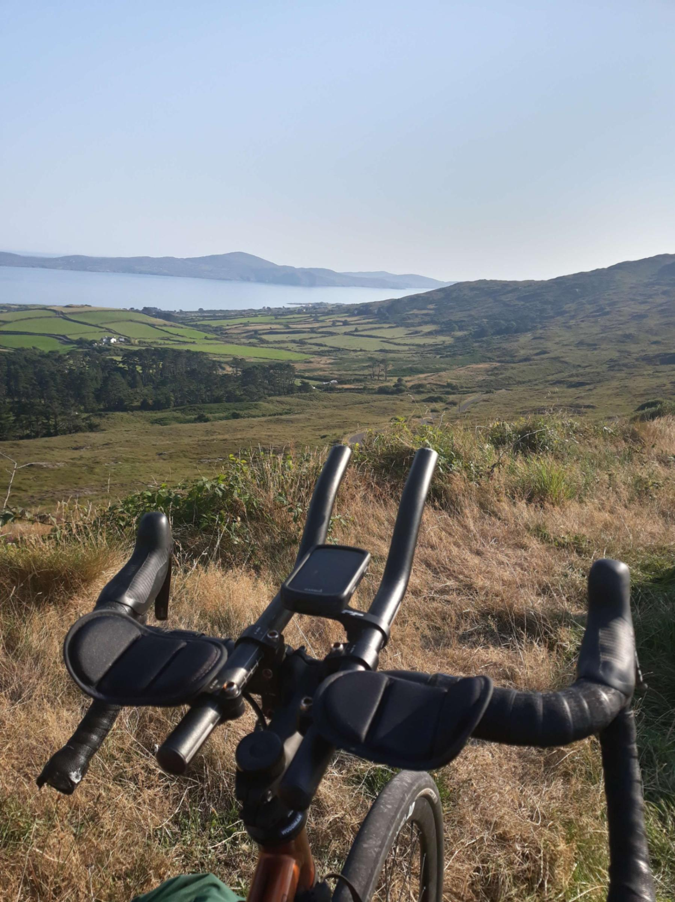
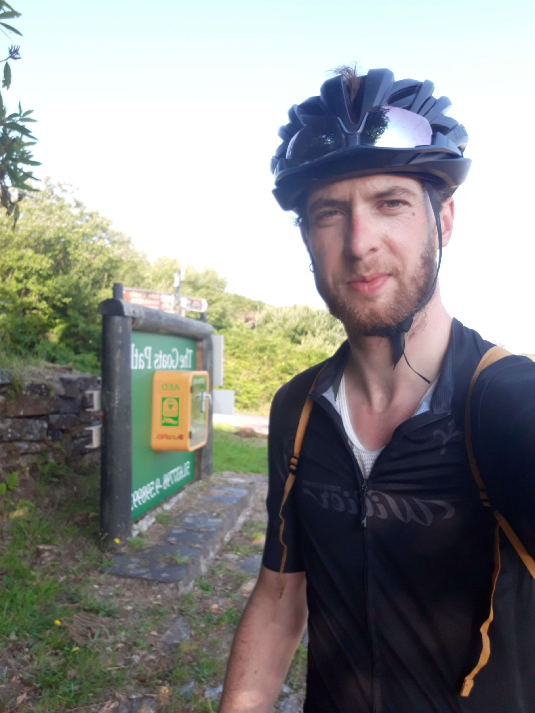

+++
title = "From Beara to Durrus"
draft = "false"
date = "2022-08-12 21:55:00.211962"
+++

The alarm goes off, I look at the time: 6am, I turn it off, go back to sleep, then wake up 1h30 later. In the end, holidays don't change me much from the office!

I chat a bit with old touring cyclists sleeping next to me. As I marvel at the fact that one of them sleeps sheltered by a simple bivy, his colleague replies, rolling his "r"s under his big beard, "don't tell him he's hardcore, you're quite hardcore yourself", pointing at my camp over my shoulder.

I turn around laughing: my tent is half set up because I finally decided I wanted to see the stars last night. Dew drops drip from the fabric onto my sleeping bag, rolled in a ball in the wet grass.

A squadron of big black slugs has gone on an expedition on my mattress and bags, in search of the precious McVitie's. I am indeed perhaps a bit in the process of becoming a vagabond, I tell myself, it's time the trip ends.







Besides, something found access to one of my biscuits, because it's half nibbled. Double dose of homemade coffee and I'm on the road. We laughed yesterday about my diet based on slow and fast sugars: I change nothing, at 10:30am it's carrot cake and large coffee.

That's enough to motivate; it's better to actually because the campsite was at the foot of the biggest climb of the day. Too bad for the knees, they'll warm up in pain.







The day is very similar to yesterday, I go around the peninsula again, this time it's the "ring of Beara". The views are less impressive, but there are also far fewer tourists, which doesn't displease me.

I mainly pass through many small villages whose house fronts are painted in garish colours. Is it to attract tourists? Is there a historical reason? How old is the captain? So many questions that will remain unanswered.







As I'm lost in all these thoughts, I already arrive at Castletownbere (yes the villages here have names you wouldn't wish on anyone). Without realising it, I've done the tour of the peninsula and unfortunately missed the turn towards the point. Too bad, I'm already too far to turn back.

I continue my road on a large main road a bit too busy to be as pleasant as yesterday. Surprisingly, the landscape has changed again and I cross much more mineral hills, covered in rocks sometimes.

The road is good and easy, I eventually go back down along small coves where families joyfully swim. In Bantry, restocking at Lidl. I buy moisturiser because my hands and feet are cracking everywhere; the heat probably.

I absolutely must find a small sewing kit too, because my tent is showing signs of weakness (thanks to campers who tripped over the guy lines) and the rain should return by Monday. I don't really want the trip to end badly.

Short and pleasant chat with overloaded people from Toulouse: the mountain is hard with 50 kg bikes! No kidding. I also take a detour before the campsite because I haven't ridden much despite the time and I'm feeling good.

Well, this will be my second big climb of the day, because I have to climb the cliff overlooking the bay. The sun begins to set on the horizon, the colours are magnificent.

After Durrus (where I buy more food, it's by far my biggest expense) I only have 5 km to the campsite. It's full, but by playing the nice cyclist card who only has a tiny tent, they end up squeezing me into a corner that's more the owners' garden than the campsite itself.

The view over the inlet and the mountains in the background is magnificent, the grass rather tall and soft: it suits me very well. I've still burned badly despite the many layers of sunscreen. It's time to treat all that, before attacking a good dinner of beans, peas and sardines in oil, in front of the wide and disgusted eyes of my German table neighbours.

Tomorrow, if the weather permits, same again! I'm told I still have many beautiful places to discover along the coast, so I'll continue to take my time.

## Comments
#### Moum
No doubt about it...! as someone would have said ... 😌, you seem to have found paradise! An enchantment, for your appetite (sense 1) to always go further, faster, higher and for your pleasure of discovery! This face becoming Irish radiates happiness! 🙂 And then, what to say about Mc Vitties, apple pies, brownies, muffins and other carrot cakes! You almost make us envy your beans with canned sardines! What an appetite! (Sense 2), (Well, I don't want to seem insistent), your warm encounters seem just as colourful! Thank you Ivan for these generous lines and your equally generous photos!
So, Keep savouring! 😚
#### Nina
I feel like the best summer series is coming to an end...
Don't you want to take another little tour, so we can continue to feast our eyes and collect unusual recipes? :)
#### Dad
Hello Ivan,
You have to savour these last days and also probably this sunny parenthesis.
I allow myself a few suggestions before leaving paradise: go see a hurling or Gaelic football match, try an Irish crumble cake or a shepherd's pie (but apparently you're more of a sweet tooth), attend a greyhound race or an Irish dance show, find a pub where there's a concert with violin-piano-guitar and why not pipes and Irish harp, spot a van restored by two friends to sell chips and burgers.........
Riddle for the coming evenings, who tells this?
"- My ancestor, a Russian prince, was in Paris. He looked furiously like Louis XVI, so he was arrested and led to the guillotine. As the blade was about to fall, his wife parted the crowd screaming, approached the executioner... Unfortunately, she didn't speak French...... She remarried shortly after."
Come on son, keep fingering.
#### Sandrine
Hello Ivan!!
It's always a delight to accompany the morning coffee with your stories...
The episode of the electric bikes particularly amused me yesterday!
Now I think Onepoint will have to invest in a bike-desk! Otherwise the return to work will be hard! And the advantage for them: with your pedal stroke, you could power the whole company with electricity! 😂
Enjoy the next kilometres, feast... on landscapes and other delights!
P.S. I also salute Ivan's mum, now owner of a DS 😉
#### Yann
Here dear Ivan, I've caught up on all my backlog (I'm mad at myself for letting time get the better of me…). But actually I was in courses, super motivated, that I devour from morning until night.
Once again beautiful images :D 
Thank you a thousand times.
By the way, were you able to enjoy watching the stars? Personally, I love that, even if I don't do it enough, because the comfort of my bed doesn't push me to go out once night has fallen.
Enjoy everything that makes this trip magical until the end: the landscapes, the speed, the elements, but also the encounters, the exchanges, the mutual aid, the sharing. So many beautiful things I could glimpse in your stories! It's beautiful, and it gives me heart again :) 
Bises
#### L'arbre du chapon
Hello Ivan!
I disconnected a few days but I just caught up and it's always with pleasure that I read your travel story!
What a performance and what courage!
Frankly, to outsmart electric bikes, bravissimo!
I envy what you eat, the way you talk about it makes my mouth water! But I don't envy the slugs at all!!! Beurk!!! 😫
I don't know when you're coming back? But enjoy your last days and continue to delight us with your words and photos!
Enjoy!
