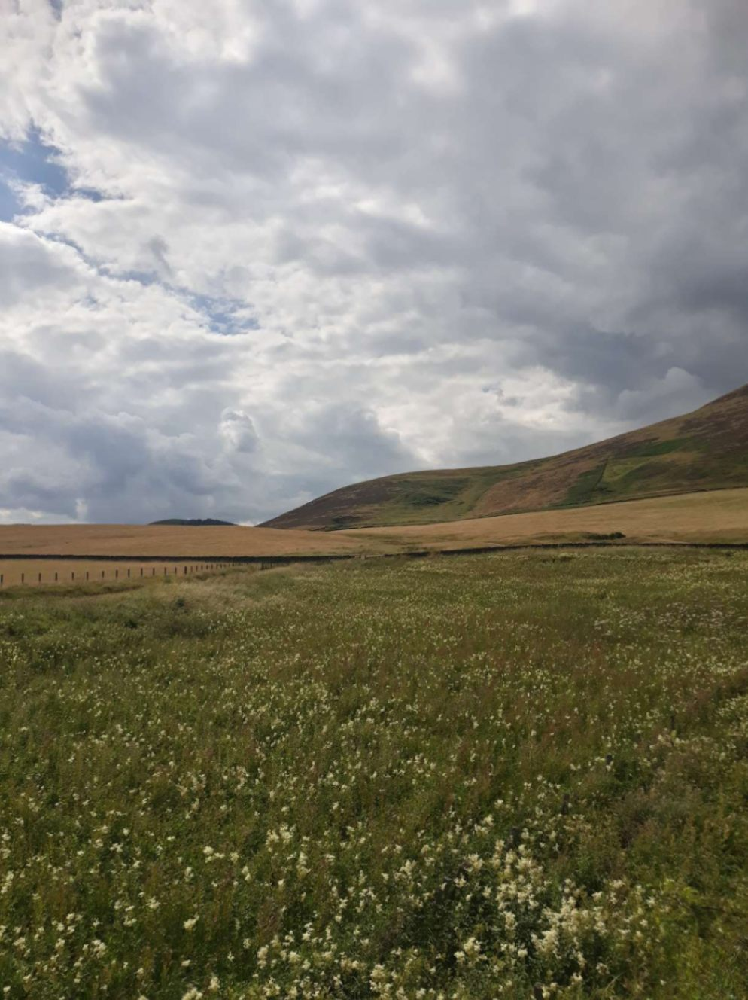

+++
title = "From Carlisle to Edinburgh"
draft = "false"
date = "2022-07-30 07:08:39.959080"
+++

The day starts with a disappointing discovery. A wrestling match apparently took place between my phone and me during the night. The screen is in a thousand pieces, I suppose we can say I won.

Anyway, it's 5:30am, the ideal time to do nothing and sleep in. For me, it's time to get up painfully and go lock myself in a container that serves as a shower to put on my wet cycling clothes.

It's so cold and the wind is so strong that I decide to put on my 2nd jersey, the famous Alpina Giro, kindly provided by my favourite bike shop owners (Myriam and Olivier -if you're reading this- thank you a thousand times, you're truly the best, I wouldn't be here without your wise advice and incredible gear).

This jersey is much thicker and more visible, I figure it'll be better under the drizzle. I go all out, overshoes, waterproof jacket.







The tent is quickly packed away, I whip up a meal of ham slices, bread, hummus and a few plums (my diet seems to interest more than one person). Let's note that in these conditions, there's no real notion of breakfast, lunch, dinner, etc. It's just about EATING (preferably balanced).

With over 10,000 kcal burned each day, I must do my utmost to compensate at least in part for this energy loss. I finally leave at 7:30am, heading for Edinburgh.







Half an hour later, I have to stop to remove my waterproof and the beanie I had slipped under my helmet. The drizzle and wind have stopped, the clouds have (a bit) scattered; it's going to be a nice day today.

Unfortunately, the first 100 km test my morale severely. It's about going up from Carlisle on the motorway that leads to Glasgow or Edinburgh. Problem: the cycle path is literally parallel (and 30m away) from said motorway.

If I find the genius who thought the noise of 36-tonne trucks at 130 km/h could be pleasant music to a cyclist's ears, I'll give him a piece of my mind. The road is in poor condition, not a village, it's a desert crossing.

At noon I've swallowed 100km, I ride without thinking. Just as I'm about to attack my emergency rations because I'm dropping with fatigue, a small café at the edge of a village pulls me out of my stupor. I'll end up having lunch there with two other cyclists. First hot meal since Tuesday, I'm in good condition to tackle the afternoon.

Small setback though, my rear tyre is punctured (after 1000km, that's fair), so I'll have to pump it up regularly throughout the second part of the day.







This time it's very rolling, I have the wind at my back, the 40 miles to Edinburgh go without problems. I take a tour of the city because I'm early and I want to revive my memories of my first visit 10 years ago (I didn't recognise anything).

I weave through the suburbs to reach the bridge that takes me to the other bank and, incidentally, my campsite. As usual it's at the top of a hill, except this time, I'm refused! It's actually a campsite reserved for Scottish Scouts. Honestly, if that was all it took, I was ready to sign up (they said no).

They point me to another place at the bottom of the hill. I go back down, suspicious because I didn't see anything on the way there. After a chat with the very pleasant Chris who loves "La douce France", I learn that the campsite burned down and that, no, I can't sleep in his garden.

I finally surrender to the expert hands of my GPS which suggests... going back up the hill. I comply, it'll help for tomorrow and I'll surely find a wild camping spot.

After a few kilometres desperately searching for a patch of green that could welcome me, I come across a fishery. A small lake, tents everywhere around, smoking braziers, chickens and goats roaming free; once again, a little piece of paradise.

After some negotiations with the grandpa owner, of whom I understand one word in three, I can set up. The atmosphere is special, very redneck. Compulsory military haircut, camo trousers, beer and fishing rod as essential accessories. But the place is quiet and - have I said it enough? - I love the smell of wood fire.

Tomorrow, we get into the thick of it, with a stage that will take me to the Inverness area. As I write, my neighbours are lighting a huge fire, what a joy.

## Comments
#### Moum
Dear Ivan, I delight in reading you. It's terrible to say but, if everything went smoothly, (hey!😉), it would be less fun. Your tenacity and humour in the face of hardships command my admiration. I understand why you didn't choose to cycle around the Netherlands, it would have been much less fun. Me who doesn't even take my electric bike to go to the beach... (well, I can walk there, it's true, I'm silly...😁!).
I'm proud of you my son, as your father would say. You're so cute in your tricolour jersey, I take back everything I said, I'm deeply grateful to him!
I hope you'll be able to sort out the punctured tyre quickly. I can't wait to see your new photos!
With all my motherly love 😘. 

Hello to L'Arbre du Chapon! (another incredible story... 😊!).
#### Dad
There it is, the 1000 km mark is passed, but it wasn't a game!
A thousand bravos then.
Little remark: someone must have messed with your GPS, indeed you're advancing like a crab! By going straight, you'd already be in the Shetlands...
So you reached Edinburgh without stopping by to say hello to Leslie in North Berwick, one of the purest symbols of British phlegm:
"- Leslie, there's a problem with one of your dog....hem...how to say that....this dog shit on my bedroom's carpet...and....a lot....
- Really, on YOUR carpet, please next time would you mind lock the door....Because you know....."
What would one expect in the face of such outrage? "Fucking dog" or "Scumbag" would have seemed appropriate, or at least without directly blaming the dog "Holy cow" or the softer "Oh my goodness"...
Not at all, instead the practice of the all-British art of the suspended sentence: "You know............" you imagine the rest but it goes without saying that everyone knows the rest. "You know.........." fabulous conclusion....
British anecdote aside, (it's to give you some reading too...)
Be careful, the further north you go, the colder it gets, the more the roads take detours, the more they add butter to the Flapjacks and oil to the Fish & Chips.
We delight in all your anecdotes and photos!
Come on son and stay on the left side.
#### L'arbre du chapon
What a savoury story, I love reading you and discovering your journey. I shudder at the thought of imagining you in your wet clothes.... Having spent a week in Scotland camping with non-stop rain and unable to dry anything, I sympathise... Not to mention the fatigue!
I see that Edinburgh bridge again and remember those somewhat grumpy Scots!!
I don't even know how you find time to write to us when you must be so exhausted.
But I see the positive dominates!
Have a good trip!!! And read you soon!
#### Brice
This kind of adventure gives lots of dreams by looking at the photos but reading you some mishaps spice up your journey and you seem to hold on 💪 It's becoming a bit Scottish too, 😅 will you try a stage in folk costume? "Kilt" to be there! 😜 Bonne route and... take care and watch out for squirrels 🐿😃
#### Sandrine
Wow! The adventure level doesn't drop! What a journey! Your parents are very proud of you and I understand them!!
Was it not enough to fight with your phone? Did you also have to attack the bottle?😂 Or I didn't understand the photo!🤔
Did the midges think to reserve the best welcome for you?😀👍
I eagerly await the next article!!
#### Olivier and Myriam
Completely in admiration of your journey!
What courage and humility.
Thank you and see you soon around a good Italian coffee 😁
Our friendship
