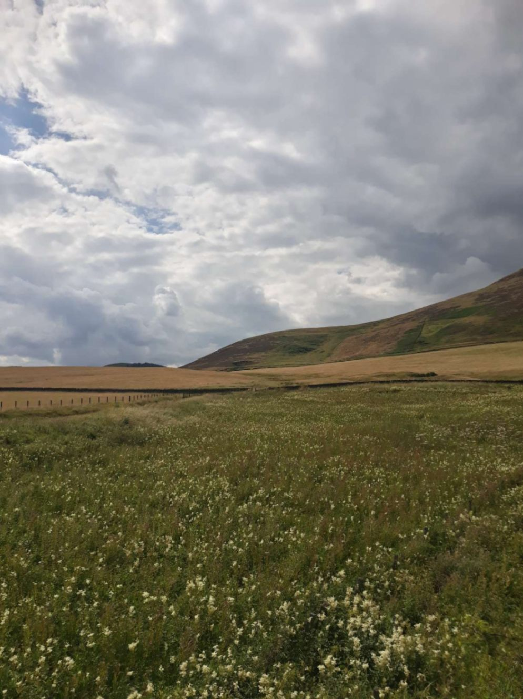

+++

title = "De Carlisle à Edimbourg "

draft = "false"

date = "2022-07-30 07:08:39.959080"
+++

La journée commence par un constat décevant. Un combat de catch a manifestement eu lieu entre mon téléphone et moi dans la nuit. L'écran est en mille morceaux, je suppose qu'on peut dire que j'ai gagné.

Quoi qu'il en soit, il est 5h30, l'heure idéale pour ne rien faire et continuer sa grasse matinée. Pour moi, c'est le moment de me lever péniblement et d'aller m'enfermer dans un conteneur qui fait office de douche pour enfiler mes affaires de vélo trempées.

Il fait si froid et le vent est si fort que je décide d'enfiler mon 2ème maillot, le fameux alpina giro, fourni gracieusement par mes velociste préférés (Myriam et Olivier -si vous lisez ceci- merci mille fois, vous êtes vraiment les meilleurs, je n'en serais pas là sans vos conseils avisés et votre matériel incroyable).

Ce maillot est bien plus épais et plus voyant, je me dis que ça passera mieux sous la bruine. Je mets la totale, couvre chaussures, veste imperméable.







La tente est vite rangée, j'expédie un repas composé de chiffonade de jambon, de pain, de houmous et de quelques prunes (mon régime alimentaire à l'air d'en intéresser plus d'un). Notons bien que dans ce genre de conditions, il n'existe plus vraiment de notions de petit-déjeuner, déjeuner, dîner, etc. Il s'agit juste de MANGER (si possible équilibré).

A plus de 10 000 kcal dépensées chaque jour, je dois faire le maximum pour compenser au moins en partie cette perte d'énergie. Je pars enfin à 7h30, direction Edimbourg.







Une demi-heure plus tard, je dois m'arrêter pour enlever mon imper et le bonnet que j'avais glissé sous mon casque. La bruine et le vent se sont arrêtés, les nuages se sont (un peu) dispersés ; il va faire beau aujourdhui.

Malheureusement, les 100 premiers km mettent à rude épreuve mon moral. Il s'agit de remonter depuis Carlisle l'autoroute qui permet de rejoindre Glasgow ou Edimbourg. Problème, la piste cyclable est littéralement parallèle (et à 30m) de ladite autoroute.

Si je retrouve le génie qui a cru que le bruit de 36 tonnes lancés à 130k/h pouvait être une musique agréable aux oreilles d'un cycliste, je lui dirait ma façon de penser. La route est en mauvais état, pas un village, c'est la traversée du désert.

A midi j'ai englouti 100km, je roule sans réfléchir. Alors que je suis le point d'attaquer mes rations de secours car je tombe de fatigue, un petit café en sortie de village me tire de la torpeur. J'y dejeunerai finalement en compagnie de deux autres cyclistes. Premier repas chaud depuis mardi, je suis en bonne condition pour attaquer l'après-midi.

Petite déconvenue cependant, mon pneu arrière est crevé (au bout de 1000km, c'est honnête), je devrais donc regonfler régulièrement, toute la 2ème partie de la journée.







Cette fois c'est très roulant, j'ai le vent dans le dos, les 40 miles jusqu'à Edimbourg se font sans problèmes. Je fait un tour en ville car je suis en avance et je veux faire revivre mes souvenirs de ma première visite il y a 10 ans (je n'ai rien reconnu).

Je me faufile dans les faubourgs pour atteindre le pont qui me permet de rejoindre l'autre rive et, accessoirement, mon camping. Comme d'habitude il est en haut d'une colline, sauf que cette fois, on me refuse ! Il s'agit en fait d'un camping réservé aux Scouts écossais. Franchement, si ça ne tenait qu'à ça, j'étais prêt à m'engager (ils ont dit non).

On m'indique un autre endroit en bas de la colline. Je redescend, suspicieux car je n'ai rien vu à l'aller. Après une discussion avec le très agréable Chris qui adore "La douce France", j'apprends que le camping a brûlé et que, non, je ne peux pas dormir dans son jardin.

Je m'en remet finalement aux mains expertes de mon GPS qui me propose de... remonter la colline. Je m'exécute, ça m'avance pour demain et je trouverais sans doute un coin de camping sauvage.

Après quelques kilomètres à chercher ardemment un coin de verdure qui pourrait m'accueillir, je tombe sur une pêcherie. Un petit lac, des tentes partout autour, des braseros fumants, des poules et des chèvres en liberté ; une fois de plus, un petit coin de paradis.

Après quelques tractations avec le papy propriétaire des lieux, dont je comprends un mot sur trois, je peux m'installer. L'ambiance, c'est spécial, très redneck. Coupe militaire obligatoire, treillis, bière et canne à pêche en accessoires indispensables. Mais le coin est tranquille et -l'ai-je assez dit ?- j'aime l'odeur du feu de bois.

Demain, on entre dans le vif du sujet, avec une étape qui me mènera dans les alentours d'Inverness. Pendant que j'écris, mes voisins allument un immense brasier, quel bonheur.

## Commentaires
#### Moum
Cher Ivan, je me régale à te lire.C'est terrible de dire ça mais, tout irait comme sur des roulettes, (hey!😉), ça serait moins drôle. Ta ténacité et ton humour face aux galères forcent mon admiration. Je comprends pourquoi tu n'as pas choisi de faire le tour des Pays-Bas, ça aurait été beaucoup moins marrant. Moi qui ne prends même pas mon vélo électrique pour aller à la plage ... (enfin, je peux y aller à pied, c'est vrai, je suis bête ...😁!).
I'm proud of you my son, comme dirait ton papa. Tu es trop mignon dans ton maillot tricolore, je retire tout ce que j'ai dit, je lui suis profondément reconnaissante!
J'espère que tu vas pouvoir régler cette histoire de pneu crevé rapidement. J'ai hâte de découvrir tes nouvelles photos!
With all my motherly love 😘. 

Bonjour à L'Arbre du Chapon! (autre histoire incroyable ... 😊!).
#### Dad
Ça y est, les 1000 bornes sont dépassées, mais ce ne fut pas un jeu !
Mille fois bravo donc.
Petite remarque : quelqu'un a dû te dérégler ton GPS, en effet tu avances en crabe ! En tirant tout droit, tu serais déjà aux Shetlands...
Ainsi tu as rallié Edinburgh sans passer dire bonjour à Leslie à North Berwick, un des plus purs symboles du flegme britannique :
"- Leslie, there's a problem with one of your dog....hem...how to say that....this dog shit on my bedroom's carpet...and....a lot....
- Really, on YOUR carpet, please next time would you mind lock the door....Because you know....."
À quoi est-on en droit de s'attendre face à une telle outrance ? " Fucking dog" ou "Scumbag" eurent semblés appropriés, ou pour le moins sans mettre directement en cause le chien "Holy cow" ou encore le plus soft " Oh my goodness"...
Not at all, en place la pratique de l'art tout britannique de la phrase suspendue : " You know............" à toi d'imaginer la suite mais il va sans dire que la suite tout le monde la connaît. " You know.........." fabuleuse conclusion....
Anecdote britannique mise à part, (c'est pour te faire un peu de lecture à toi aussi...)
Attention, plus tu montes au nord, plus il fait froid, plus les routes font des détours, plus Ils rajoutent du beurre dans les Flapjack et de l'huile dans les FaC.
Nous nous régalons de toutes tes anecdotes et des photos !
Come on son and stay on the left side.
#### L’arbre du chapon
L’arbre du chapon
Quel savoureux récit, j’adore te lire, et découvrir ton périple. Je frémis À l’idée de t’imaginer dans tes vêtements mouillés…. Ayant passé une semaine en Écosse en camping avec de la pluie non-stop et sans pouvoir rien sécher, je  compatis… Sans compter la fatigue !
Je revois ce pont d’Édimbourg et me souviens de ces Écossais un peu bourrus!! 
Je ne sais même pas comment tu peux prendre le temps de nous écrire tellement tu dois être éreinté. 
Mais je vois que le positif domine! 
Have good trip!!! And read you soon !
#### Brice
Ce genre d'aventure donne beaucoup à rêver en regardant les photos mais à te lire quelques péripéties pimentent ton voyage et tu sembles tenir bon 💪 Il devient un peu plus scottich aussi, 😅 tenteras-tu une étape en tenue folklorique ? "Kilt" à être là-bas ! 😜 Bonne route and... take care et fais attention aux squirrels 🐿😃
#### Sandrine
Ouah! Le niveau d'aventure ne descend pas ! Quel périple ! Tes parents sont très fiers de toi et je les comprends !! 
Cela ne t'a pas suffi le combat contre le portable? A-t-il fallu que tu t'en prennes à la gourde?😂 Ou je n'ai pas compris la photo!🤔
Est-ce que les midges ont pensé à te réserver le meilleur accueil?😀👍
Je guette avec impatience le prochain article!!
#### Olivier et Myriam
Complètement en admiration devant ton périple !
Quel courage et quelle humilité.
Merci à toi et à bientôt autour d’un bon café italien 😁
Nos amitiés
