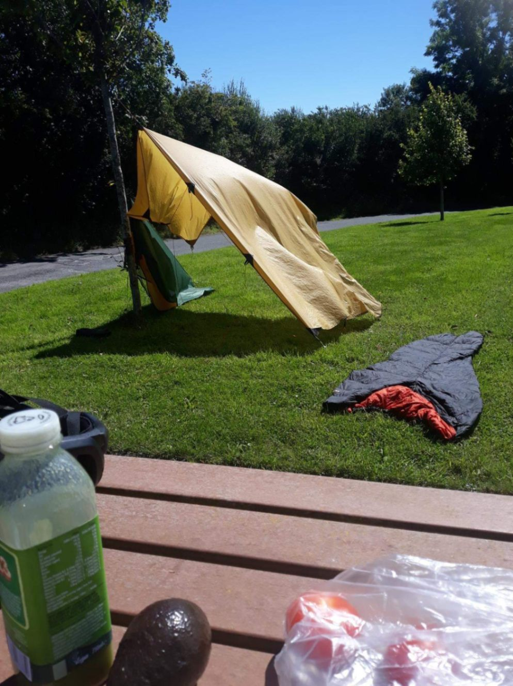
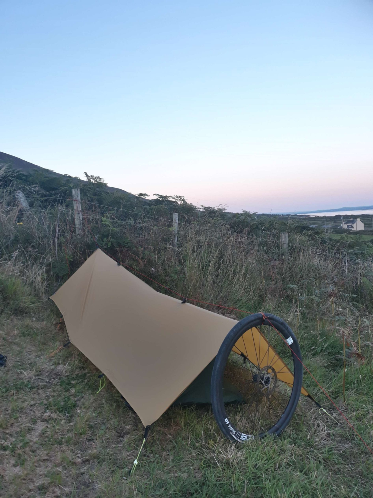

+++
title = "From Carrigaholt to Inch Beach"
draft = "false"
date = "2022-08-10 22:29:31.915999"
+++

"He adored Ireland. He idolized it all out of proportion...no, make that: he - he romanticized it all out of proportion. Yeah. To him, no matter what the season was, this was still a country that existed in black and white and pulsated to the great tunes of the Dubliners.' Uh, no let me start this over." (Good luck finding where this comes from, which I've mangled once again).

I wake up grumpy this morning. My phone battery decided to die during the night and so it didn't ring this morning. It's not like the first days, with accumulated fatigue I no longer wake up at the first light of dawn.

So it's 8am when I emerge, hearing noise around me. I'm literally soaked (see the photo of the inside of the tent where water trickles down the walls). A thick mist, like yesterday, obscures the landscape. I who wanted to do a long day, that's ruined.

I get ready in a flash, down my breakfast standing up, chatting with my neighbours. As I'm about to leave, a Frenchman who just did the peninsula I'm heading to today tells me I'm going to climb the highest pass in Ireland, no less!







I love this kind of surprise, it immediately makes the day more interesting; the magic of planning nothing of your holidays apart from a vague itinerary. Departure at 9:30am, after a handful of minutes I shed jacket, leg warmers and arm warmers: we were just in a cloud, the sun is shining brightly and the temperature is already high.

I unfortunately feel that form isn't there. I don't understand these spells of laziness, I ate well last night and this morning, slept well and yet I have no energy, just the desire to go rest in the shade of a tree.







I drag myself to Kilrush where I do big shopping because I had nothing left. I buy way too much actually, which forces me to carry my small backpack. I don't like that, it makes me sweat.

In Killimer I take the ferry to cross to the other side of the inlet, which saves me a huge detour inland. Shortly after -it's already past noon- I stop for my lunch break.







I take the opportunity to dry all my gear; I'll lose time packing everything, but I can't stand the humidity and the smell that goes with it anymore. I make the classic mistake when I'm tired: I eat too much.

Slouched on a picnic table, I devour toast after toast (with hummus or pesto, tomatoes and peppers), then an industrial quantity of dried dates.







Once everything is dry and I'm full, I get back on the road. Not easy with these extra kilos. The path from the landing stage isn't very interesting, I cross a peaceful but dull countryside, where only a few rivers brighten the landscape.

On the sandy banks, boats sleep in the sun. I finally dig up a café in a village, where in addition to my Americano I'm served iced water for my bottles.

I'm fascinated by these country villages, they no longer bother to give names to shops. Want a drink? It happens at Alan's café, unless you prefer to drink across the street, at Loyd's bar.

I finally arrive in Tralee. The town is perfectly charming, the kind of small rural town where I'd like to spend at least a day, visiting all the little colourful shops with vintage names.







But I dash off, because I've done very few kilometres so far and I'm eager to reach Connor's Pass. I try the method taught by my friend Maxime which consists of swallowing a dose of instant coffee with a gulp of water, to wake up a bit. It's absolutely atrocious and I nearly spat it all out, but at least it gives me a little boost.

The landscape changes, becomes more rolling. I see the slopes I'll soon be tackling. Since form isn't quite there yet, I conserve energy as much as possible, enjoying the wind that's still pushing me.

Here I am at the foot of the pass. I'm told 400m of elevation gain over 5km. That seems frankly manageable, especially after the 28,000m of climb I have in my legs and the terrible ramps of the Lake District.

I'm not mistaken, the climb is easy, pleasant. The gradient doesn't exceed 7%, but the sun still beating down makes me drip copiously. Calmly, I string together the small hairpin bends, the view opens and stretches over the "fjord" I crossed this morning.

At the top, I see the lighthouse from yesterday's point and even the Aran Islands! Charming landscape. Even more charming is the descent I glimpse on the other side. Big bends that beckon me.

I put my jacket back on and launch myself onto this immense playground, there are few cars. I descend the valley at good speed, before turning westwards, to follow the coast towards the campsite I spotted this morning.

Soon, I'm surrounded by hills with pink outcropping rocks. The setting sun changes the colour of the grass and heather, giving it orange and golden reflections like I'd never had the chance to see before.

This landscape reminds me delightfully of the Aubrac, which I visited last March. Major difference here: at each bend, the promise of catching a glimpse of the sea; an almost-island privilege.

A long gentle descent carries me to the beach. A gigantic grassy dune almost completely cuts off this new inlet. A surf school and many vans are gathered there, it's a place much appreciated by foreigners.

The campsite is on the hillside, I'm placed at the very top, it's windy but quiet, so perfect. After a copious dinner of chips and hot dog, I find the beach hotel bar (again) to welcome me and serve me a drink.

Nothing planned for tomorrow, I have, as some have pointed out, few kilometres left to Cork. So I take the road quietly, taking the opportunity to visit, rest.

(P.S. what would a good day in Ireland be without being offered a Guinness as I finish this article?)
