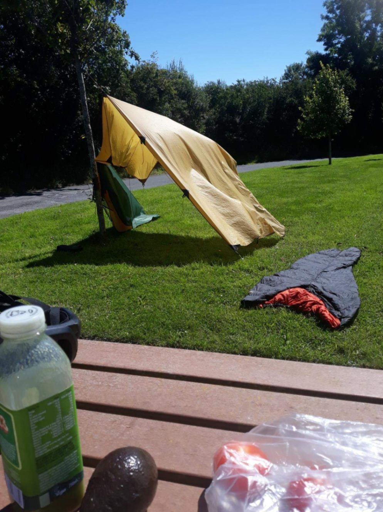
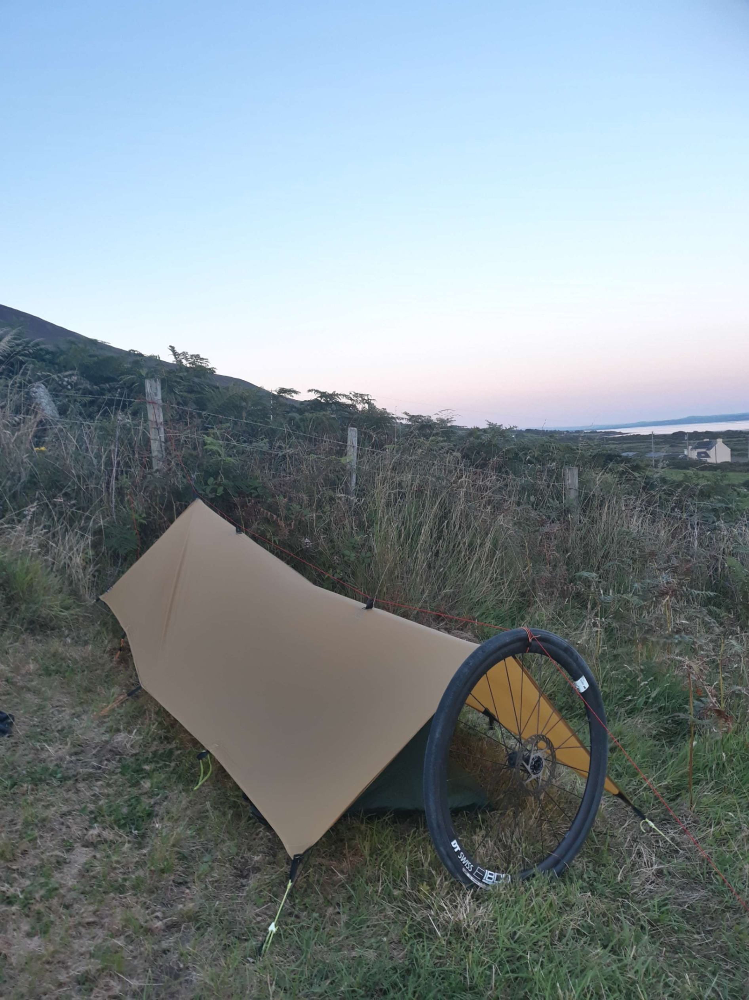

+++
speed = "15.315451"
title = "De Carrigaholt à Inch Beach"
gps = "Morning_Gravel_Ride.png"
draft = "false"
distance = "158115"
elevation = "1609"
duration = "10:19:26"
date = "2022-08-10 22:29:31.915999"
+++

"He adored Ireland. He idolized it all out of proportion...no, make that: he - he romanticized it all out of proportion. Yeah. To him, no matter what the season was, this was still a country that existed in black and white and pulsated to the great tunes of the Dubliners.' Uh, no let me start this over." (Bon courage pour trouver d'où vient celle-là, que j'ai truandée une fois de plus).

Je me lève bougon ce matin. La batterie de mon téléphone a décidé de me lâcher dans la nuit et il n'a donc pas sonné ce matin. Ce n'est pas comme les premiers jours, avec la fatigue accumulée, je ne me réveille plus aux premières lueurs de l'aube.

Il est donc 8h lorsque j'émerge, entendant du bruit autour de moi. Je suis littéralement trempé (voir la photo de l'intérieur de la tente où l'eau ruisselle sur les parois). Une brume épaisse, comme hier, obstrue le paysage. Moi qui voulais faire une grande journée, c'est râpé.

Je me prépare en quatrième vitesse, avale mon petit-déjeuner debout, en discutant avec mes voisins. Au moment de partir, un français qui vient de faire la péninsule où je me rends aujourd'hui m'apprend que je vais gravir le col le plus haut d'Irlande, rien que ça !







J'adore ce genre de surprises, ça rend tout de suite la journée plus intéressante ; la magie de ne rien prévoir de ses vacances à part un vague itinéraire. Départ à 9h30, au bout d'une poignée de minutes je tombe veste, jambières et manchettes : nous étions juste dans un nuage, le soleil brille fort et la température est déjà élevée.

Je sens malheureusement que la forme n'est pas au rendez-vous. Je ne comprends pas ces accès de paresse, j'ai bien mangé hier soir et ce matin, bien dormi et pourtant je n'ai aucune énergie, juste l'envie d'aller me reposer à l'ombre d'un arbre.







Je me traîne jusqu'à Kilrush où je fais de grandes courses car je n'avais plus rien. J'en achète beaucoup trop d'ailleurs, ce qui m'oblige à transporter mon petit sac à dos. Je n'aime pas ça, ça me fait transpirer.

À Killimer je prends le ferry pour passer de l'autre côté du bras de mer, ce qui m'évite un immense détour par les terres. Peu de temps après -il est déjà midi passé- je m'arrête prendre ma pause déjeuner.







J'en profite pour faire sécher toutes mes affaires ; je vais perdre du temps à tout ranger, mais je ne supporte plus l'humidité et l'odeur qui va avec. Je commets l'erreur classique lorsque je suis fatigué : je mange trop.

Avachi sur une table de pique-nique, je dévore tartines sur tartines (de houmous ou pesto, avec tomates et poivrons), puis une quantité industrielle de dates séchées.







Une fois que tout est sec et que je suis rassasié, je reprends la route. Pas facile avec ces kilos en trop. Le chemin depuis le débarcadère n'est pas très intéressant, je traverse une campagne paisible mais morne, où seules viennent égayer le paysage quelques rivières.

Sur les berges sablonneuses, des barques dorment au soleil. Je dégote enfin un café dans un village, où l'on me sert en plus de mon americano une eau glacée pour mes gourdes.

Je suis passionné par ces villages de campagne, on ne s'embête plus à donner des noms aux commerces. Vous voulez prendre un verre ? Ça se passe au Alan's café, à moins que vous ne préfériez boire en face, au Loyd's bar.

J'arrive finalement à Tralee. La ville est parfaitement charmante, le genre de petite bourgade rurale où j'aimerais passer au moins une journée, à visiter toutes les petites échoppes colorées aux noms vintage.







Mais je file, car j'ai fait bien peu de kilomètres pour l'instant et j'ai hâte d'atteindre Connor's Pass. Je tente la méthode enseignée par mon ami Maxime qui consiste à avaler une dosette de café soluble avec une gorgée d'eau, pour me réveiller un peu. C'est absolument atroce et j'ai failli tout recracher, mais au moins ça me donne un petit coup de fouet.

Le paysage change, devient plus vallonné. J'aperçois les pentes auxquelles je vais bientôt m'attaquer. Comme la forme n'est pas encore tout à fait là, je m'économise à fond, profitant du vent qui me pousse toujours.

Me voilà enfin au pied du col. On m'annonce 400m de dénivelé répartis sur 5km. Ça me paraît franchement abordable, surtout après les 28 000m de d+ que j'ai dans les pattes et les rampes terribles du Lake District.

Je ne m'y trompe pas, la montée est facile, agréable. Le dénivelé ne dépasse pas 7%, mais le soleil qui tape encore fort me fait allègrement dégouliner. Tranquillement, j'enchaîne les petits lacets, la vue s'ouvre et s'étire sur le "fjord" que j'ai traversé ce matin.

En haut, j'aperçois le phare de la pointe d'hier et même les îles d'Aran ! Charmant paysage. Plus charmante encore est la descente que j'entrevois de l'autre côté. De grands virages qui me tendent les bras.

Je remets ma veste et m'élance dans cette immense piste de jeu, il y a peu de voitures. Je descends le vallon à bonne vitesse, avant de bifurquer vers l'ouest, pour longer la côte vers le camping que j'ai repéré ce matin.

Rapidement, me voilà encerclé de collines aux rochers roses affleurant. Le soleil couchant fait changer de couleur l'herbe et la bruyère, lui donne des reflets oranges et dorés comme jamais encore je n'avais eu la chance d'en observer.

Ce paysage me rappelle avec délice l'Aubrac, que je visitais en mars dernier. Différence majeure ici : à chaque sortie de virage, la promesse d'apercevoir la mer ; privilège presque-insulaire.

Une longue et douce descente m'emporte jusqu'à la plage. Une gigantesque dune herbeuse coupe presque en entier ce nouveau bras de mer. Une école de surf et de nombreux vans y sont amassés, c'est un lieu fort apprécié des étrangers.

Le camping est sur le flanc de la colline, on m'installe tout en haut, c'est venteux mais tranquille, donc parfait. Après un dîner copieux à base de frites et hot-dog, je trouve le bar de l'hôtel de la plage (encore) pour m'accueillir et me servir à boire.

Rien de prévu pour demain, il me reste, comme certains l'ont fait remarquer, peu de kilomètres jusqu'à Cork. Je prends donc la route tranquillement, j'en profite pour visiter, me reposer.

(P.S. que serait une bonne journée en Irlande sans que l'on m'offre une Guiness alors que je finis cet article ?)
