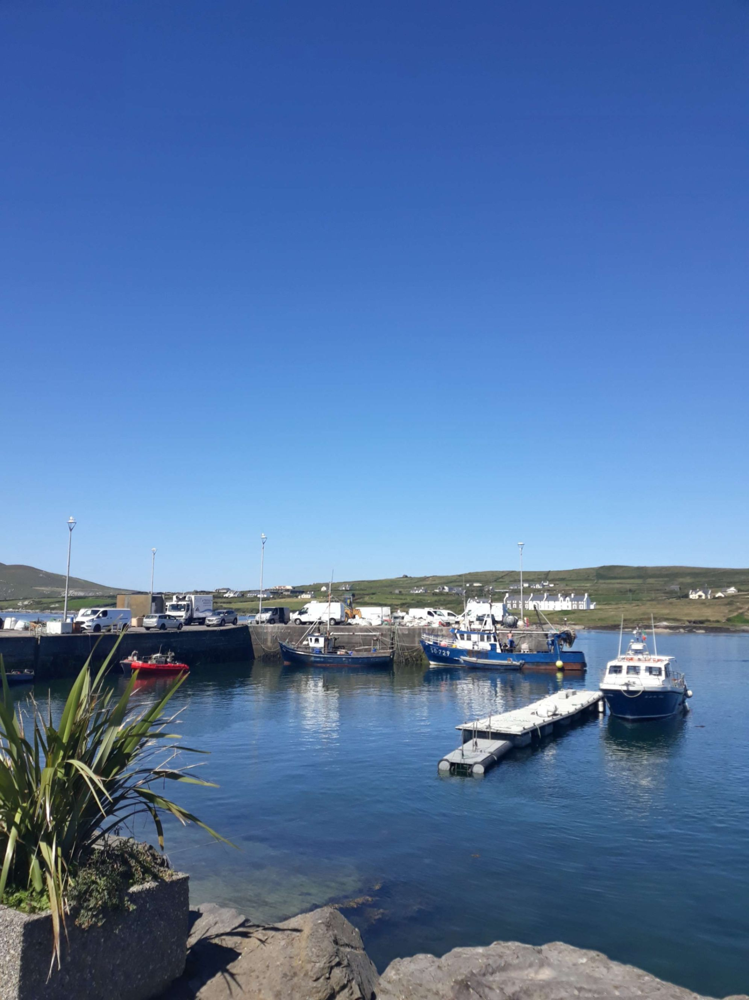
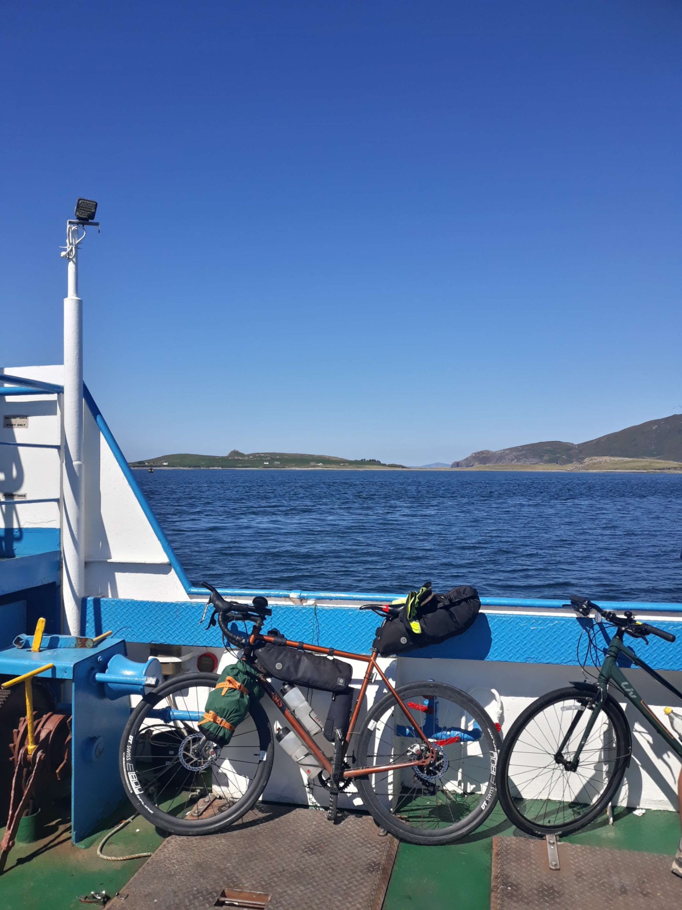

+++
title = "From Inch Beach to Beara"
draft = "false"
date = "2022-08-11 21:40:59.431869"
+++

What a beautiful sight the sunrise over the dune this morning. From my perch, it's a magnificent spectacle. I prepare quickly, this time it's the perfect opportunity to make some kilometres.

I know my planned route doesn't make a full loop of the next peninsula, so I can add quite a few miles if I feel up to it.

I had planned to treat myself to two or three slices of English cake, I eat the whole thing, plus a yoghurt and a fruit (tough, this morning appetite!). It's already so mild that I leave in shorts and t-shirt, what a joy!

I don't make the same mistake as yesterday: barely ten kilometres in I come across a service station, I stop for a coffee. It's about waking up quickly, to gauge my potential for the day. Looks pretty good!







The first hours go without a hitch, they allow me to go around the inlet. Once on the other side, the wind catches me like yesterday, it blows in the same direction and I fly without effort towards the point, where many small summits await.

Very early, I turn off the GPS; this day will be under the sign of the pleasure of riding and I don't want to burden myself with a pre-defined route. Besides, I'm starting to feel really good.







First small ascent, a coffee awaits me at the top, it's the occasion for another hot drink accompanied by a raisin scone (please let these cakes become more common in France).

These last few days, I've abandoned my flapjack collection for chocolate McVitie's, biscuits I forbid myself in everyday life because too fatty and too sweet, but which I love (dipped in tea, try it!).







The area is really very touristy, I sometimes have to slalom between coaches, but that's really the only shadow on the picture. The sun shines with all its might, not a cloud to trouble the sky.

I soon arrive at the famous junction that should allow me to avoid the whole tip of the peninsula. My form is definitely there, it's early, so I take the little dead-end road instead.







Very quickly, I arrive at a ferry (another one) that I take, out of curiosity and for the modest sum of €2. Without knowing it, I've just started the Ring of Kerry, an incredible scenic route going around the point.

I follow the coastline, especially in front of the Skellig islands, a high place of Irish smuggling (so here everything is linked: smuggler's bay, smuggler's cafe, smuggler's hotel...).

Bad luck, I soon arrive at the cliffs of the island, which are a high place of local cycling. I'm greeted by a climb at 10% average with beautiful ramps at 14%. Under 30°, it's less easy than in the Lake District.

Despite everything, the climb is short and I reach the summit, from where I can contemplate the bluish immensity dotted with small green and grey confetti.







At the top there's also a group of hilarious Germans, in jeans and shirts, not athletic in the slightest and yet not particularly sweaty. They ride magnificent electric bikes whose Bosch motor must produce, without a doubt, at least four times the power of the cyclist sitting on it.

I'm happy they're climbing like that rather than in a camper van, but a bit frustrated too, given the effort I just put in.







I leave before them, no question of queuing in this somewhat tricky descent, which heats up my brakes like rarely before. At the bottom, the bliss continues. I go from bay to bay, each more magnificent than the last.

Seeing these peninsulas on the map, I expected something more like Cap Fréhel for example, rugged and flat. Here, I feel like I'm in Corsica, or even other more exotic islands.







Small steep mountains plunge into the sea, while between their foothills hide sandy coves with turquoise water. Some pastures on the flats and sometimes a white house.

The road is very good, I zoom happily in aero position. I feel I've gained a lot in flexibility since the start of the trip, I spend practically my whole day on the aero bars and the numbers don't lie!

I take a strategic pause and here come the Germans catching up with me! We start the second pass in single file... I can't stand for long the crackling of electric motors and the sight of flabby calves activating them.

A furious pedal stroke allows me to overtake all these people. I spot a silhouette in a triathlon suit higher up: there's a good target. I catch up, he hears me, glances behind him then accelerates the pace; I like that!





I push too to stay in his wheel, he can't shake me off. I follow him to the top, then in the first bends of the descent. Thanks to a long straight, I get back on the aero bars and it's over for him, he can't compete with so much aerodynamics.

I overtake him and we greet each other with a knowing smile: it was a nice little race. I let myself be peacefully carried along the rest of the route to the very charming town of Sneem where I enjoy a nice slice of apple pie with a last coffee.

In Kenmare I do some small shopping for the evening then I quietly finish my last 15 km to the campsite. My blood sugar level plummets, after consuming so much sugar during the day.

I see stars and my legs wobble, nothing abnormal but not easy to keep clear thoughts until arrival, especially since I don't want to consume any more sugar for now.

The campsite is, for once, well equipped for "tenters" and I find a nice common area to recharge my devices and eat dry (because the humidity is still there, despite the heat).

It'll be hard to do better in the coming days than this perfect day. I'll probably ride the same way tomorrow, without overthinking it; the forecast is also good.

## Comments
#### Moum
Ah Ivan, what joy this stage! It's splendid!!! I'm glad you finally have good weather, it changes your life, even if, luckily for riding, you don't have the temperatures we have here, 🥵, well, it's a bit like the Seychelles there, 😎, but the water stays cool! It fascinates me to see you ingest so many "sweet treats" without it stopping you from having wings!! Your food photos, pure joy! ha!ha!😋 And what energy! I see you were able to put your taste for challenge to good use! Bravo! Enjoy these extraordinary conditions and keep pêching!! 😉😘
PS: I see there's competition. I bow this time to the speed of the adversary, (whom I salute), in finding this dear Allen!😉
#### Dad
There are the grandiose landscapes, the anecdotes, the encounters. I'm stunned and amused by the place occupied by what in normal times one might call "the little treats"... It's a true Prévert-style inventory:
- A yoghurt, a fruit, two or three slices of English cake.
A large service station Americano.
- A raisin scone, a Flapjack from the bottom of the bag, two McVitie's, a tea to dip the McVitie's.
Two tall Germans with flabby calves.
- A nice slice of apple pie.
A small Irish coffee.
- A tired camper slips under his tent, all aerodynamics.
Good day Brett, under the sun and near turquoise waters.
Come on son, keep contourning et recontourning.
#### Yann
It's me again!
I'm slowly but with great joy catching up on reading your logbook.
I see you also know how to treat yourself :D That's great, you should.
And there you even went without GPS to enjoy. That must have been top.
But I'm worried, did you have enough coffee on this day?
Sugar is good, but caffeine?
He he, I'm not serious, you know your needs better than me. Anyway, this climb with the electro-cycled Germans that you managed to overtake, I say bravo! And for the other cyclist it must have been nicer. I take my hat off to you (even if I don't have one here ;)) But I do my best lol
Come on, have a nice day, I see the sun is there, enjoy it well
Bises
