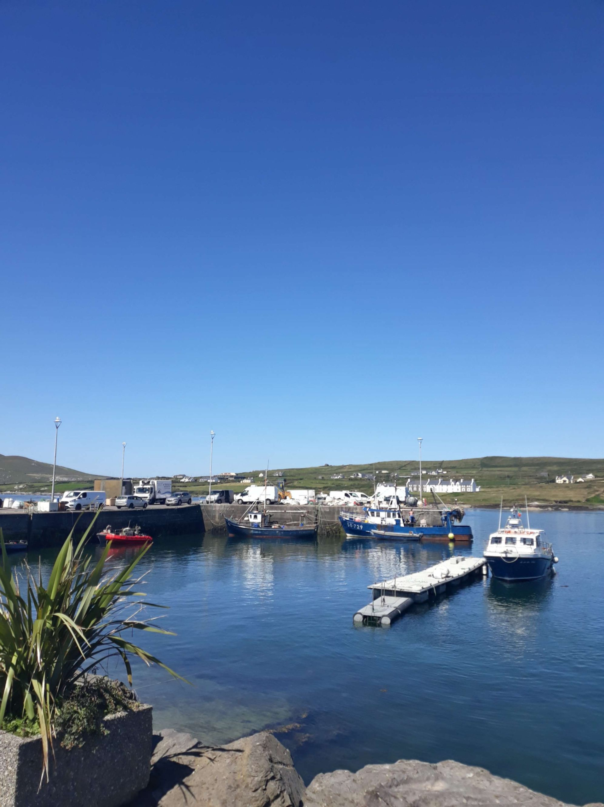
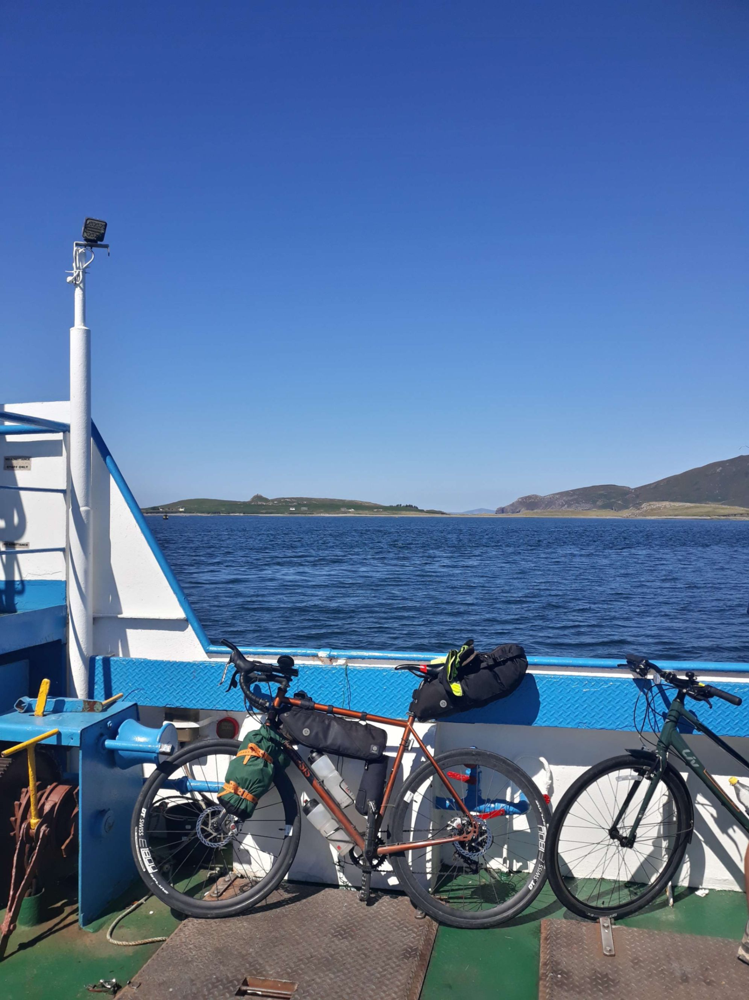

+++

title = "De Inch Beach à Beara"

draft = "false"

date = "2022-08-11 21:40:59.431869"
+++

Quel beau spectacle que le soleil levant sur la dune ce matin. De mon perchoir, c'est un spectacle magnifique. Je me prépare rapidement, cette fois c'est l'occasion rêvée de faire des kilomètres.

Je sais que mon itinéraire prévu ne fait pas la boucle complète de la prochaine péninsule, donc je peux me rajouter pas mal de bornes si je me sens en forme.

J'avais prévu de me régaler de deux ou trois tranches de cake anglais, je l'avale en entier, en plus d'un yaourt et d'un fruit (costaud, cet appétit du matin !). Il fait déjà tellement doux que je pars en short et t-shirt, quel bonheur !

Je ne fais pas la même erreur qu'hier : au bout de dix kilomètres à peine je tombe sur une station service, je m'y arrête prendre un café. Il s'agit de se réveiller rapidement, histoire de jauger de mon potentiel pour la journée. Ça m'a l'air plutôt bien !







Les premières heures se déroulent sans accrocs, elles me permettent de contourner le bras de mer. Une fois de l'autre côté, le vent m'attrape comme hier, il souffle dans la même direction et je m'envole sans effort vers la pointe, où s'annoncent de nombreux petits sommets.

Très tôt, je coupe le GPS ; cette journée se déroulera sous l'égide du plaisir de rouler et je ne veux pas m'encombrer d'un itinéraire prédéfini. En plus, je commence à me sentir vraiment bien.







Première petite ascension, un café m'attend en haut, c'est l'occasion d'une nouvelle boisson chaude accompagnée d'un scone aux raisins (pitié faites que ces gâteaux deviennent plus courants en France).

Ces derniers jours, j'ai abandonné ma collection de flapjack pour passer aux MacVities au chocolat, gâteaux que je m'interdis dans la vie de tous les jours car trop gras et trop sucrés, mais dont je raffole (trempés dans du thé, essayez !).







La zone est vraiment très touristique, je dois parfois un peu slalomer entre les cars, mais c'est vraiment la seule ombre au tableau. Le soleil brille de toutes ses forces, il n'y a pas un nuage pour troubler le ciel.

J'arrive bientôt au fameux embranchement qui devrait me faire éviter tout le bout de la presqu'île. Ma forme est bien là, il est tôt, je m'engage donc plutôt sur la petite route en cul de sac.







Très vite, j'arrive à un ferry (encore un) que j'emprunte, par curiosité et pour la modique somme de 2€. Je viens sans le savoir de commencer le Ring of Kerry, un parcours scénique incroyable faisant le tour de la pointe.

Je suis le trait de côte notamment devant les îles de Skellig, haut lieu de la contrebande irlandaise (donc ici tout y est lié : smuggler's bay, smuggler's cafe, smuggler's hotel...).

Pas de chance, j'arrive bien vite sur les falaises de l'île, qui, elles, sont un haut lieu du cyclisme local. Je me fais accueillir par une montée à 10% de moyenne avec de belles rampes à 14%. Sous 30°, c'est moins facile que dans le Lake district.

Malgré tout, la montée est courte et je parviens au sommet, d'où je peux contempler l'immensité bleutée parsemée de petits confettis verts et gris.







En haut il y a aussi un groupe d'Allemands hilares, en jeans-chemise, pas sportifs pour un sou et pourtant pas franchement transpirants. Ils montent de magnifiques vélos électriques dont le moteur Bosch doit produire, à n'en pas douter, au moins quatre fois la puissance du cycliste assis dessus.

Je suis content qu'ils grimpent comme ça plutôt qu'en camping-car, mais un peu frustré aussi, vu l'effort que je viens de fournir.







Je repars avant eux, pas question de faire la queue dans cette descente un peu ardue, qui fait chauffer mes freins comme rarement jusqu'alors. En bas, l'extase se poursuit. Je passe de baie en baie, plus magnifiques les unes que les autres.

En voyant ces péninsules sur la carte, je m'attendais plus à quelque chose du genre du cap Fréhel par exemple, rude et plat. Ici, j'ai l'impression d'être en Corse, voire dans d'autres îles plus exotiques encore.







De petites montagnes abruptes se jettent dans la mer, tandis qu'entre leurs contreforts se cachent des criques sablonneuses à l'eau turquoise. Quelques pâturages sur les replats et parfois une maison blanche.

La route est très bonne, je file joyeusement en position aéro. Je sens que j'ai beaucoup gagné en souplesse depuis le début du voyage, je passe pratiquement ma journée sur les prolongateurs et les chiffres ne mentent pas !

Je fais une pause stratégique et voilà que les allemands me rattrapent ! On entame le deuxième col en file indienne... je ne supporte pas longtemps le crépitement des moteurs électriques et la vue des mollets flasques qui les activent.

Un petit coup de pédale rageur me permet de dépasser tout ce beau monde. J'aperçois une silhouette en combinaison de triathlon plus haut : voilà un bon objectif. Je le rattrape, il m'entend, jette un coup d'œil derrière lui puis accélère la cadence ; ça me plaît !





Je pousse aussi pour rester dans sa roue, il n'arrive pas à me lâcher. Je le suis jusque en haut, puis dans les premiers lacets de la descente. À la faveur d'une grande ligne droite, je repasse sur les prolongateurs et c'est fini pour lui, il ne peut pas rivaliser avec tant d'aérodynamisme.

Je le dépasse et nous nous saluons d'un sourire entendu : c'était une belle petite course. Je me laisse tranquillement porter sur la suite du trajet jusqu'à la très charmante ville de Sneem où je déguste une belle part de tarte aux pommes avec un dernier café.

À Kenmare je fais de petites courses pour le soir puis je termine tranquillement mes 15 derniers km vers le camping. Mon taux de glycémie s'effondre, après avoir consommé tant de sucre durant la journée.

Je vois des étoiles et j'ai les jambes qui flageolent, rien d'anormal mais pas facile de garder les idées claires jusqu'à l'arrivée, d'autant que je ne veux plus consommer de sucre pour le moment.

Le camping est, pour une fois, bien prévu pour les "tentistes" et j'y trouve un bel espace commun où recharger mes appareils et manger au sec (car l'humidité est toujours là, malgré la chaleur).

Ce sera difficile de faire mieux dans les jours à venir que cette journée parfaite. Je vais rouler de la même façon demain sûrement, sans me prendre la tête ; le temps annoncé est aussi bon.

## Commentaires
#### Moum
Ah Ivan, quelle jubilation cette étape! C'est splendide!!! Je suis contente que tu aies enfin du beau temps, ça change la vie, même si, heureusement pour rouler, tu n'as pas les températures que nous avons ici, 🥵, bon, c'est un peu les Seychelles là, 😎, mais l'eau reste fraîche! Ça me fascine de te voir ingurgiter autant de "lichouseries" sans que cela ne t'empêche d'avoir des ailes !! Tes photos gastronomiques, un vrai bonheur! ha!ha!😋 Et quel tonus! Je vois que tu as pu mettre à profit ton goût pour le défi! Bravo! Profite-bien de ces extraordinaires conditions and keep pêching!! 😉😘
PS: je vois qu'il y a de la concurrence. Je m'incline cette fois devant la rapidité de l'adversaire, (que je salue au passage), à trouver ce cher Allen!😉
#### Dad
Il y a les paysages grandioses, les anecdotes, les rencontres. Je suis stupéfait et amusé de la place qu'occupent ce qu'en temps normal on pourrait appeler " les petites cochonneries"... C'est un véritable inventaire à la Prévert :
- Un yaourt, un fruit, deux ou trois tranches de cake anglais .
Un grand Americano de station.
- Un scone aux raisins , un Flapjack de fond de sacoche, deux MacVities, un thé pour tremper les MacVities.
Deux grands allemands aux mollets flasques.
- Une belle part de tarte aux pommes.
Un petit café irlandais.
- Un campeur fatigué se glisse sous sa tente tout en aérodynamisme.
Bonne journée Brett, sous le soleil et près des eaux turquoises.
Come on son, keep contourning et recontourning.
#### Yann
C'est encore moi ! 
Je rattrape doucement mais avec beaucoup de joie la lecture de ton carnet de bord.
Je vois que tu sais aussi te faire plaisir :D C'est top, il faut.
Et là en plus tu es vraiment parti sans GPS pour profiter. Ce devait être top.
Mais je suis inquiet, as-tu pris assez de café en ce jour ?
Le sucre c 'est bien, mais la caféine ?
Hé hé, je ne sjuis pas sérieux, tu connais mieux tes besoins que moi. En tout cas , cette montée avec les allemands électrocyclés que tu as su dépasser , je dis bravo ! Et pour l'autre cycliste ça devait être plus sympa. Je te tire mon chapeau (même si je n'en ai pas là ;) ) Mais je fais de mon mieux lol
Allez belle journée, je vois que le soleil est là, profite en bien
Bises
