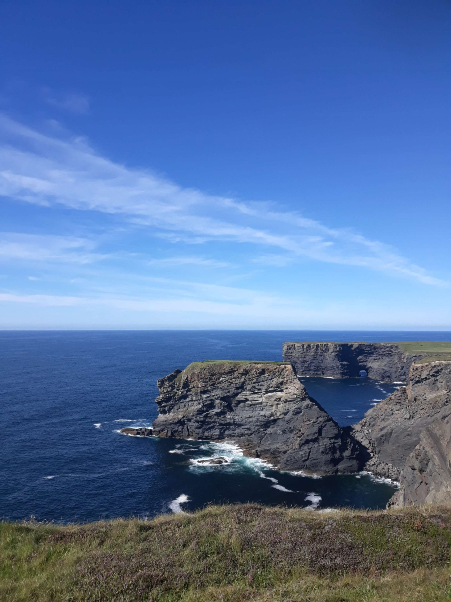

+++
title = "From Inishmore to Carrigaholt"
draft = "false"
date = "2022-08-09 21:57:09.571363"
+++

Finally an early wake-up! Actually, I mainly get up because everything, absolutely everything is soaked. The island is extremely humid this morning and the dew has well penetrated under the tent. The sleeping bag is soaked and drops tumble onto my face.

It's a magnificent sun that welcomes me, as I crawl in the wet grass outside my shelter. I put on my sandals to go take some photos.

Taking advantage of the common room that opens early, I have breakfast in the warmth, only to discover, on leaving, that a thick mist has invaded the landscape. No more beaches, small fields bounded by stones, etc; I already struggle to find my tent.

Things are quickly packed, the freshly cut grass doesn't help, I get it everywhere, in and on my bags.







I believe a ferry leaves around 10am, so I take advantage of the few hours I have left to explore the island. A few pedal strokes and I'm on the small winding roads that snake through fields.

If the mist prevents me from seeing much, it gives the landscapes I glimpse an even more mysterious, even mystical, aspect. The ruins of a castle, an old Celtic cemetery and always cows and horses, everywhere.







I thought I was heading straight East and here I am at the Western tip. A pretty lighthouse awaits me there, at the other end of a beach of large white pebbles. I settle in to enjoy some fruit cake and suddenly, miracle, the fog vanishes for a few moments.

I can finally enjoy a clear view of the open sea, in the distance I see the hills of Connemara that I left yesterday. Not a sound, no animals, no people, no boats.







It's past 9am, I pack my cake away, the mist returns. The return is a bit less leisurely, I want to know the details of the crossing at the harbour office.

It's at the tourist office that I'm received: the boat leaves at 10:45am, I have a bit over three-quarters of an hour free. I do some small shopping at Spar then, after chatting with the cashier who turns into a tour guide and then with a cycling enthusiast waiting for me outside, it's high time to head to the quay.







In front of the port, I have 10 minutes left, I'd gladly have a good hot coffee (it's becoming a whim, I know). I push open the door of the reception room of a somewhat luxurious B&B, ignoring the "residents only" sign.

I apologise for my intrusion to the hostess who welcomes me and ask for the famous coffee, she happily agrees to give me one and, when I ask how much I owe her, I get an answer we'd like to hear more often: "nothing, I believe in karma".

That's convenient, so do I, and today the planets seem rather well aligned. I dash to the quay with my coffee, the best there is. An old sea dog, cap screwed on his head and a few teeth missing, lifts my bike with a light gesture and there's the little iron cross loaded on the upper deck.

The website indicated 32€ for the crossing, on board they ask me for 25, I negotiate 15 (student advantage...). These little shuttles go quite fast, I let myself be rocked by the waves and before the end of the mere 35 minutes of crossing that separate us from the coast, I manage to fall asleep for a few handfuls of minutes.





 

Disembarkation at Doolin, a small very touristy resort which I quickly escape. A short journey takes me inland to Lisdoovarna, where I have lunch. The temperature rises, I remove arm warmers and leg warmers, apply a second layer of sunscreen.

I follow the coastal road that should take me to Kilkee and its majestic cliffs. No difficulties today, very little climbing and the wind pushes me strongly -to my great pleasure- through the verdant pastures overlooking the sea.






Many people on this road, the sun has brought the Irish out of their homes, the beaches are crowded. The arrival in front of the cliffs leaves me speechless for a moment. The sea is a deep blue, the cliffs immense, the rollers crashing against them impressive.

The road closely follows this sculpted coast and I discover the Ross bridge that an old man in a café had told me about. A large stone arch stands over the sea and facing it, a rocky spur, a striking spectacle.

I don't linger too long because I started the route very late, around noon, and I want to do at least a good hundred kilometres despite everything. I soon reach the lighthouse at the tip of the peninsula, where the old man from the café had also arranged to meet me.

I'm very glad to run into him because he not only points out a bar that also serves as a grocery but also a nearby campsite. We're indeed in the deep countryside, the last small shop I saw was over two hours ago and of course I have absolutely nothing to eat.

Thanks to him, I'm soon restocked with the highest quality provisions (beans, sardines in oil and sliced bread) and I quietly finish this short day of cycling -but big in emotions- in a nice campsite, with my feet in the water.

Bad luck, once again no proper spot for the tent, I'm starting to know the tune: I'll be soaked. This constant humidity is becoming hard, despite the daytime weather!

Tomorrow, I need to take the ferry early to cross the large sea inlet facing me. I hope to treat myself with a long day of pedalling; if only the sun will still be on my side.

## Comments
#### Sandrine
Hello Ivan!
Another delight reading you! I can't wait to know the rest: are you going to venture into the "fingers" of the southwest? Or do you have another plan? We'll see tonight...
You definitely have a gift for attracting sympathy as we've lost count of the offerings you receive along your route!
Anyway, continue to delight in these magnificent expanses... And if the morning drops are too unpleasant for you, you can already imagine that in Bordeaux you'll probably miss them, given the weather there!!
Have a nice day!
P.S. Do you also have tricks like "how to dodge a Patou for a hiker"? Just in case...😂
#### Dad
Whoa there! Slow down, slow down....you're almost at the gates of Cork...
Everything seems to be going very well, apart from perhaps the little residual morning humidity (without which we wouldn't feel like we're in Ireland)....
So I don't think the B&B hostess particularly believes in Karma, but I could be wrong, however I think I've already heard that line in an episode of "The Persuaders!" said by Brett Sinclair.....(Ivan Moore)
Back then I tried to learn his lines by heart......
Come on son. Keep karming...
#### Moum
At this rate, Ivan, are you planning to do the picturesque coast in detail? Or are you considering a Limerick-Dublin on the back roads before reaching Cork? 🤔 Not so simple to combine tourism and the taste of sporting performance!! You're enjoying yourself, that's the main thing! Your daily column is a joy to read.
So, Keep zigzaging! 😊
#### Yann
Hello Young Ivan!
I haven't seen the time pass these last few days, so I'm catching up on reading your thrilling stories :D 
I love it, and the photos you share are nothing I think compared to the beauty of these places, which only the eye can appreciate in its full singularity.
I see that coffee has an important place since the start of your journey, I understand you. But at least, is it good? If you're like me, I'm picky, and I like good coffee. And it's great to see that even for a small coffee, there is still humanity in some beings in this so mercantile world: these are things as simple as this but so important for our personal humanity that I'm moved.
Otherwise be careful, I think you have an Alien growing at the level of your solar plexus ;) I saw that on one of your photos of you today. Take care!
See you soon
Bises
