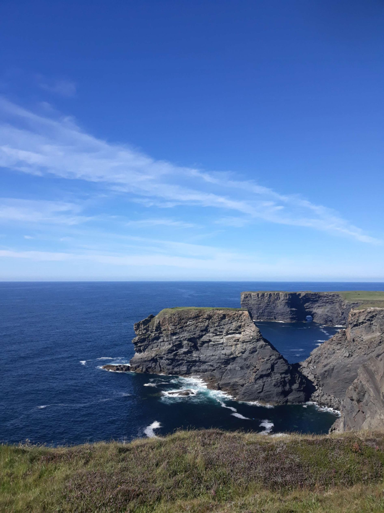

+++

title = "De Inishmore à Carrigaholt"

draft = "false"

date = "2022-08-09 21:57:09.571363"
+++

Enfin un réveil matinal ! En réalité, je me lève surtout car tout, absolument tout est trempé. L'île est extrêmement humide ce matin et la rosée a bien pénétré sous la tente. Le duvet est imbibé et des gouttes me dégringolent sur le visage.

C'est un magnifique soleil qui m'accueille, alors que je rampe dans l'herbe mouillée en dehors de mon abri. J'enfile mes sandales pour aller faire quelques photos.

Profitant de la salle commune qui ouvre tôt, je prends mon petit-déjeuner au chaud, pour découvrir, en sortant, qu'une brume épaisse a envahi le paysage. Plus question de plages, de petits champs délimités par des pierres, etc ; je peine déjà à retrouver ma tente.

Les affaires sont vite rangées, l'herbe qui a été fraîchement coupée n'arrange rien, j'en mets partout, dans et sur mes sacoches.







Je crois savoir qu'un ferry part vers 10h, je profite donc des quelques heures qui me restent pour aller découvrir l'île. Quelques tours de pédales et me voilà sur les petites routes sinueuses qui serpentent à travers champs.

Si la brume m'empêche d'y voir grand-chose, elle donne aux paysages que j'aperçois un aspect encore plus mystérieux, voire mystique. Les ruines d'un château, un vieux cimetière celtique et toujours des vaches et des chevaux, partout.







Je croyais partir plein Est et me voilà arrivé à la pointe Ouest. Un joli phare m'attend là, à l'autre bout d'une plage de gros galets blancs. Je m'installe pour déguster un peu de cake aux fruits et voilà que tout à coup, miracle, le brouillard s'évanouit quelques instants.

Je peux enfin profiter d'une vue dégagée sur le large, au loin j'aperçois les collines du Connemara que j'ai quitté hier. Pas un bruit, ni animaux, ni personnes, ni bateaux.







Il est 9h passées, je remballe mon gâteau, la brume retombe. Le retour se fait un peu moins en flânant, je veux connaître les détails de la traversée à la capitainerie.

C'est à l'office du tourisme que l'on me reçoit : le bateau part à 10h45, il me reste un peu plus de trois quarts d'heure libres. Je fais de petites courses au Spar puis, le temps de discuter avec la caissière qui s'improvise guide touristique et ensuite avec un féru de vélo qui m'attend à l'extérieur, il est grand temps de me rendre sur le quai.







Devant le port, il me reste 10 minutes, je boirais bien un bon café chaud (ça devient une lubie, je sais). Je pousse la porte de la salle de réception d'un b&b un peu luxueux faisant fi du panneau "residents only".

Je m'excuse de mon intrusion auprès de l'hôtesse qui m'accueille et demande le fameux café, elle accepte avec plaisir de m'en donner un et, lorsque je lui demande combien je lui dois, j'ai droit à une réponse que l'on aimerait entendre plus souvent : "rien, je crois au karma".

Ça tombe bien, moi aussi, et aujourd'hui les planètes ont l'air plutôt bien alignées. Je file sur le quai avec mon café, le meilleur qui soit. Un vieux loup de mer, casquette vissée sur la tête et quelques dents en moins, soulève mon vélo d'un geste leste et voilà le petit croix de fer chargé sur le pont supérieur.

Le site indiquait 32€ la traversée, à bord on me demande 25, je négocie 15 (avantage d'étudiant...). Ces petites navettes vont bien vite, je me laisse bercer par les vagues et avant la fin des seulement 35 minutes de traversée qui nous séparent de la côte, je réussis à m'endormir quelques poignées de minutes.







Débarquement à Doolin, petite station très touristique dont je m'extirpe rapidement. Un court trajet m'amène dans les terres à Lisdoovarna, où je déjeune. La température monte, je retire manchettes et jambières, applique une seconde couche de crème solaire.

Je suis la route côtière qui doit me mener jusqu'à Kilkee et ses falaises majestueuses. Pas de difficultés aujourd'hui, très peu de dénivelé et le vent me pousse avec force -pour mon plus grand plaisir- à travers les pâturages verdoyants qui surplombent la mer.






Beaucoup de monde sur cette route, le soleil a fait sortir les irlandais de chez eux, les plages sont bondées. L'arrivée devant les falaises me laisse bouche bée un instant. La mer est d'un bleu profond, les falaises immenses, les rouleaux qui s'y écrasent, impressionnants.

La route suit de près cette côte ciselée et je découvre le pont de Ross dont m'avait parlé un vieux bonhomme dans un café. Une grande arche de pierre se dresse sur la mer et en face d'elle, un éperon rocheux, spectacle saisissant.

Je ne tarde pas trop car j'ai commencé la route très tard, vers midi, et je veux faire au moins une bonne centaine de kilomètres malgré tout. Je rejoins bientôt le phare à la pointe de la péninsule, où m'avait d'ailleurs donné rendez-vous le vieux du café.

Je suis bien content de tomber sur lui car il m'indique non seulement un bar qui fait également épicerie mais aussi un camping proche. Nous sommes en effet dans la campagne profonde, le dernier petit magasin que j'ai croisé remonte à plus de deux heures et bien sûr je n'ai absolument rien à manger.

Grâce à lui, me voilà bientôt rechargé en provisions de la plus haute qualité (beans, sardines à l'huile et pain de mie) et je finis tranquillement cette petite journée de vélo -mais grande en émotions- dans un joli camping, les pieds dans l'eau.

Pas de chance, cette fois encore pas d'emplacement correct pour la tente, je commence à connaître la chanson : je vais être trempé. Ça devient dur cette humidité constante, malgré la météo en journée !

Demain, je dois prendre le ferry de bonne heure pour passer le grand bras de mer qui me fait face. J'espère me faire plaisir avec une longue journée de pédalage ; pourvu que le soleil soit toujours de la partie.

## Commentaires
#### Sandrine
Hello Ivan !
Encore un régal de te lire ! J'ai hâte de connaitre la suite : vas-tu t'aventurer dans les "doigts" du sud-ouest ? Ou as-tu un autre plan? Nous verrons ce soir...
Décidément tu as le don d'attirer la sympathie car nous ne comptons plus les offrandes que l'on te fait tout au long de ton parcours !
En tous cas, continue de te délecter de ces magnifiques étendues... Et si les gouttes du matin te sont trop pénibles, tu peux déjà imaginer qu'à Bordeaux elles te manqueront probablement, vue la météo qui y règne !!
Belle journée à toi !
P.S. As-tu aussi des astuces genre "esquive d'un Patou pour un randonneur" ? C'est juste au cas où...😂
#### Dad
Ouh là là ! Slow down, slow down....tu es presque aux portes de Cork ...
Tout a l'air de très bien se passer, mis à part sans doute la petite humidité résiduelle du matin ( sans laquelle on n'aurait plus l'impression d'être en Irlande)....
Alors je ne pense pas que l'hôtesse du B.B ne croit particulièrement au Karma, mais peut-être que je me trompe, cependant il m'a déjà semblé entendre cette réplique dans un épisode de "Amicalement vôtre" prononcée par Brett Sinclair.....( Ivan Moore)
À l'époque j'essayais d'apprendre par cœur ses répliques......
Come on son. Keep karming...
#### Moum
A ce rythme -là, Ivan, tu prévois de faire la côte pittoresque dans le détail? A moins que tu n'envisages un Limerick-Dublin sur les routes de traverse avant de rejoindre Cork? 🤔 Pas si simple de combiner tourisme et goût de la performance sportive!! Tu te fais plaisir, là est l'essentiel! Ta rubrique journalière est une joie à lire.
Alors, Keep zigzaging! 😊
#### Yann
Hello Young Ivan !
Je n'ai pas vu le temps passer ces derniers jours, et j eme remets donc à la lecture de tes récits palpitants :D 
J'adore, et les photos que tu partages ne sont rien je pense à côté de la beauté propre à ces lieux, que seul l'oeil peut apprécier dans son entière singularité.
Je vois que le café occupe une place importante depuis le début de ton voyage, je te comprends. Mais au moins, est-il bon ? Si tu es comme moi, je suis difficile, et j'aime les bons cafés. Et c'est génial de voir que même pour un petit café, il existe encore de l'humanité chez certains êtres dans ce monde si mercantile : ce sont des choses aussi simples que celles-ci mais si importante pour notre humanité personnelle que j'en suis ému.
Sinon fais attention, je crois que tu as un Alien qui pousse au niveau de ton plexus solaire ;) J'ai vu ça sur une des photos de toi du jour. Fais attention à toi ! 
A bientôt
Bises
