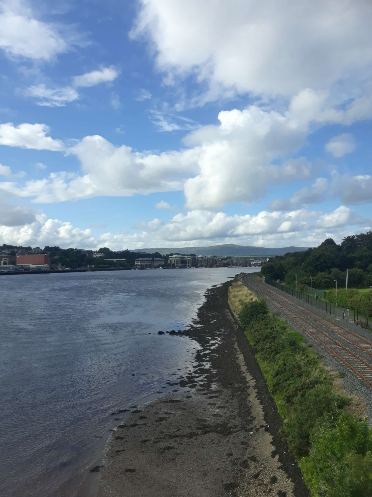

+++
title = "From Larne to Letterkenny"
draft = "false"
date = "2022-08-04 22:40:11.799892"
+++

2:30am, "are you taking the 4 am sir?". I'm woken (yelled at) thus from my deep sleep on the metal benches of the P&O terminal. It's already time to go to check-in, I'm the only foot passenger.

Quick glance at my ticket, no identity check, after all, we're still in the UK. After still long minutes of waiting, I finally board a shuttle that takes me into the heart of the ship.

From there, I go up to the bar, find a bench to continue my night, uncomfortable, but it'll have to be enough to get through the coming day. At 5:30am the sun rises, the Irish coasts are in sight.







Disembarkation 6am, I take my time, wash briefly, prepare my gear properly, have breakfast (i.e. a flapjack). First pedal stroke at 7am. Ireland is cold, much colder than Scotland I just left and everything is damp, a sign that the rain I'm trying to avoid isn't far.

And indeed it doesn't miss, after a few kilometres in the sun, I get my first soaking of the day, what a disappointment. I quickly find a service station, where I buy provisions for the day. Second breakfast by the sea. It's very beautiful, but it's so cold!







I set off again, invigorated by the bread spread with peanut butter I just devoured. The wind is from the northwest, very rare according to a local I met later. Bad luck, that's my direction, once again I'm pedalling into nothing.

I partly follow the tourist coastal road to Ballycastle, which was supposed to be my landing point (according to the original plan). Very pretty fishing town where I look for Ursa Minor, a traditional bakery, reason for my visit.







Once found, I enjoy a large coffee with a slice of strawberry cake and... a "French-style" baguette that I devour! Apparently, I missed it.

I'm supposed to then visit The Giant's Causeway, a mythical place around here, exceptional geological formation. When I arrive, the area is invaded by tourist coaches and I'm asked to park my bike to finish with 50 minutes of walking. That's obviously too much for me -I'll buy a postcard- I leave straight away.







From that moment on, I focus on efficiency. The goal is to reach the west coast to start the Wild Atlantic Way tomorrow that will take me to Cork. So I head straight, through the countryside, without worrying about the landscape, this is a real transfer stage this time.

Quite a lot of climbing and often rain joining the party, in short heavy showers, but disastrous for morale. I finally arrive at Derry after many hours of effort.







It's clear that I'm no longer in the state of grace of the Tongue stage and that the backlash of my very mediocre night is being felt. But as I repeated to myself all day: slow and steady, I'll get there eventually.

Derry is rather nice but I don't linger, because the final stop is Letterkenny, a frankly deprived industrial town (yes I always pick the nicest places). A meeting with an Irishman opens my eyes: if you look properly, you can find hostels for the same price as campsites! I jump for joy, because I'm a bit tired of the constant dampness of the tent.

In Letterkenny there's only one, badly rated online, but which attracts me nonetheless, it's the Artist Hostel. That'll be my stop for tonight.

Leaving Derry, unfortunately, I soon notice that I'm bouncing a lot on my bike and for good reason, the rear tyre has punctured again (at 2,000 km this time, a sign?!). So I advance slowly, with frequent pumping, in the Irish hills (the Republic this time, I crossed the border).






The GPS finishes this trying day by sending me into paths that aren't paths, covered in brambles and branches of all kinds. Having neither the necessary skill nor the suitable tyres, I wallow miserably in the mud several times. Morale is hanging by a thread (that thread being that I don't want to camp on this path).

Finally, the road, the main road, a service station (again!), I can get some provisions for the evening. I take advantage of this place to change the inner tube, pumping the other one is useless, the valve is defective, it's to be thrown away.

I finally arrive at the deserted city centre, occupied only by a few aimlessly roaming gangs. A quick search tells me the location of the hostel, I escape from this hell. I'm welcomed very well despite the late hour. The place is a joyful mess, as the name suggested, that suits me fine.

To top it off, I'm offered a beer, again! An "Irish gift", they tell me. The owner gives me a choice, I can either take a bed, or pitch the tent in the garden, for almost nothing. While thinking I open my bags; horror, everything is soaked with water, sleeping bag included. The decision is quickly made, I sleep inside (and I promise myself to buy a waterproof bag when I return).

Finally an evening warm and dry! Tomorrow, heading to the west coast for a journey that promises to be magnificent. After this difficult day without too many landscapes, I can't wait.

## Comments
#### Dad
The contrast is striking, at the hour when the camper cries: "Give us a sea to cross, a breath of air to breathe!"
These last days have tested your capacity to resist adverse elements very severely.... Bravo for your endurance abilities because the mishaps really accumulated yesterday. You'd think you'd come out of a Paris-Roubaix every evening for 3 days, "the Hell of the North" daily.
I 🤞, but after today, northern weather forecasts much better days.
Maybe you can take the opportunity to stay sheltered a bit and take photos of people who look like Colm Meaney in "The Snapper".
Come on son, keep thinking that it will be better.
#### Sandrine
Hi Ivan!
Your courage is truly tested...
Yesterday's day spared you nothing!
Hopefully Erin will take pity and offer you an Ireland lit by sunshine.
I take this opportunity to greet your supporters from L'Arbre du Chapon in St Gilles, from Fouesnant to Paris, from La Roche sur Yon to ...
I wish you a good day and cross my fingers that it won't disappoint your hopes: green Ireland carries its colour!🍀
See you soon in your next article!
#### Yann
Ah la la Ivan! So much bad luck! That the weather isn't cooperating is one thing, but when the mechanics get involved, it becomes heavy indeed. But you have this strength of resilience that allows you to move forward and find in a small pleasure a bit of joy to keep you going.
Courage to you Ivan! And bravo!
#### Moum
"Slow and steady"! Great motto Ivan! No need to ask what "you did with the common sense your mother gave you at birth..."! I'm proud of you, you've probably inherited the breath of your great-great-grandfather, the great talabarder before eternity and yours from the Hobbit the art of camouflage, (I can see you change expression as soon as you're no longer in the open air), endurance and, very important, the pleasure of eating...! Ah! peanut butter!! 🙄 The peanut butter flapjack! You'll have to ask Dad to make you some, he'll love it! By the way, you confirm, don't you Ivan, that he has two passions, apart from flapjacks of course, your tad coz, (in Breton in the text): François Morel and ... the bombarde! ... But he's in a teasing mood...😊 Come on! Off to Puy du Fou!! Ah, no that's after the 18th .... Aunt Yolande needs your advice, they're out of ideas for the 2023 programming... One pedal stroke and hop! huh? no but! You'll blow Jannie Longo away! That's not what I said!😉
Courage Ivan, you're going to discover a paradise under the sun, I'm sure of it.
Keep wilding!!
Sunny kisses 😘
