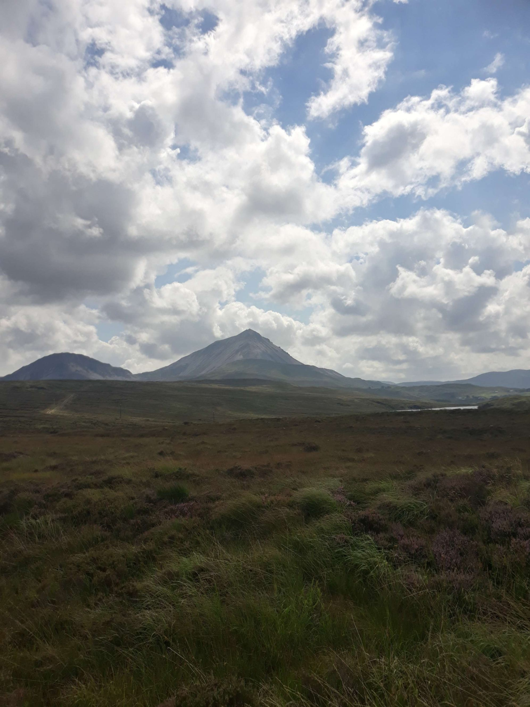

+++
title = "From Letterkenny to Portnoo"
draft = "false"
date = "2022-08-05 20:31:52.239959"
+++

The night is long and comfortable, in my real bed. Camping is a bit like the story of the madman who bangs his head against a wall: it feels so good when you stop!

I sleep a bit too much, unfortunately. Around 8am I finally emerge, I dash to breakfast. I chat briefly with the other guests before slipping away to get ready and leave as early as possible, I'm already very late.

I can't work miracles, departure won't happen until 9:30am. So I already know the day will be shorter, especially since I have no energy, despite the copious meal I just had.

And the route doesn't spare me. Letterkenny is in a bowl, we immediately attack with 3 km of climbing to get out of the city. After a short flat section, it's back to climbing and this time it's serious.







It's about crossing one of the first passes of Glenveagh National Park. I curse my hastily made route that goes straight through the park when I could go around it all by the coast.

At the first big difficulty, I stop, I don't have the legs. I take the opportunity to eat a cereal bar and read your messages from yesterday, it gives me a bit of courage to set off again.







I finally conquer this climb, to discover, at last, a magnificent landscape. The mountain top plunges into a small "high altitude" lake, sheep graze peacefully and the road descends in beautiful hairpin bends that I take great pleasure in flying down.

Once at the bottom, I decide to follow the Eurovelo 1, which follows the coastline less than my route, which will allow me to advance more directly towards the next campsite; I'm trying to conserve energy.







Despite the magnificent landscapes that motivate me, I quickly drop from exhaustion. I end up collapsing in a ditch (voluntarily, this time), to swallow industrial quantities of peanut butter on the little bread I have left, to get the machine going again.

But I think it's mainly fatigue that's overwhelming me, I've already been cycling for 12 days more than I've slept, the night on the ferry probably finished me off.







I set off again after a long time sitting in the soft grass. Too bad, I decide that this day will be a buffer and will allow me to recover to start again in full force tomorrow.

I try to aim for a campsite not too far away, especially since I need to spend some time on the bike. It's indeed high time to swap the tyres, because the rear one is already badly damaged, compared to its mate.







So I continue my route at a very reduced speed to conserve energy. The place is as beautiful as it is empty. Soon, I start wondering about supplies, because I literally have nothing left to eat or drink.

I'll have to wait a very long time before coming across... a service station (+10 points to those who guessed). The atmosphere is very Texan, with country music blasting through shabby loudspeakers.







After buying enough for a real lunch as well as provisions for the rest of the day, I decide, me too, to be a bit redneck. My chain has been screaming for days, all the oil having been washed away by the numerous downpours.

I find a tiny bottle of 2-stroke engine oil. It's absolutely not suitable, but the container is the right size for me to carry. I generously smear it on the chain: it's greasy, sticky, but at least silent, finally.

I leave again full and with rested ears. I finally feel a semblance of energy returning and I swallow without trouble the few dozen kilometres I have left. At 5pm, I finally pass the symbolic 100km mark. I laugh about it, because usually it's between noon and 1pm.







I arrive around 7pm in a seaside resort that's apparently very touristy. My choice falls on the dunes campsite, where I can eat a hot meal in the small restaurant (see photo of the incredible frozen pizza).

Tonight, I go to bed as early as possible. I absolutely must recover to try to do better tomorrow. That said, the road is very hard, the elevation significant and the wind always present.







Maybe I'll change my rhythm for the Irish part of the trip, so I can visit a bit more, even if it means finishing by train to reach Cork on time for example. No decision is made yet, but I'm thinking about it.






## Comments
#### Dad
If I were a pleasure garden, without hesitation: the Jardin des Plantes in Nantes. A street: M. Ravel. A walk by the water: the Erdre between La Tortière and La Gandonnière. But if I were an island... giving a definitive answer would be too difficult, you'd have to narrow the geographic area.
For example, a Breton island: without contest: Île d'Yeu.
No.1 would probably remain Texel in Holland: these lines of colour are so remarkably cut, a succession of watercolours...
But the alliance of violence and delicacy, it's on Achill Island that you find it best... Big sister is right: I was conquered and I remember very well the moments spent there...
Incredible Keem bay!!
Since now, conditions seem better......
I sincerely hope you'll have the opportunity to discover it (I think there's a cycle path), even if I imagine that in summer, many tourists travel it...
Come on son, keep impregnating and it may be a good idea to slow down....
#### Moum
Hello Ivan,
Your body is imposing a change of rhythm and that's a very good thing! What you've done so far is somewhat of a feat. Here you are on a mythical land! Taking time to appreciate this beautiful country is an obvious thing. I can't wait to see what you'll discover...!
Take care of you, baby, and Keep cool!
😉😘
#### Yann
Hi Ivan! What magnificent landscapes!
I hope that compensates for your fatigue, you're feasting your eyes ;)
I must say I don't know how you hold up physically! It's such a hard route!
So once again, good luck! Your bike is your best friend right now :D
