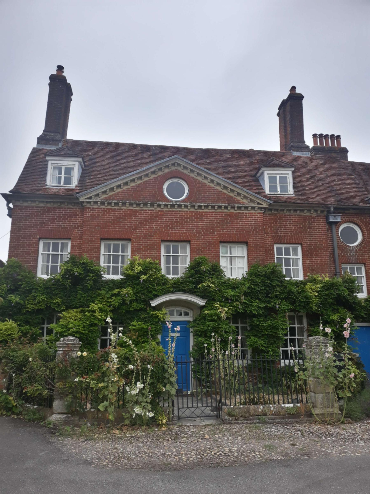

+++
title = "From Portsmouth to Wales"
date = "2022-07-24 19:25:36.296635"
draft = "false"
+++

The night was short and uncomfortable on the Normandie. Large coffees kept me company throughout the day but unfortunately the fatigue remained until the end.

In these conditions, finishing the stage was very difficult; numerous sugary oat bars helped, to some extent.

When the time came to cross the bridge linking England to Wales, a little tear was shed. This day was definitely one of the hardest of my short cycling life.







To top it all off, the rain joined the party this evening. If the tent holds up, the night will be long and restful, otherwise...

Tomorrow, I'm off to play in the Welsh hills, before turning back towards the centre of England.







I go to bed exhausted, but happy.
























## Comments

#### Dad
Bristol, Cardiff... so many memories!!!
We're already addicted to the blog and the photos...
Enjoy your second day.
Come on son.

#### Sandrine
Very nice photos! It's really nice to follow the journey with your story and the illustrations along the way! Bravo for this courageous first pedal stroke!

#### Andréas
Bravo for your first stage! I hope you got some rest and that the weather will be better during your crossing of Wales! Good luck, friend!

#### Moum
Courage Ivan for facing the Welsh rollercoasters!! It will probably take a few days to find your cruising rhythm. Thanks for these lovely photos, how charming! So sweet! Kisses 😘

#### Michaël
Congratulations on your first stage. Hopefully the next ones will be less laden with fatigue. Good luck to you Ivan.

#### Ken Follett
Bravo my chicken for this stage! A true champion. Thanks for the stage summary and the photos, I'm loving it. Careful not to overdo the Welsh, it could harm your performance! ... and I'm talking about the beer of course ;)

#### Leslie
Go Ivan - looking good! Hope your homemade gear passes the crash test...
Viel Spass!!

#### Teunteve
Bravo my nephew!
Like your father I'm a fan of all these countries... I saw you were very close to Coleford which is the twin town of Saint-Hilaire-de-Riez
I'm looking forward to the photos of Scotland and Ireland.
Good luck to you from Gérard and me
