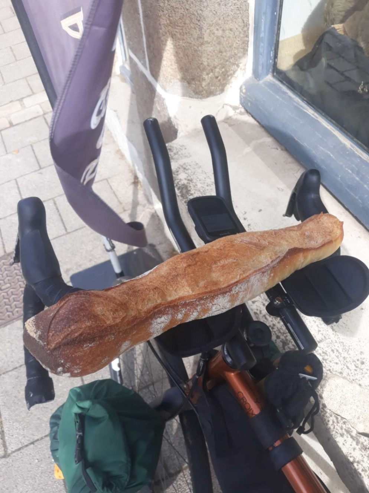
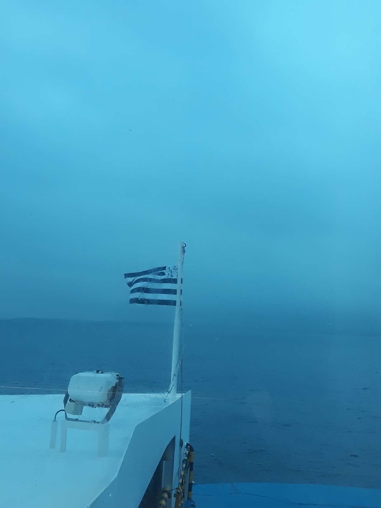

+++
title = "From Roscoff to Fouesnant"
date = "2022-08-18 17:12:44.824790"
draft = "false"
+++

These ferry crossings are a true pleasure, ever renewed. The beer isn't very expensive, I love watching the coast recede, then approach the next day, you sleep well on them. Well, that's if you booked a cabin. Me, I just have a reclining seat and a neighbour behind who's a kickboxing champion.

So at 10pm, as I'm about to use my loudest voice to tell her to go see if I'm in Scotland, I notice the poor old lady seems a bit... disturbed. So I keep my bad mood to myself, grab my sleeping bag and go sleep in the corridor.

The carpet isn't as comfortable as the campsite grass, but it'll do. In fact it does the job so well that the hostess's voice wakes me: arrival in Roscoff in 20 minutes.

Quickly, I pack my things, do a quick wash and I'm already in the hold getting my bike out. I chat a bit with the other cyclists returning from Ireland, everyone seems quite tired. Customs clearance, looking for an open café.

I'm served a "French-style" breakfast, baguette, croissants and jam on the programme. I down it all, change in the toilets and chat for a good half hour with a triathlete taking her coffee break.

The stage ahead is short, barely over 100 km. However, crossing Finistère always comes with crossing the Monts d'Arrée, which can present some nice difficulties.

Since I can't wait to get home and rest, I decide to do the route at a good pace, without stopping. I nibble on the way the peaches I imported from Cork as well as a baguette bought on departure.






Dear compatriots, you don't know the luck you have enjoying your daily slice of Campaillette, Tradition or other labelled baguette. What joy, this crispy bread, this warm and soft crumb, this scent!

I wouldn't be surprised if I have nightmares about sliced bread, a kind of post-traumatic shock, specialists would say. I don't take time to take photos, I promised to be there for lunch, I want to keep my word.

Fields and forests follow one another. In Châteaulin, the well-known difficulty is getting out of the basin. My itinerary does me the honour of taking me to climb a small local summit. 210 m high, we've seen worse. Although the 7% average warms me up a bit, despite the gloomy weather.

In no time, Quimper (or Kemper for purists). There, I disconnect everything, this road, I know it by heart, I don't bother with small paths and fly along the main road.






I've been out of water for a while now, I just want to arrive as quickly as possible. Straight South by the Bénodet road, Pleuven, Fouesnant, a few hundred metres down the Cap descent and I'm there; 25 days of travel come to an end.

I'm exhausted and happy to finally be able to enjoy the prune Breton cake (well deserved I think) waiting for me. I'll be able to delight in a real hot meal, a shower, a cozy bed, family and friends.

Thanks again to all those who followed and supported me. What a pleasure to discover your messages along my travel days. Before the end of the week, I'll draw up a small bilan of this adventure on this blog and then... it'll already be time to plan the next one!

## Comments

#### Sandrine

BRAVO IVAN!!

Savour your return, enjoy the reunion and the baguette!

Thank you for bringing us together around this incredible journey...

See you very soon!!

#### Georges

Bravo Ivan! I'm impressed by this journey, looking forward to the next adventure!

#### Max

Respect and perplexity(ies) for this poetic and sporting journey!

Can't wait to hear your story in person! Recover well from all these efforts, your body will surely thank you! Tough guy... A cycling practice with an admirable philosophy, dear friend, chapal beau!

#### Damien le Belge

Great journey, it was nice to cross paths and then be able to follow the rest of your adventure!

#### L'arbre du chapon

Hi Ivan! I wish you a good return to your beautiful Brittany that I love so much! A big thank you for making us travel through your delicious prose and beautiful photos! I imagine all this will be missed and you'll quickly be projected into another adventure. In the meantime, good rest! Kenavo!!!!!

#### Pollux du 2.9.

Coffee at Ty Pierre in the early morning > life.

You'll have to come back to try their fish&chips now. For that you'll need to accept slowing down a bit surely :)

Congratulations on this great adventure and especially on the story you made of it!

#### Cabellou

Bravo! Fascinating!
