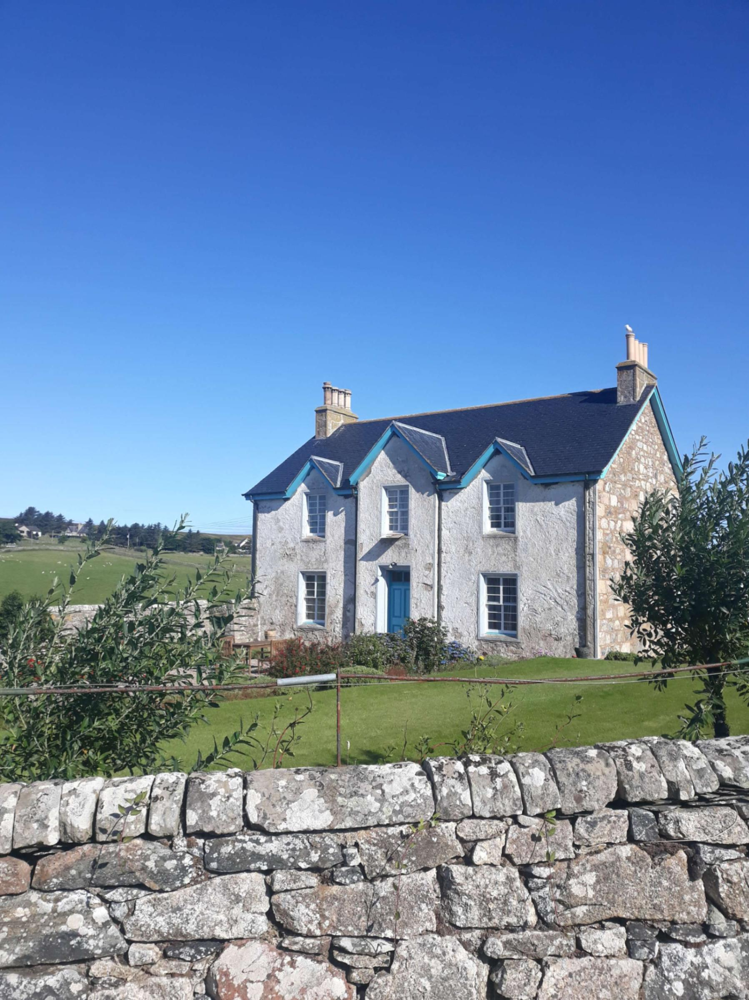
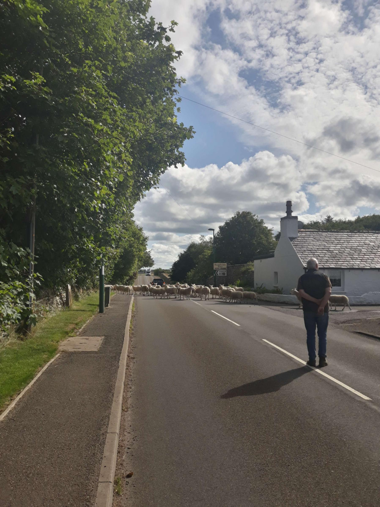

+++
title = "From Tongue to John o' Groats then 🚌 to Inverness"
draft = "false"
date = "2022-08-01 16:37:06.229765"
+++

This morning, no more battery. I get up with the sun, around 5am and prepare a good breakfast with coffee. At 7:30am the campsite laundry room reopens and I can retrieve my battery that I left charging there.

I make sure to be ready so that, when the time comes, I can leave directly. Around 7:40am, that's done and I head off.

I quickly arrive on the famous North Coast 500, a road that winds through the highlands, very popular with motorcyclists and cyclists of all kinds. The road is indeed magnificent, following the cliff line. I discover golden sand beaches and as my surfer cousin would say, "it's tubing"!







A very strong headwind once again thwarts my speed desires. But I'm eager, really eager to arrive at John o' Groats, which is one of the highlights of this trip. So I don't count the expense (of energy I mean).

I mash the pedals, my knees swell, my thighs burn and I finally pick up some speed. The arrival is liberating. It's just noon, I've covered more than 100km.







John o' Groats is a hamlet, turned into a small tourist hub, due to its reputation as "the northernmost town in the UK". Once my finish photo taken, I devour, not without satisfaction, my first fish & chips of the trip! And yes, who would have thought, I've been almost reasonable until now.

I'm convinced I've beaten my Belgian friend, on whom I had almost a day's lead. When he publishes his route for the day, surprise! He started riding at 3am and made up all his delay while I was sleeping peacefully.







In fact, we crossed paths on the road at noon, in Thurso, without knowing it... too bad, we missed the chance to say goodbye. Perhaps it's only a postponement for a future session?

Anyway, I decided yesterday that my initial plan no longer pleased me much. It consisted of backtracking over 200km to then reach the great lochs and the west of the country, heading for Ireland.







Damien (the Belgian, let's finally give him a name), tells me that from Thurso, trains and buses connect to Inverness, which would make a very good starting base to cross towards the west.

But then, I check with the John o' Groats tourist office: the last bus leaves in an hour and the town is 30km away. No problem, only solutions; my fish & chips weighing heavily on my stomach, I start a monumental sprint (the wind at my back this time, admittedly) towards Thurso to catch this damn bus, which I haven't even reserved.







I spend, once again, the watts without counting and it pays off. 50 minutes for 30 km, a small personal record, especially as loaded as I am. Arriving at the bus station, the driver reopens the luggage compartment seeing me arrive soaking with sweat.

Friendly but not too much, he scolds me because I'm not loading my bike fast enough, but still allows me to board even though the bus (with 12 seats) is obviously packed full.

Once seated, a detail comes back to mind: no laundry for almost 10 days (yes, last time I just couldn't be bothered). I count on the granny in front of me who reeks of perfume to cover my odour. Some people will remember their 2h30 journey to Inverness.

Me, I'll probably just sleep. Arrival expected around 7:30pm, I'll quietly land somewhere to sleep and leave again tomorrow, more or less according to my initial plans. The bus follows the NC500 southwards, I enjoy the scenery, without the effort, what more could you ask for?

## Comments
#### Sandrine
Your ninth article was thrilling! I didn't have time to say ouf: the connoisseurs had already found the answer to the riddle 😉 "Hydropneumatic my little man"!
So "Ivan straight ahead" lives up to his reputation! What a record these 50 minutes!!! I say "green jersey"! 🏆🎊
I loved this tenth article and its dose of humour!!
On the gourmet side, for me it was: country ham, Cantal and St Nectaire on toast with a glass of red wine...
But I wouldn't say no to tasting the famous fish&chips one day!!
In the photos you seem to have magnificent blue sky, what a blessing!
Enjoy!
#### Dad
Magnificent landscapes!!!
I think you did well: 200 km in reverse...
We, for our part, arrived under the blazing sun of Cantal. It may seem like nothing, but in the evening you pray to Mary because even the Dore river hits hard here.
We almost envy your nights, aligoté, in your sleeping bag, with a cold nose!
You remain faithful to the French reputation for bodily care.
Come on son, keep downing. And for the story, thanks a lot.
Can't wait to discover the west coast!
#### Margot
Great to follow this journey I'm delighting in reading and bravo for the sprint. Smelly French remains a good cliché don't worry about the bus it's the French charm!
#### Moum
From one Finis Terrae to another, all proportions kept, (I saw that John o' Groats is 2200 miles from the North Pole!), Ivan what a race!! But what beauty these landscapes! There's something divine about being at the end of the world, the penn ar bed! I read without breathing or almost, your story, it was so thrilling, nice stylistic effect 😉! We really feel like we're there! And magnificent weather too, great! Here the heat returns, thank God, you don't have to suffer it, that would be terrible! For you and ... for others ... I gathered it's too cold to wash, but luckily, you kept Alpina Giro, you did well my son, honour is safe, "Ma Che! "these Italians, they're really disgusting...!
Well, tonight it was beer and pizza and yes ... a good pizza and a good beer ... in the cool ...! Brittany is like Scotland, but better ...! You don't agree Ivan,?
yes well, I exaggerate a bit .... 🙃
You seem, in any case, to have reached an incredible level of fitness, a real diesel but capable of a hell of a time trial performance! Impressive!
I hope you found a nice little nest to recover well!!
Kisses 🐑🐑🐑🐑🐑🐑🐑🐑🐑😘!
#### Teunteve
And meanwhile, we're sponsoring all our body's water in Ardèche which is one of the departments under Orange heatwave alert. Like my young brother I far prefer cool temperatures to those exceeding 35! But it's super nice this week spent every summer with family....
I look forward to you arriving in Ireland, a country we have travelled (I hope you'll make a trip to the Aran Islands where you can say hello to Jerry... and above all don't forget Achill Island, your father's love at first sight!
Big kisses from all the family!😍
