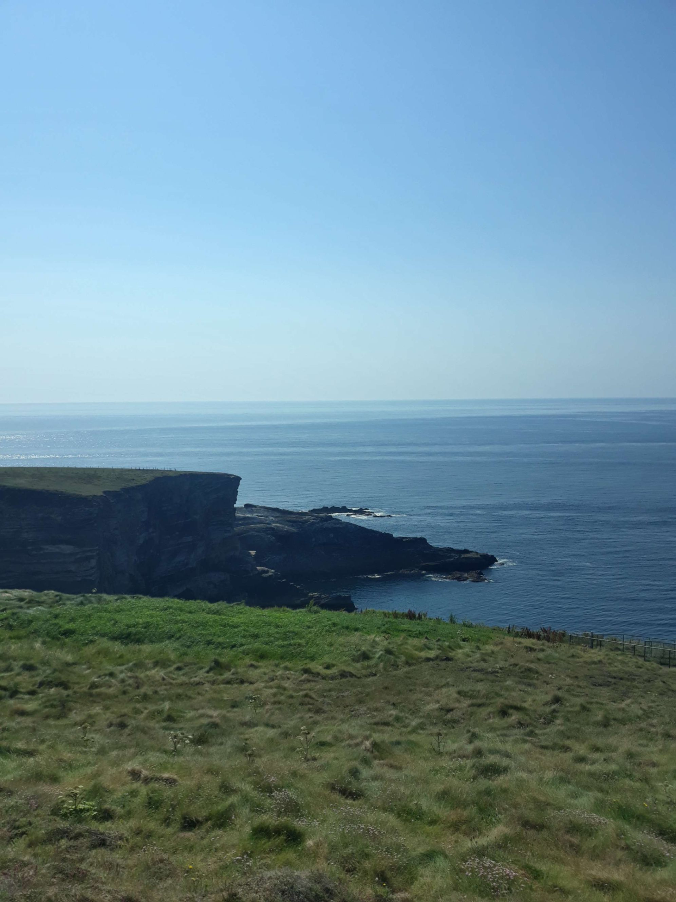

+++
title = "The Triptych of Death 💀"
date = "2022-08-13 22:16:29.111085"
draft = "false"
+++

Thank you for all the end-of-route suggestions you gave me on the blog or privately. Nevertheless, none mention "go around all the local passes just like that for laughs because you never get enough", too bad.

It was so beautiful yesterday that I don't bother setting up the tent. I throw the mattress in the grass, the sleeping bag on top and it'll be a night under the stars.

As I'm loading photos for the article (yesterday's, still), I'm interrupted by the very friendly campsite owner. He asks about my trip and I end up telling him that Ireland is very beautiful, but really they don't have the coasts of Wales and even less of the Lake District.







That's all it takes to make my interlocutor redden; the "feckin' brits" would do something better than the Irish?! Then arrives, coincidentally, a cyclist friend of my host.

They launch into a big debate about whether it's possible to achieve 3,000 metres of elevation gain on a day's cycling in the area (I unfortunately mentioned this figure somewhat by chance). They agree on three summits. Going via the Mount Gabriel weather station, then Healy pass and finally Priest's leap, the total works.







The discussion ends there, they're very happy to have proved to me that, if you look properly, the west coast harbours little leg-breaking treasures. Going to bed I think. I'm more or less one day's ride from Cork, where I have no desire to arrive too early.

From Sunday, the weather turns bad. Wouldn't this be the opportunity to treat myself to a somewhat crazy stage? I fall asleep on that.







The night is excellent, the sunrise magnificent. I prepare a coffee as well as a route that passes through the mentioned summits, to see. I manage to cobble something together: 200 km, 3,000m of elevation gain. I finish a second cup of the dark brew and my decision is made, I'll go for it.

I tell the owner I'm leaving my gear in his field. He's delighted to learn that I'm going to discover a bit more of "his" peninsula and laughs heartily at the announcement of the day's numbers; I apparently come across as a gentle madman.







I attack with Mount Gabriel, a very short steep section but with 15% ramps. The road is actually closed, the area belongs to Irish aviation, but I'm assured that if I don't linger too long, it'll pass. My knees will warm up on that, because the slope is only a few kilometres from the campsite.

The view at the top is breathtaking, a 360° panorama over the two peninsulas and the immense bay. I see Baltimore (no, not in the USA) and the island facing it.







A fast and technical descent precedes a visit to the magnificent small coastal towns of Schull then Goleen. I head to Mizen Head, the "southwesternmost point of Ireland", the sign says so. Immense and almost empty beaches stretch at my feet, I wonder if I wouldn't be better off in the water.

It's already very hot and I know the mercury must be around 30° in the afternoon. Soon, I finish the first small loop of 70km and I'm back at the campsite, where I restock with water.

Now, it's time for the big piece. I tackle it first at Healy pass, which is on the peninsula I went around yesterday. I go back the same way in reverse, too bad. The GPS makes me play on the hillside on small steep roads, before sending me back to the main road, well warmed up for the small pass ahead.

The climb is rather easy, 5% average, but the sun is melting the asphalt. My tyres stick to the road making the requisite "floutch" sound in this kind of situation, with each wheel revolution. It slows me down but not enough to prevent me from quickly reaching the top.







I contemplate the lovely view, the road snakes through beautiful grassy slopes. Superb descent under the sun, the sea shines. It goes up a bit before arriving in Kenmare, where I buy a small snack, at the same place where I stopped the day before.

The big piece is now, I take the N71 towards Glengariff, ready to face the hardest pass of the day. I forgot to get more water and after a few minutes, I'm out. It disturbs me, I dehydrate quickly and... miss the turn for Priest's leap.






I climb, climb, but it's not very hard. Once at the top, a small wooden sign lets me see my error: I just went over Caha Pass. I'm frankly frustrated but turning back isn't possible; it's already 7pm and going all the way back down to then climb the difficult hairpin bends of Priest's leap doesn't seem like a reasonable option.

Too bad, I return to camp, a bit disappointed. Once there, the numbers don't lie: I didn't reach the announced 3,000m of elevation gain. But the distance is good, the average speed too, I'm pleased with myself nonetheless.

Tomorrow I'll resume a more normal rhythm, the day might even be shortened to allow my legs to recover from today's effort. I'll go sleep in my field again (with my flysheet this time, the rain might return).

## Comments
#### Dad
When you escape the triptych of death, it seems you are definitively adopted by the Irish, even the most red-faced! I read in "Sud-Ouest" that Onepoint might install an antenna in Galway: an application for calculating elevation gain...
Come on son, keep upanddowning!
#### Moum
Seeing these magnificent beaches at the bottom of these majestic bays, these solitary roads in this grandiose nature, I remain thoughtful ..." my Godness ...
luckily he doesn't do triathlon.."! 200km, 3000m of climbing, hop, hop, hop, come on ... 8h ... a little escapade! Reading you, day after day, it seems so easy. It's not, and, frankly Ivan, bravo!😌 Finally the picturesque coast, in detail, you're doing it!!! (my joke falls flat). 
So, Keep silly! 🙃😚
#### Sandrine
The taste for challenge doesn't leave you! What determination! A real "Galwegian"!
Unlike you, we had almost forgotten the sensation of rain, dampness, wetness... The storm came last night to the great joy of nature!!
Irishment your! 🍀😊
