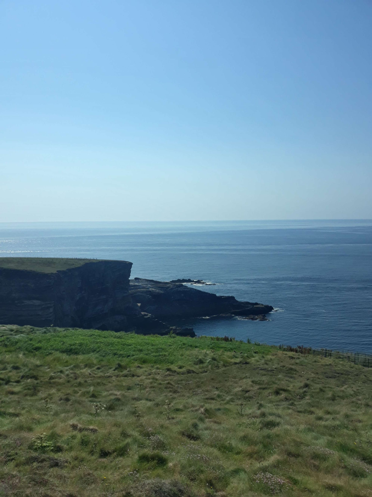

+++
title = "Le triptyque of death 💀"
date = 2022-08-13 22:16:29.111085
draft = "false"
+++

Merci pour toutes les propositions de fin de parcours que vous m'avez faites sur le blog ou en privé. Néanmoins, aucune ne mentionne "faire le tour de tous les cols du coin jusque comme ça pour rire parcequ'on en a jamais assez", dommage.

Il faisait si beau hier que je ne m'encombre pas avec le montage de la tente. Je jette le matelas dans l'herbe, le duvet par-dessus et ce sera une nuit à la belle étoile.

Alors que je suis en train de charger les photos pour l'article (d'hier, toujours) je suis interrompu par le propriétaire du camping, très sympathique. Il me questionne sur mon voyage et je finis par lui dire que l'Irlande, c'est très beau, mais vraiment ils n'ont pas les côtes du Pays de Galles et encore moins du Lake District.







Il n'en faut pas plus pour empourprer mon interlocuteur ; les "feckin' brits" feraient quelque chose de mieux que les irlandais ?! S'en vient alors, coïncidence, un ami cycliste de mon hôte. 

Ils partent dans un grand débat pour savoir s'il est possible de réaliser 3 000 mètres de d+ sur une journée de cyclisme dans les parages (j'ai eu le malheur d'évoquer ce chiffre un peu par hasard). Ils tombent d'accord sur trois sommets. En passant par la station météo du Mount Gabriel, puis le Healy pass et enfin Priest's leap, le compte est bon.







La discussion s'arrête là, ils sont bien content de m'avoir prouvé que, en cherchant bien, la côte ouest recèle de petits trésors casse-pattes. En allant me coucher je cogite. Je suis à plus ou moins une journée de route de Cork, où je n'ai aucune envie d'arriver trop tôt.

A partir de dimanche, le temps se gâte. Ne serait-ce pas l'occasion de se faire plaisir avec une étape un peu folle ? Je m'endors là-dessus.







La nuit est excellente, le soleil levant magnifique. Je prépare un café ainsi qu'un itinéraire qui passe par les sommets mentionnés, pour voir. J'arrive à bricoler quelque chose : 200 km, 3 000m de d+. Je finis une deuxième tasse du noir breuvage et ma décision est prise, je tente le coup.

Je préviens le proprio que je laisse mon barda dans son champ. Il est ravi d'apprendre que je vais découvrir un peu plus "sa" péninsule et rit à gorge déployée à l'annonce des chiffres de ma journée ; je passe apparemment pour un doux dingue.







J'attaque par Mount Gabriel, un raidillon très court mais avec des rampes à 15%. La route est en réalité interdite, la zone appartient à l'aviation irlandaise, mais on m'assure que, si je ne traîne pas trop, ça passe. Les genoux s'échaufferont là-dessus, car la pente n'est qu'à quelques kilomètres du camping.

La vue en haut est imprenable, un panorama à 360° sur les deux péninsules et l'immense baie. Je vois Baltimore (non, pas aux États-Unis) et l'île qui lui fait face.







Une descente rapide et technique précède la visite des magnifiques petites villes côtières de Schull puis de Goleen. Je me rends à Mizen Head le "point le plus au sud-ouest d'Irlande", c'est le panneau qui le dit. Des plages immenses et presque vides s'étendent à mes pieds, je me demande si je ne serais pas mieux dans l'eau.

Il fait déjà très chaud et je sais que le mercure doit avoisiner les 30° dans l'après-midi. Bientôt, j'ai fini la première petite boucle de 70km et je suis de retour au camping, où je me ravitaille en eau.

Maintenant, c'est parti pour le gros morceau. Je l'attaque en premier à Healen pass, qui se trouve sur la péninsule que j'ai contourné hier. Je refais la route en sens inverse, tant pis. Le GPS me fait jouer à flanc de colline sur de petites routes abruptes, avant de me renvoyer sur la nationale, bien échauffé pour le petit col à venir.

La montée est plutôt facile, 5% de moyenne, mais le soleil fait fondre l'asphalte. Mes pneus collent à la route en faisait le "floutch" de rigueur dans ce genre de situation, à chaque tour de roue. Ça me ralentit mais pas assez pour ne pas arriver rapidement en haut.







Je contemple la jolie vue, la route serpente à travers de belle pentes herbeuses. Descente superbe sous le soleil, la mer brille. Ça remonte un peu avant d'arriver à Kenmare, où j'achète un petit goûter, au même endroit que là où je m'étais arrêté la veille.

Le gros morceau, c'est maintenant, je reprends la N71 en direction de Glengariff, prêt à affronter le col le plus dur de la journée. J'ai oublié de reprendre de l'eau et au bout de quelques minutes, je suis à court. Ça me perturbe, je me déshydrate vite et... loupe le virage pour Priest's leap.






Je monte, monte, mais ça n'est pas très dur. Une fois arrivé en haut, un petit panneau en bois me permet de constater mon erreur : je viens de passer Caha pass. Je suis franchement frustré mais un retour en arrière n'est pas possible ; il est déjà 19h et tout redescendre pour remonter les lacets difficiles de Priest's leap ne me semble pas une option raisonnable.

Tant pis, je rentre au camp, un peu déçu. Une fois arrivé, les chiffres ne mentent pas : je n'ai pas atteint les 3 000m de d+ annoncés. Mais la distance est bonne, la vitesse moyenne aussi, je suis content de moi malgré tout.

Demain je reprendrai un rythme plus normal, la journée sera peut-être même écourtée pour permettre à mes jambes de récupérer de l'effort fourni aujourdhui. Je retourne dormir dans mon champ (avec ma toile cette fois, la pluie pourrait revenir).

## Commentaires
#### Dad
Lorsqu'on échappe au triptyque de la mort, il parait que l'on est définitivement adopté par les Irlandais, même les plus empourprés ! J'ai lu dans le "Sud-Ouest" que Onepoint allait peut-être installer une antenne à Galway : une demande d'application pour le calcul des dénivelés...
Come on son, keep upanddowning !
#### Moum
En voyant ces plages magnifiques au fond de ces baies majestueuses, ces routes solitaires dans cette nature grandiose, je reste songeuse ..." my Godness ...
heureusement il ne fait pas de triathlon.." ! 200km, 3000m de dénivelé, hop, hop, hop, allez ... 8h ... une p'tite escapade! A te lire, au fil des jours, ça paraît tellement facile. Ça ne l'est pas, et, franchement Ivan, bravo!😌 Finalement le pittoresque de la côte, dans le détail, tu le fais !!! (ma blague tombe à plat). 
Alors, Keep silly! 🙃😚
#### Sandrine
Le goût du défi ne te lâche plus ! Quelle détermination ! Un vrai "Galwois"!
Contrairement à toi, nous avions presque oublié la sensation de pluie, d'humide, de mouillé... L'orage s'est invité cette nuit pour la plus grande joie de la nature !!
Irishment votre ! 🍀😊
