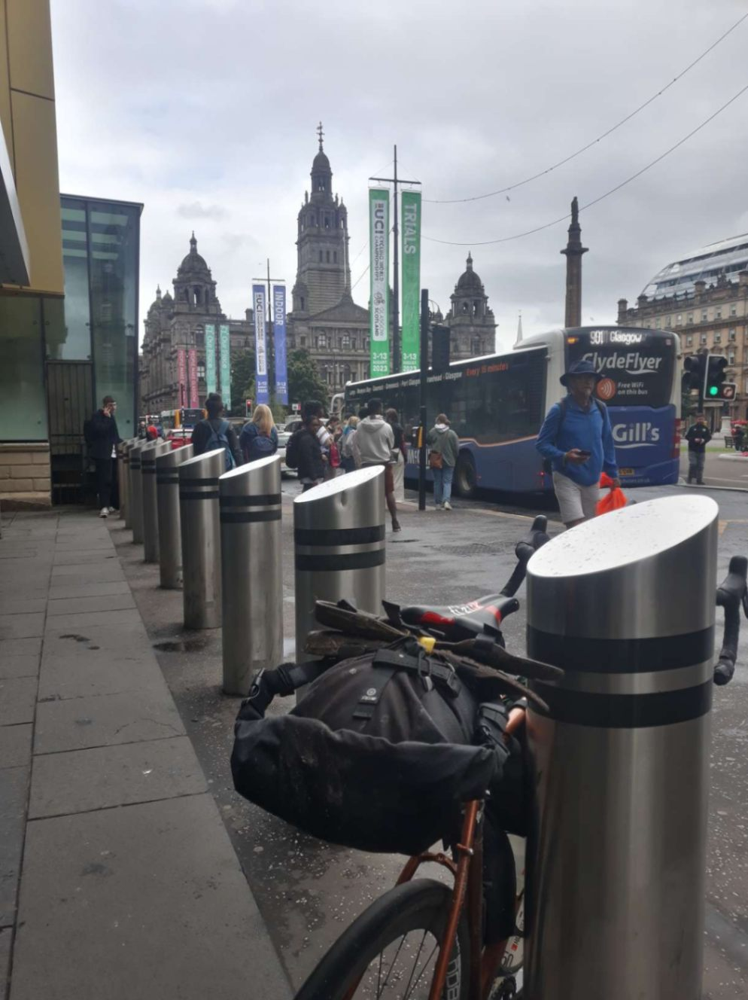
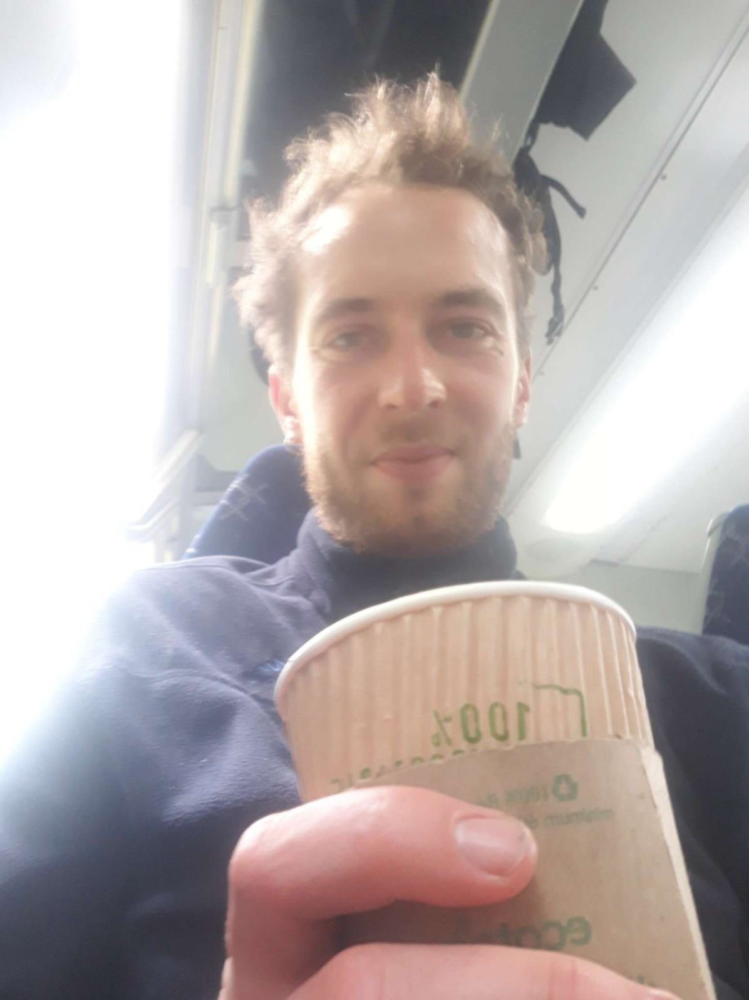

+++
title = "Oban 🚂 Cairnryan"
date = "2022-08-03 20:37:43.170928"
draft = "false"
+++

Another waking up in the rain this morning. And this time it's the big wet rain. I prepare my ever-present pita bread sandwich for breakfast.

It's already late but my battery is once again charging at reception, which only opens at 8am. Once a coffee is downed, I pack up and retrieve my brick, a bit recharged.

I decide to go to Oban city centre, even if it's a detour from Glasgow, because I want to know if the small ferry that used to cross from Campbeltown to Ballycastle still operates. At the tourist office, the verdict comes: it's no.







Double blow because I'm also told that the only road leading to Glasgow is a big main road like I took the day before, but, apparently, even more dangerous. I'm already soaked after only 20km of cycling, needless to say this news sounds the death knell for my motivation.

I then inquire about a means of reaching by rail the only available ferry terminal. It's long and a bit complicated, but possible. In just a few minutes, I'm "fully booked". And I thought I'd have some time to visit Oban!

I actually have 30 minutes to buy something to nibble on during the long journey ahead. Once that's sorted, I jump into a train from another age, composed of two tired carriages and a diesel locomotive.

The windows are wide open, tree branches sometimes whip the fuselage, leaving little leaves tumbling onto the seats (this apparently shocks nobody except me). At each stop, I fear the train won't restart.

The loco sputters, coughs, the train starts again then stops abruptly. At some stations, you see several mechanics bustling to get the old lady going again. Willy-nilly, we finally arrive in Glasgow around 3:30pm.

Once again, no time to hang around, I dash to the other station from which the second train departs, I buy more food (because, yes, I consume as much during my rest days as during cycling days), chat with a few other friendly passengers and off we go on a local TER towards Ayr, in the southwest.

You can feel we're getting closer to the coast, pigeons and other raptors turn into seagulls. In Ayr, last change, for Girvan, which will be my terminus.

Finally, about 35km along the coast (during which I GET SOAKED) will take me to the boarding terminal at Cairnryan. I book a ticket for the 4am ferry.

It's strategic: I'll rest warm and dry in the terminal until check-in around 3am, enjoy a magnificent sunrise over the water at 5am, then be able to start a beautiful day on the road around 6:30am in Northern Ireland. That's the theory. Practice will tell us tomorrow what really happened.

I'll finally be able to take out my diary that I've been carrying for over a week and read it with a good hot chocolate. The night is going to be long!

## Comments
#### Moum
Hello Ivan! Since I'm not asleep yet after a long musical evening, I'm thinking of you in this place, this terminal, a bit arid, after the magnificent landscapes you've traversed! But hey, it's part of the journey, these transitions, between two destinations however beautiful they may be. And then there, at least, you're dry! I find you look a bit grumpy🥴 after these diluvian adventures and ... it's D+12, normal! I hope you'll sleep a bit before tackling the roads of Ireland. I'm impatient to discover the second chapter of your epic! I don't know why, but I had images of a comic strip in my head, reading you tonight🚴🚂 Funny isn't it!
I kiss you very tightly! Keep cool!🙂
#### Moum
PS: He still shines a ray, Jolly Jumper, in this big station hall... ! 😍😊
#### Dad
Tell me, wouldn't you be better off lying on your towel on a Vendée beach no?
Godfather had bought you all the summer dossiers, at least you'd have learned something. Hey answer!
There was L'Humanité's dossier: "The Red October of Nuppes"
Libé: "Can Asselineau transform the youth?"
La Croix: "Did the Pope inspire the pope?"
L'Équipe: "Lloris or Maignan in Qatar?"
Le Monde: "Why are Scots climate-sceptic?"
Ouest-France Vendée Ouest: "Will there still be sardines in 2030?"
Elle: "He neglects you for his bike? The right questions."
Télégramme de Brest: "Where to listen to bombarde this summer?"
Well, I hope at least you're reading the Yourcenar you got for Christmas!!
Good luck Ivan, the end of the week promises to be magical. If you're too tired, think of an Irish coffee ma non troppo!
Come on son, keep pubing!
#### Yann
Well, bravo Ivan for all these many kilometres swallowed up, I read your writings, magnificent travel diary!
I understand it mustn't be easy every day, and luckily an opportune meeting can bring a bit of humanity on a darker day.
I look forward to reading the rest of your adventure :)
Courage to you, see you soon in the comments ;)
#### L'arbre du chapon
I jump back on the moving train... that's the case to say it, and always with as much pleasure, I read your adventures Ivan!!!
But so much water so much water so much water!!!
Despite everything you are much better where you are than following the world news which is very uninteresting compared to nature!!
And what about the bombarde! My Breton soul shivers!!
My great friend Jamie Fraser could tell you about it....
So good continuation of your journey and hello to your mother! It's true that the tree of the capon is quite a story!!!
Enjoy!!
#### Michaël
Courage Ivan. You're advancing further in your journey than hubcomx :-D . I see that unfortunately you don't lack rain, don't hesitate to send us some because here we're desperately short. Enjoy the magnificent landscapes you encounter (apart from the main roads).
