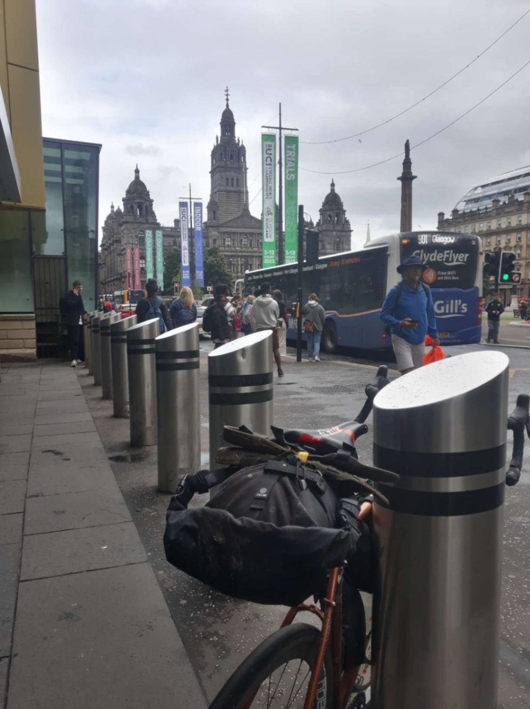
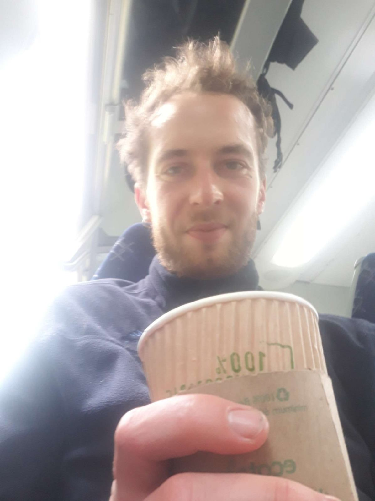

+++
title = "Oban 🚂 Cairnryan"
date = 2022-08-03 20:37:43.170928
draft = "false"
+++

Encore un réveil sous la pluie ce matin. Et là, c'est la grosse pluie qui mouille. Je me prépare mon sempiternel sandwich à base de pain pita pour le petit-déjeuner.

Il est déjà tard mais ma batterie est une fois de plus en train de charger à l'accueil, qui n'ouvre qu'à 8h. Une fois un café avalé, je plie bagage et je récupère ma brique, un peu rechargée.

Je décide d'aller au centre ville d'Oban, même si c'est un détour par rapport à Glasgow, car je veux savoir si le petit ferry qui permettait de traverser de Campbeltown à Ballycastle opère toujours. A l'office du tourisme, la sentence tombe : c'est non.







Double coup dur car on m'apprend également que la seule route qui mène à Glasgow est une grande départementale comme j'ai emprunté la veille, mais, à priori, plus dangereuse encore. Je suis déjà trempé après seulement 20km de vélo, inutile de dire que cette nouvelle sonne le glas de ma motivation.

Je me renseigne alors sur un moyen de rejoindre par le rail le seul embarcadère disponible. C'est long et un peu compliqué, mais possible. En quelques minutes seulement, me voilà "fully booked". Moi qui croyais avoir un peu de temps pour visiter Oban !

J'ai en fait 30 minutes pour acheter de quoi grignoter pendant le long voyage qui m'attend. Dès que c'est réglé, je saute dans un train d'un autre âge, composé de deux wagons fatigués et d'une locomotive diesel.

Les fenêtres sont grandes ouvertes, les branches des arbres fouettent parfois la carlingue, laissant de petites feuilles dégringoler sur les sièges (ça ne choque manifestement personne à part moi). A chaque arrêt, je crains que le train ne redémarre pas.

La loco a des ratés, toussote, le train repart puis s'arrête brutalement. Dans certaines gares, on voit plusieurs mécanos s'affairer pour faire repartir l'ancêtre. Bon gré, mal gré, nous finissons par arriver à Glasgow vers 15h30.

Une fois encore, pas le temps de traîner, je file à l'autre gare d'où part le deuxième train, je rachète à manger (car, oui, je consomme autant pendant mes jours de repos que de vélo), discute avec quelques autres passagers sympathiques et c'est parti pour un TER ambiance locale direction Ayr, au sud-ouest.

On sent qu'on se rapproche de la côte, les pigeons et autres rapaces se changent en goélands. À Ayr, dernier changement, pour Girvan, qui sera mon terminus.

Pour finir, environ 35km le long de la côte (pendant lesquels JE PRENDS LA FLOTTE) me mèneront au terminal d'embarquement de Cairnryan. J'y réserve un ticket pour le ferry de 4h.

C'est stratégique : je me reposerais au chaud et au sec dans le terminal jusqu'au check-in vers 3h, profiterais d'un magnifique lever de soleil sur l'eau à 5h, puis pourrais commencer une belle journée sur la route vers 6h30 en Irlande du Nord. Ça, c'est la théorie. La pratique nous dira demain ce qu'il en aura vraiment été.

Je vais enfin pouvoir sortir mon journal que je trimballe depuis plus d'une semaine et le lire avec un bon chocolat bien chaud. La nuit va être longue !

## Commentaires
#### Moum
Coucou Ivan ! Comme je ne dors pas encore après une longue soirée musicale, je pense à toi dans cet endroit, ce terminal, un peu aride, après les magnifiques paysages que tu as traversés! Mais bon, ça fait partie du voyage, ces transitions, entre deux destinations si belles soient-elles. Et puis là, au moins, t'es au sec ! Je te trouve la mine un peu chafouine🥴 après ces péripéties diluviennes et ... c'est J+12, normal! J'espère que tu vas dormir un peu avant d'attaquer les routes d'Irlande. Je suis impatiente de découvrir le deuxième chapitre de ton épopée! Je ne sais pas pourquoi, mais j'avais dans la tête les images d'une BD, en te lisant ce soir🚴🚂  Funny isn't it! 
Je t'embrasse très fort!  Keep cool!🙂
#### Moum
PS:  Il jette un rayon, quand même, Jolly Jumper, dans ce grand hall  
de gare ... !  😍😊
#### Dad
Dis-donc, tu s'rais pas mieux étalé sur ta serviette sur une plage vendéenne non ?
Parrain t'avais acheté tous les dossiers d'l'été, au moins t'aurais appris queq chose. Dis tu répond !
Y'avait l'dossier d'lhuma :"L'octobre rouge de la Nuppes"
Libé : "Asselineau peut-il transformer la jeunesse ?"
La croix : "The pope a-t-il inspiré le pape ?"
L'équipe : " Lloris ou Maignan au Quatar ?"
Le Monde : "Pourquoi les écossais sont climato-sceptiques ?"
Ouest-France Vendée Ouest : "Y aura t-il toujours de la sardine en 2030 ?"
Elle : " Il vous délaisse pour son vélo ? Les bonnes questions."
Télégramme de Brest : " Où écouter de la bombarde cet été ?"
Bon, j'espère au moins q'tu lis le Yourcenar q'ta eu pour Noël !!
Bon courage Ivan, la fin de semaine risque d'être féerique. Si tu es trop fatigué, pense à l'irish Coffee ma non troppo !
Come on son, keep pubing !
#### Yann
Et bien, bravo Ivan pour tous ces nombreux kilomètres avalés, j'ai lu tes écrits, magnifique carnet de voyage !
Je conçois que ce ne doit pas être facile tous les jours, et heureusement qu'une rencontre opportune peut apporter un peu d'humanité dans un jour plus sombre qu'un autre.
J'ai hâte de lire la suite de ton aventure :) 
Courage à toi, à très vite dans les commentaires ;)
#### L’arbre du chapon
Je reprends le train en marche….. c’est le cas de le dire, et toujours avec autant de plaisir, je lis tes péripéties Ivan!!!
Mais que d’eau que d’eau que d’eau!!!
Malgré tout tu es bien mieux là où tu es que de suivre les informations du monde qui sont très inintéressantes  au regard de la nature!! 
Et que dire de la bombarde ! Mon âme de bretonne frémit !! 
Mon grand ami Jamie Fraser pourrait t’en conter….
Alors bonne suite de voyage à toi et bonjour à ta maman! Il est vrai que l’arbre du chapon  c’est quand même une sacrée histoire!!!
Enjoy!!
#### Michaël
Courage Ivan. Tu avances plus dans ton périple qu'hubcomx :-D . Je vois que malheureusement tu ne manques pas de pluies, n'hésites pas à nous en envoyer car ici on en manque cruellement. Profite bien des magnifiques paysages que tu rencontres (en dehors des départementales).
